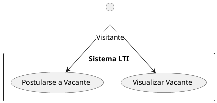
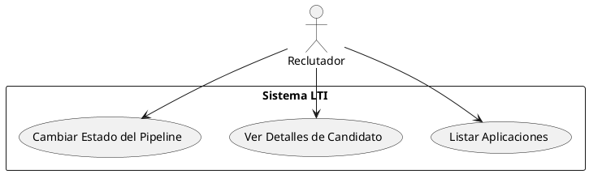
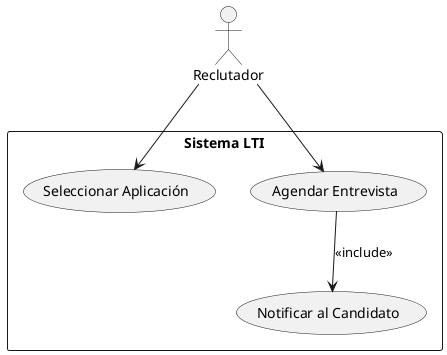

# 📋 ATS – LTI (Linked Talent Intelligence)

## 🧭 Descripción del Proyecto

**LTI** es un sistema de seguimiento de candidatos (ATS) diseñado para optimizar el proceso de reclutamiento, desde la publicación de vacantes hasta la contratación. Su interfaz amigable, motor de automatización y trazabilidad completa lo hacen ideal para empresas modernas que buscan eficiencia en sus procesos de talento humano.

### 🎯 Valor Añadido y Ventajas Competitivas

- Pipeline visual para seguimiento de candidatos
- Automatización de notificaciones por etapa
- Interfaz ágil y adaptativa (VueJS)
- API RESTful para integraciones
- Reportes y KPIs en tiempo real
- Seguridad granular por roles

---

## ⚙️ Funciones Principales

| Módulo                  | Funcionalidades Clave |
|--------------------------|------------------------|
| Gestión de Vacantes      | Crear, editar, publicar y cerrar vacantes |
| Postulación de Candidatos| CV, datos de contacto, origen, canal |
| Pipeline de Selección    | Movimiento por etapas, calificaciones, observaciones |
| Entrevistas              | Agendamiento, tipo, resultado, comentarios |
| Comunicación             | Notificaciones automáticas al candidato |
| Reportes y Métricas      | Tiempo de contratación, fuentes, estados |
| Seguridad                | Roles: reclutador, gerente, admin |

---

## 📈 Lean Canvas

```text
Problema:
- Procesos de selección ineficientes y sin trazabilidad
- Falta de colaboración entre reclutadores y gerentes
- Poco control sobre el funnel de talento

Clientes:
- Equipos de Recursos Humanos
- Startups en expansión
- Consultoras de reclutamiento

Propuesta de Valor:
- ATS moderno con trazabilidad, automatización y UI amigable

Métricas Clave:
- Tiempo medio de contratación
- Tasa de conversión por etapa
- Nivel de satisfacción de usuarios

Ventaja Competitiva:
- Modularidad, integración rápida y UX optimizada

Canales:
- Web propia, demo por contacto
- Marketplaces SaaS, venta directa

Estructura de Costos:
- Infraestructura cloud
- Desarrollo continuo
- Soporte

Flujo de Ingresos:
- Suscripciones mensuales escalables
```

---

## 🧩 Casos de Uso Principales

### 1. Postulación a Vacante

**Actor:** Visitante  
**Objetivo:** Postularse a una vacante desde la web

<details>
<summary>Ver Diagrama (PlantUML)</summary>



</details>

---

### 2. Gestión del Pipeline

**Actor:** Reclutador  
**Objetivo:** Avanzar candidatos por el proceso de selección

<details>
<summary>Ver Diagrama (PlantUML)</summary>



</details>

---

### 3. Programar Entrevista

**Actor:** Reclutador  
**Objetivo:** Agendar entrevista y notificar al candidato

<details>
<summary>Ver Diagrama (PlantUML)</summary>



</details>

---

## 🗃️ Modelo de Datos

```text
VACANTES
- id: int
- titulo: string
- departamento: string
- ubicacion: string
- descripcion: text
- fecha_apertura: date
- fecha_cierre: date
- estatus: string
- usuario_id: int (FK)

CANDIDATOS
- id: int
- nombre_completo: string
- email: string
- telefono: string
- cv_url: string
- linkedin_url: string
- fecha_registro: date
- origen: string

APLICACIONES
- id: int
- candidato_id: int (FK)
- vacante_id: int (FK)
- estado: string
- fecha_postulacion: date
- fecha_ultimo_avance: date
- comentarios: text
- calificacion: float

ENTREVISTAS
- id: int
- aplicacion_id: int (FK)
- tipo: string
- fecha_hora: datetime
- duracion_minutos: int
- resultado: string
- comentarios: text
```

---

## 🧱 Diseño del Sistema (Alto Nivel)

```text
[ Navegador Web ]
       |
       v
[ Frontend VueJS ]
       |
       v
[ Laravel API (REST) ]
  |    |    |
DB  Jobs  Auth
```

### Componentes:

- **Frontend:** VueJS + VueRouter
- **Backend:** Laravel 10 + JWT Auth + Jobs
- **DB:** PostgreSQL
- **Infra:** Dockerized, compatible con Portainer o ECS

---

## 🧭 Diagrama C4 – Nivel 3: Gestión de Aplicaciones

<details>
<summary>Ver Diagrama (PlantUML)</summary>

```plantuml
@startuml
!include https://raw.githubusercontent.com/plantuml-stdlib/C4-PlantUML/master/C4_Component.puml

LAYOUT_WITH_LEGEND()

Person(reclutador, "Reclutador", "Usuario que gestiona aplicaciones")
Container(web, "Frontend", "VueJS", "Interfaz de usuario")
Container(api, "API ATS", "Laravel", "Lógica y seguridad")
ContainerDb(db, "PostgreSQL", "Almacén de datos")

Component(controller, "AplicacionesController", "Exposición de endpoints")
Component(service, "ApplicationService", "Lógica del negocio de pipeline")
Component(repo, "ApplicationRepository", "Acceso a datos")

reclutador --> web
web --> api
api --> controller
controller --> service
service --> repo
repo --> db
@enduml
```

</details>
