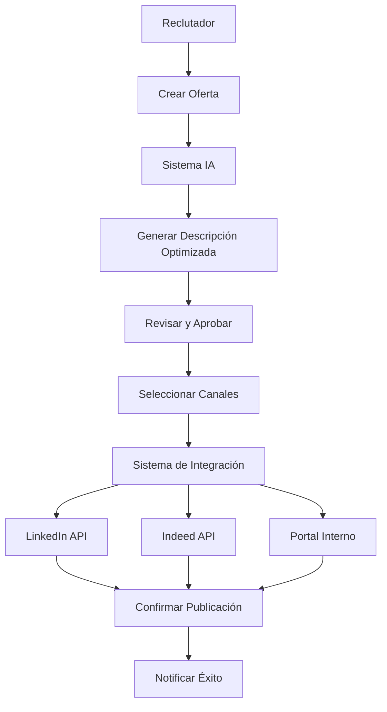
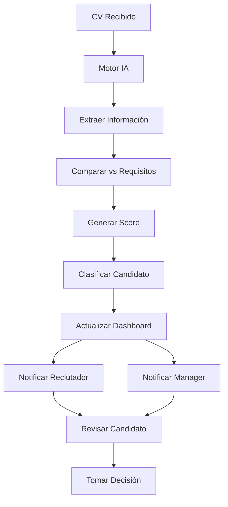
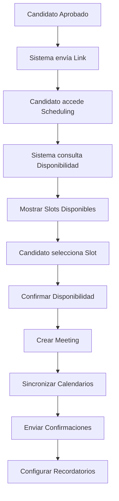
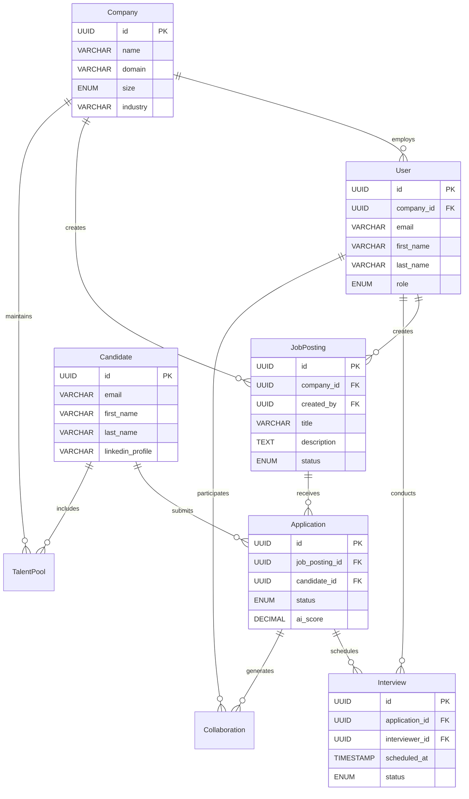
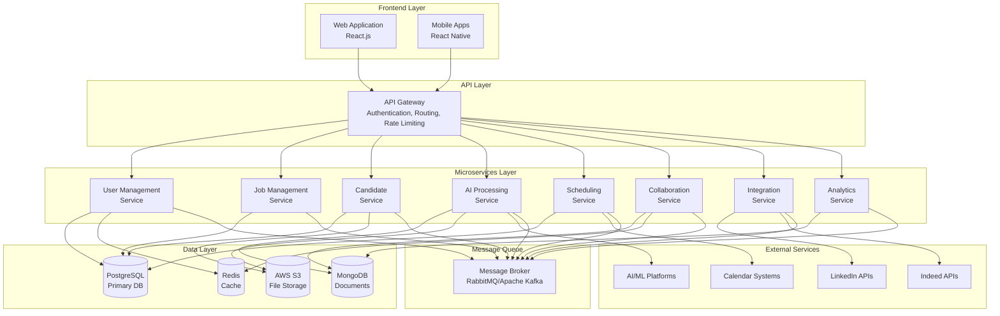
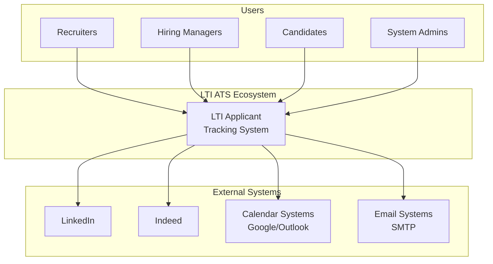
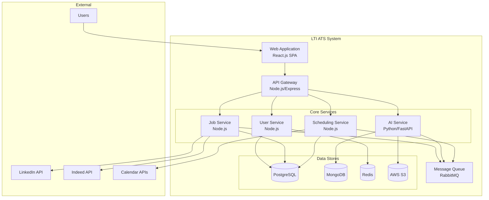
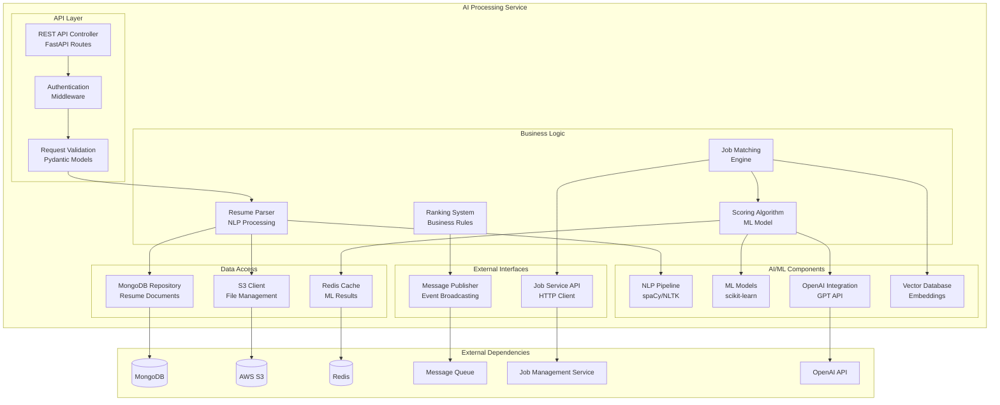
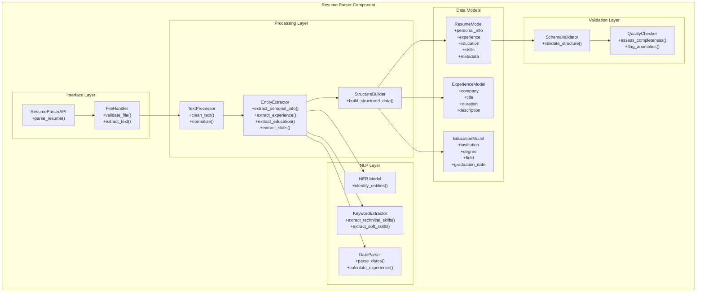

# LTI Applicant Tracking System - Diseño y Documentación

## 1. Investigación y Análisis de Requisitos

### 1.1 Descripción del Software de LTI

**LTI ATS** es una plataforma de seguimiento de candidatos diseñada específicamente para empresas pequeñas y medianas que buscan optimizar sus procesos de reclutamiento mediante automatización inteligente y colaboración en tiempo real.

### 1.2 Valor Añadido y Ventajas Competitivas

**Principales Diferenciadores:**

- **Publicación Multi-Canal en 1 Click**: Automatización completa para publicar ofertas simultáneamente en LinkedIn, Indeed y portal propio
- **IA Integrada para Screening**: Análisis automático de CVs con scoring y matching inteligente
- **Colaboración en Tiempo Real**: Sistema de comentarios, votaciones y evaluaciones colaborativas entre reclutadores y managers
- **Auto-Scheduling Inteligente**: Los candidatos pueden auto-programar entrevistas basándose en disponibilidad de entrevistadores
- **Talent Pool Proactivo**: Scraper de LinkedIn para construir una base de datos propia de candidatos potenciales
- **Dashboard Unificado**: Vista centralizada del pipeline completo con métricas en tiempo real

### 1.3 Principales Funciones

**Core Functions:**
1. **Gestión de Ofertas de Trabajo**: Creación, publicación automática y seguimiento
2. **Análisis Inteligente de CVs**: Procesamiento con IA para scoring y matching
3. **Pipeline de Candidatos**: Seguimiento automatizado por etapas del proceso
4. **Colaboración Multi-Usuario**: Comentarios, evaluaciones y decisiones colaborativas
5. **Programación Automática**: Self-scheduling de entrevistas con integración calendarios
6. **Talent Sourcing**: Scraping proactivo y gestión de talent pool
7. **Reportes y Analytics**: Métricas de rendimiento y insights predictivos

### 1.4 Lean Canvas del Modelo de Negocio

```
┌─────────────────────┬───────────────────┬─────────────────────┬───────────────────┬─────────────────────┐
│    PROBLEMA         │  SOLUCIÓN         │  PROPUESTA ÚNICA    │   VENTAJA JUSTA   │    SEGMENTO DE      │
│                     │                   │     DE VALOR        │                   │    CLIENTES         │
├─────────────────────┼───────────────────├─────────────────────┼───────────────────├─────────────────────┤
│ • Procesos de       │ • Publicación     │ El único ATS que    │ • Tecnología IA   │ • PYMEs 50-500      │
│   reclutamiento     │   multi-canal     │ combina IA, auto-   │   propietaria     │   empleados         │
│   manuales lentos   │   automatizada    │ matización total    │ • Integración     │ • Startups en       │
│ • Falta colabora-   │ • IA para         │ y colaboración en   │   nativa LinkedIn │   crecimiento       │
│   ción HR-Managers  │   screening       │ tiempo real en una  │ • Modelo SaaS     │ • Empresas sin      │
│ • Herramientas      │ • Colaboración    │ sola plataforma     │   escalable       │   ATS actual        │
│   desconectadas     │   tiempo real     │                     │                   │                     │
│ • Talent sourcing   │ • Auto-scheduling │                     │                   │                     │
│   reactivo          │ • Talent pool     │                     │                   │                     │
├─────────────────────┴───────────────────┼─────────────────────┼───────────────────┼─────────────────────┤
│           MÉTRICAS CLAVE                │    CANALES          │    ESTRUCTURA     │    FLUJO DE         │
│                                         │                     │    DE COSTOS      │    INGRESOS         │
├─────────────────────────────────────────┼─────────────────────┼───────────────────┼─────────────────────┤
│ • Time-to-hire reducido 50%             │ • Marketing digital │ • Desarrollo      │ • SaaS mensual      │
│ • Tasa adopción 80% primer mes          │ • Partnerships HR   │   tecnológico     │   $99-399/mes       │
│ • NPS > 70                              │ • Referencias       │ • Infraestructura │ • Setup fee         │
│ • Retención clientes > 90%              │ • Content marketing │   cloud           │ • Integraciones     │
│ • CAC < 3 meses LTV                     │ • Webinars/demos    │ • Equipo comercial│   premium           │
└─────────────────────────────────────────┴─────────────────────┴───────────────────┴─────────────────────┘
```

## 2. Definición de Casos de Uso

### 2.1 Caso de Uso 1: Publicación Automatizada de Ofertas

**Descripción**: El reclutador crea una oferta de trabajo y la publica automáticamente en múltiples plataformas con un solo click.

**Actores**: Reclutador, Sistema de Integración, LinkedIn API, Indeed API

**Precondiciones**: 
- Usuario autenticado con permisos de publicación
- Cuentas empresariales conectadas en LinkedIn e Indeed

**Flujo Principal**:
1. Reclutador accede al módulo de creación de ofertas
2. Completa formulario con detalles de la posición
3. Sistema genera automáticamente descripción optimizada con IA
4. Reclutador revisa y aprueba contenido
5. Selecciona canales de publicación (LinkedIn, Indeed, portal interno)
6. Sistema publica simultáneamente en todas las plataformas
7. Sistema confirma publicación exitosa y proporciona enlaces de seguimiento

**Flujo Alternativo**:
- Si falla publicación en algún canal, sistema reintenta y notifica al usuario
- Si contenido no cumple políticas de plataforma, sistema sugiere modificaciones

**Postcondiciones**: Oferta publicada y activa en todos los canales seleccionados



### 2.2 Caso de Uso 2: Análisis Inteligente y Scoring de CVs

**Descripción**: El sistema analiza automáticamente CVs recibidos, genera scoring y presenta ranking de candidatos a reclutadores.

**Actores**: Sistema IA, Reclutador, Manager

**Precondiciones**: 
- Oferta de trabajo activa con criterios definidos
- CVs recibidos en el sistema

**Flujo Principal**:
1. Sistema detecta nuevo CV en aplicación
2. Motor de IA extrae información estructurada del CV
3. Sistema compara perfil contra requisitos de la oferta
4. Genera score basado en experiencia, skills, educación y keywords
5. Clasifica candidato en categorías (Excelente, Bueno, Regular, No Califica)
6. Actualiza dashboard con nuevo candidato rankeado
7. Envía notificación a reclutador y manager relevante
8. Proporciona resumen ejecutivo de fortalezas y gaps del candidato

**Flujo Alternativo**:
- Si CV tiene formato no estándar, sistema solicita procesamiento manual
- Si score es ambiguo, sistema marca para revisión humana

**Postcondiciones**: Candidato procesado, rankeado y disponible para revisión



### 2.3 Caso de Uso 3: Auto-Programación de Entrevistas

**Descripción**: Candidatos seleccionados pueden auto-programar entrevistas basándose en disponibilidad de entrevistadores.

**Actores**: Candidato, Sistema de Scheduling, Entrevistador, Sistema de Calendario

**Precondiciones**:
- Candidato aprobado para entrevista
- Entrevistadores con calendarios sincronizados
- Link de scheduling enviado al candidato

**Flujo Principal**:
1. Candidato recibe email con link personalizado de scheduling
2. Accede a interfaz de auto-programación
3. Sistema muestra slots disponibles basados en disponibilidad de entrevistadores
4. Candidato selecciona fecha y hora preferida
5. Sistema confirma disponibilidad en tiempo real
6. Genera meeting en calendarios de todos los participantes
7. Envía confirmaciones y detalles de la entrevista
8. Configura recordatorios automáticos 24h y 1h antes

**Flujo Alternativo**:
- Si no hay slots disponibles en timeframe solicitado, sistema sugiere alternativas
- Si candidato necesita reprogramar, puede hacerlo hasta 24h antes

**Postcondiciones**: Entrevista programada y confirmada en todos los calendarios



## 3. Modelado de Datos

### 3.1 Entidades Principales y Atributos

#### Company
- **id**: UUID (Primary Key)
- **name**: VARCHAR(255)
- **domain**: VARCHAR(100)
- **size**: ENUM('small', 'medium', 'large')
- **industry**: VARCHAR(100)
- **linkedin_company_id**: VARCHAR(50)
- **created_at**: TIMESTAMP
- **updated_at**: TIMESTAMP

#### User
- **id**: UUID (Primary Key)
- **company_id**: UUID (Foreign Key → Company.id)
- **email**: VARCHAR(255) UNIQUE
- **first_name**: VARCHAR(100)
- **last_name**: VARCHAR(100)
- **role**: ENUM('admin', 'recruiter', 'hiring_manager', 'interviewer')
- **is_active**: BOOLEAN
- **calendar_integration**: JSON
- **created_at**: TIMESTAMP
- **updated_at**: TIMESTAMP

#### JobPosting
- **id**: UUID (Primary Key)
- **company_id**: UUID (Foreign Key → Company.id)
- **created_by**: UUID (Foreign Key → User.id)
- **title**: VARCHAR(255)
- **department**: VARCHAR(100)
- **location**: VARCHAR(255)
- **employment_type**: ENUM('full_time', 'part_time', 'contract', 'internship')
- **experience_level**: ENUM('entry', 'mid', 'senior', 'executive')
- **description**: TEXT
- **requirements**: JSON
- **salary_range_min**: DECIMAL(10,2)
- **salary_range_max**: DECIMAL(10,2)
- **status**: ENUM('draft', 'published', 'paused', 'closed')
- **linkedin_post_id**: VARCHAR(50)
- **indeed_post_id**: VARCHAR(50)
- **expires_at**: TIMESTAMP
- **created_at**: TIMESTAMP
- **updated_at**: TIMESTAMP

#### Candidate
- **id**: UUID (Primary Key)
- **email**: VARCHAR(255) UNIQUE
- **first_name**: VARCHAR(100)
- **last_name**: VARCHAR(100)
- **phone**: VARCHAR(20)
- **location**: VARCHAR(255)
- **linkedin_profile**: VARCHAR(500)
- **resume_url**: VARCHAR(500)
- **source**: ENUM('linkedin', 'indeed', 'referral', 'direct', 'scraper')
- **created_at**: TIMESTAMP
- **updated_at**: TIMESTAMP

#### Application
- **id**: UUID (Primary Key)
- **job_posting_id**: UUID (Foreign Key → JobPosting.id)
- **candidate_id**: UUID (Foreign Key → Candidate.id)
- **status**: ENUM('applied', 'screening', 'interview', 'offer', 'hired', 'rejected')
- **ai_score**: DECIMAL(5,2)
- **ai_analysis**: JSON
- **cover_letter**: TEXT
- **applied_at**: TIMESTAMP
- **updated_at**: TIMESTAMP

#### Interview
- **id**: UUID (Primary Key)
- **application_id**: UUID (Foreign Key → Application.id)
- **interviewer_id**: UUID (Foreign Key → User.id)
- **type**: ENUM('phone', 'video', 'onsite', 'technical')
- **scheduled_at**: TIMESTAMP
- **duration_minutes**: INTEGER
- **meeting_link**: VARCHAR(500)
- **status**: ENUM('scheduled', 'completed', 'cancelled', 'no_show')
- **feedback**: TEXT
- **rating**: INTEGER CHECK (rating >= 1 AND rating <= 5)
- **created_at**: TIMESTAMP
- **updated_at**: TIMESTAMP

#### Collaboration
- **id**: UUID (Primary Key)
- **application_id**: UUID (Foreign Key → Application.id)
- **user_id**: UUID (Foreign Key → User.id)
- **type**: ENUM('comment', 'rating', 'status_change')
- **content**: TEXT
- **rating**: INTEGER CHECK (rating >= 1 AND rating <= 5)
- **is_private**: BOOLEAN
- **created_at**: TIMESTAMP

#### TalentPool
- **id**: UUID (Primary Key)
- **candidate_id**: UUID (Foreign Key → Candidate.id)
- **company_id**: UUID (Foreign Key → Company.id)
- **source_url**: VARCHAR(500)
- **skills**: JSON
- **experience_years**: INTEGER
- **current_company**: VARCHAR(255)
- **current_title**: VARCHAR(255)
- **engagement_score**: DECIMAL(5,2)
- **last_contacted**: TIMESTAMP
- **created_at**: TIMESTAMP
- **updated_at**: TIMESTAMP

### 3.2 Relaciones entre Entidades



## 4. Diseño del Sistema y Arquitectura de Alto Nivel

### 4.1 Arquitectura General

LTI ATS sigue una **arquitectura de microservicios** desplegada en la nube, diseñada para escalabilidad, mantenibilidad y alta disponibilidad. El sistema se compone de varios servicios especializados que se comunican a través de APIs REST y eventos asincrónicos.

### 4.2 Componentes Principales

#### Frontend Layer
- **Web Application**: React.js SPA con estado global (Redux/Zustand)
- **Mobile Apps**: React Native para iOS/Android (futuro)
- **Real-time Features**: WebSocket para colaboración en tiempo real

#### API Gateway
- **Authentication & Authorization**: JWT tokens, RBAC
- **Rate Limiting**: Protección contra abuso
- **Request Routing**: Dirigir requests a microservicios apropiados
- **Load Balancing**: Distribución de carga

#### Core Microservices
1. **User Management Service**: Autenticación, autorización, perfiles
2. **Job Management Service**: CRUD de ofertas, publicación multi-canal
3. **Candidate Service**: Gestión de candidatos y aplicaciones
4. **AI Processing Service**: Análisis de CVs, scoring, matching
5. **Scheduling Service**: Auto-programación de entrevistas
6. **Collaboration Service**: Comentarios, ratings, notificaciones tiempo real
7. **Integration Service**: Conectores LinkedIn, Indeed, calendarios
8. **Analytics Service**: Métricas, reportes, insights

#### Data Layer
- **Primary Database**: PostgreSQL (datos transaccionales)
- **Document Store**: MongoDB (CVs, análisis IA, configuraciones)
- **Cache Layer**: Redis (sesiones, datos frecuentes)
- **File Storage**: AWS S3 (CVs, documentos adjuntos)

#### External Integrations
- **LinkedIn APIs**: Talent Solutions, Company Pages
- **Indeed APIs**: Job Posting, Application Management
- **Calendar Systems**: Google Calendar, Outlook, Office 365
- **AI/ML Platforms**: OpenAI GPT, AWS Comprehend, Custom ML models

### 4.3 Diagrama de Arquitectura de Alto Nivel



### 4.4 Patrones de Arquitectura Implementados

#### Event-Driven Architecture
- **Event Sourcing**: Para auditabilidad completa de cambios
- **CQRS**: Separación de comandos y queries para optimización
- **Saga Pattern**: Para transacciones distribuidas

#### Scalability Patterns
- **Database Sharding**: Por company_id para aislamiento de datos
- **Horizontal Scaling**: Auto-scaling basado en métricas
- **CDN Integration**: Para assets estáticos y contenido global

#### Reliability Patterns
- **Circuit Breaker**: Para manejo de fallos en servicios externos
- **Retry Logic**: Con backoff exponencial
- **Health Checks**: Monitoreo continuo de servicios

## 5. Documentación - Diagrama C4

### 5.1 Diagrama C4 - Nivel 1: Contexto del Sistema



### 5.2 Diagrama C4 - Nivel 2: Contenedores



### 5.3 Diagrama C4 - Nivel 3: Componentes (AI Processing Service)



### 5.4 Diagrama C4 - Nivel 4: Código (Resume Parser Component)



---

## Conclusión

Este diseño presenta una arquitectura robusta y escalable para el LTI Applicant Tracking System, enfocado en las ventajas competitivas clave: automatización inteligente, colaboración en tiempo real, y eficiencia operacional. 

La arquitectura de microservicios propuesta permite escalabilidad independiente de cada componente, mientras que la integración de IA y las automatizaciones proporcionan el diferenciador competitivo necesario para destacar en el mercado de ATS para PYMEs.

**Próximos Pasos Recomendados:**
1. Desarrollo del MVP enfocado en los 3 casos de uso principales
2. Implementación de integraciones LinkedIn e Indeed
3. Desarrollo del motor de IA para análisis de CVs
4. Pruebas de concepto con empresas piloto
5. Iteración basada en feedback de usuarios