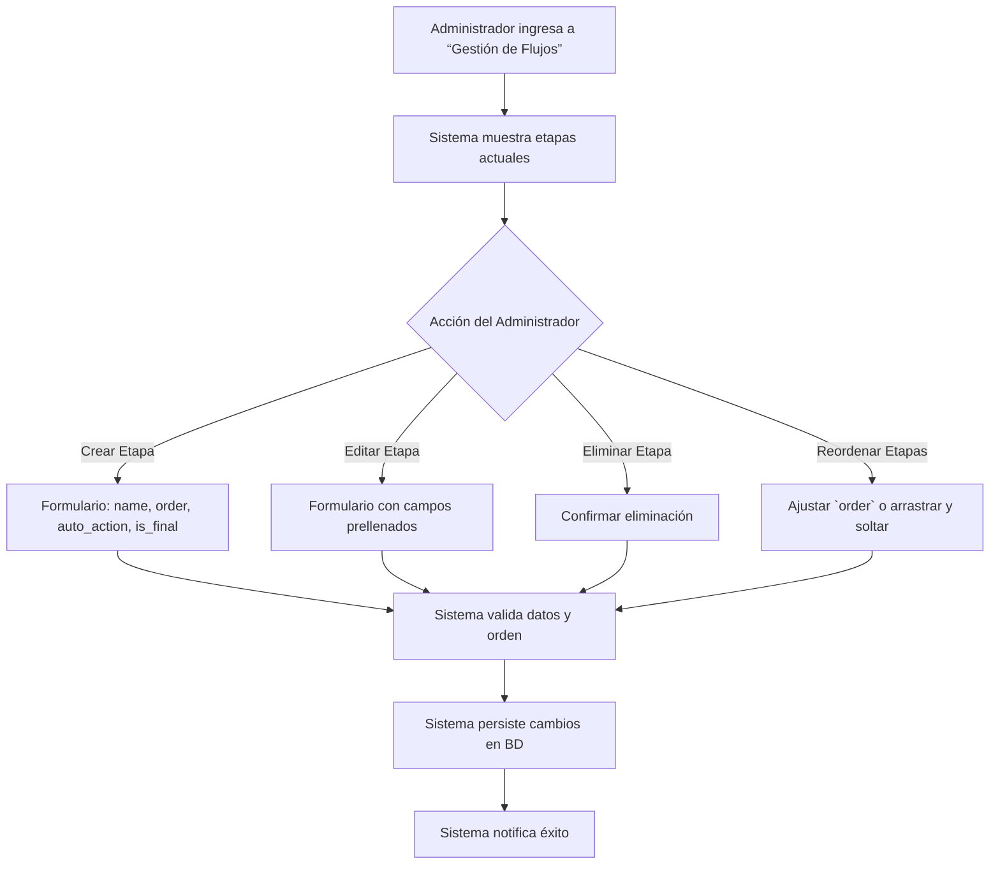
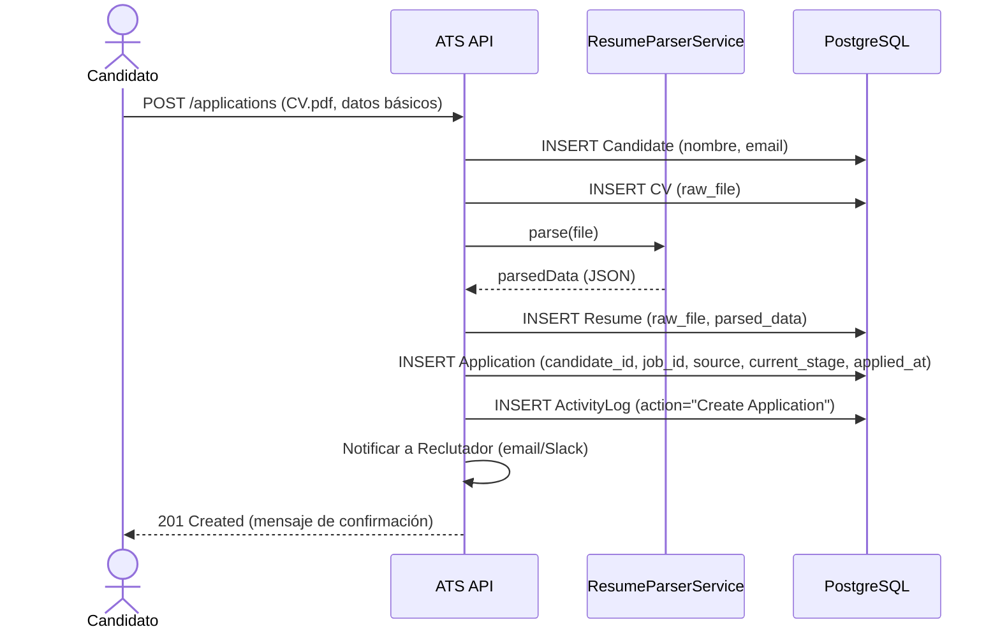
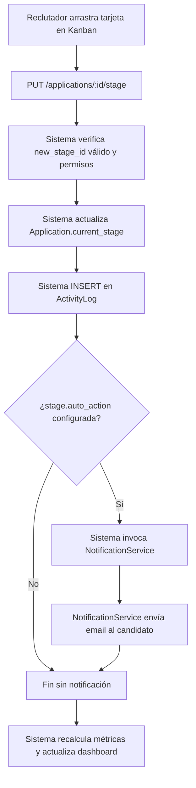
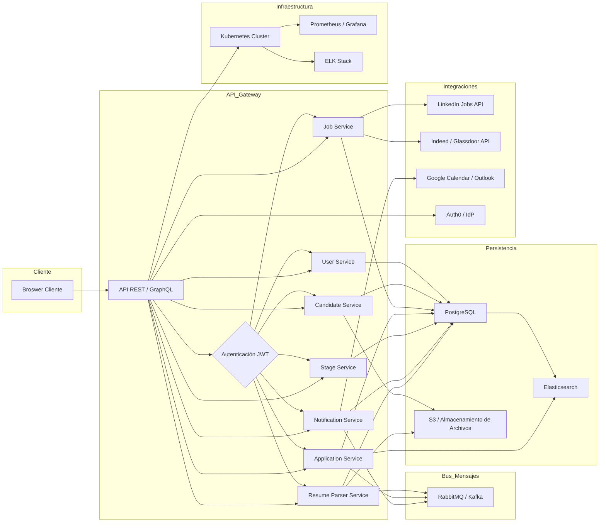
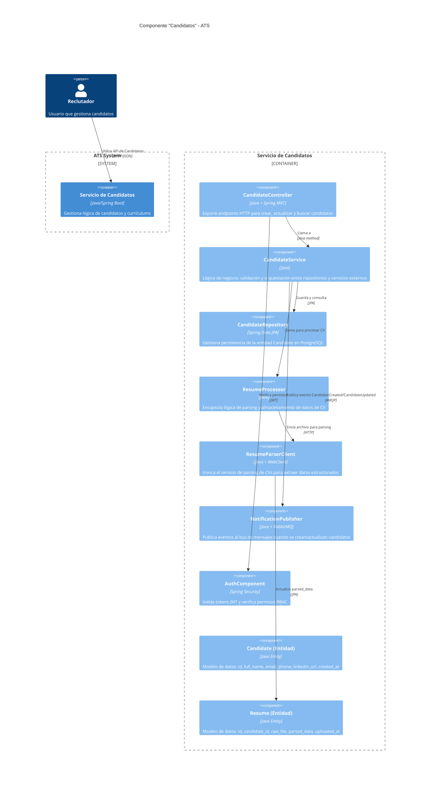

# Applicant Tracking System (ATS) - Descripción Breve

## ¿Qué es un ATS?

Un **Applicant Tracking System (ATS)** es un software especializado diseñado para **automatizar y optimizar el proceso completo de reclutamiento y selección de personal**. Funciona como un sistema centralizado que permite a los equipos de Recursos Humanos y reclutadores gestionar eficientemente el ciclo de vida de las contrataciones.

## Características Esenciales

### Centralización de candidaturas
- Agrega CVs de múltiples fuentes:
  - Portales de empleo
  - Correo electrónico
  - Sitio web corporativo

### Automatización de flujos
- Define etapas personalizadas:
  - Screening inicial
  - Entrevistas técnicas
  - Proceso de ofertas

### Comunicación inteligente
- Sistema de envío automático de:
  - Emails basados en eventos
  - Notificaciones de estado
  - Recordatorios programados

### Análisis predictivo
- Proporciona:
  - Métricas de rendimiento
  - Insights para mejoras
  - Datos para decisiones estratégicas

## Propósito Principal

> "Transformar el reclutamiento de un proceso manual y fragmentado en un flujo digitalizado, eficiente y basado en datos."

## Beneficios Clave

- ✅ **Reduce el time-to-hire** en hasta un 40%
- ✅ **Mejora la calidad** de las contrataciones
- ✅ **Optimiza la experiencia** del candidato
- ✅ **Proporciona visibilidad completa** del proceso

## Tecnología Subyacente

- **Arquitectura**: Modular y escalable
- **Inteligencia Artificial**: Motor para análisis de CVs
- **Integraciones**:
  - LinkedIn
  - Indeed
  - Sistemas HRIS
- **Cumplimiento**:
  - GDPR
  - ISO 27001

## Conclusión

*En esencia*: Un ATS es el sistema nervioso central para equipos de reclutamiento que buscan eficiencia, calidad y escalabilidad en sus procesos de contratación.

# Ventajas Competitivas y Valor Añadido de Nuestro ATS

A continuación se presentan las principales ventajas competitivas y el valor añadido que ofrece nuestro software en comparación con los productos analizados en el documento:

---

## 1. Arquitectura Modular y Escalable

- **Diseño Hexagonal**  
  - Separación clara entre núcleo de dominio, adaptadores y puertos.  
  - Facilidad para intercambiar o actualizar componentes (por ejemplo, cambiar el motor de parsing de CV sin afectar la lógica de negocio).  
  - Permite escalabilidad granular: servicios críticos como “Resume Parser” y “Notification Service” pueden escalarse de forma independiente.

- **Microservicios y Contenedorización**  
  - Despliegue basado en contenedores (Docker/Kubernetes) para aislamiento y resiliencia.  
  - Soporte para “Canary Releases” y monitoreo con Prometheus/Grafana.  
  - Autoscaling automático en servicios de alta demanda (parsing, búsqueda).

---

## 2. Parsing Inteligente y Matching Avanzado

- **Integración con Apache Tika + IA**  
  - Módulo de parsing que combina OCR básico y modelos de machine learning para extraer con alta precisión habilidades, experiencia y educación desde CVs en formatos PDF/DOCX.  
  - Reducción de errores de extracción (mejor que el parsing básico de la mayoría de ATS open source).  

- **Estructura de Datos “parsed_data” en JSONB**  
  - Almacena información estructurada (habilidades, idiomas, años de experiencia) para búsquedas y matching más precisos.  
  - Permite alimentar motores de recomendación basados en “skill weights” (ponderaciones de habilidades) y perfiles de vacante requeridos.  

- **Matching Automático con Skills**  
  - Relación N:M entre Job↔Skill y Candidate↔Skill.  
  - Cálculo de “score” de compatibilidad (0–100) que supera el scoring de palabras clave de otros ATS básicos.  
  - Sugerencias proactivas de candidatos pasivos basadas en análisis de habilidades y experiencia histórica.

---

## 3. Experiencia de Usuario Diferenciada

- **Stack Moderno con Vue.js 3 + PrimeVue + Tailwind CSS**  
  - Interfaz reactiva y altamente personalizable (tableros Kanban, filtros dinámicos, vistas responsivas).  
  - Temas claros/oscuro, rutas SPA para navegación fluida y carga diferida de módulos.  
  - Componentes con comentarios en cada módulo para acelerar la adopción por parte de equipos de desarrollo.

- **Diseño Centrado en Flujo de Trabajo (UX)**  
  - Flechas y dependencias visuales en tableros Kanban, con arrastrar/soltar intuitivo.  
  - Animaciones suaves (Framer Motion) al mover candidatos, generando feedback visual inmediato.  
  - Búsqueda avanzada “tipo Google” con autocompletado y filtros contextuales (habilidades, origen, estado).

- **Portal de Candidato Moderno**  
  - Interfaz web responsive con feedback en tiempo real sobre estado de aplicación.  
  - Chatbot o widgets de seguimiento integrados en la página “Trabaja con Nosotros”, mejorando la percepción de marca empleadora.

---

## 4. Módulo de Automatización Robusto

- **Emails y Notificaciones Basadas en Eventos**  
  - Envío automático de plantillas de email (rechazo, invitación a entrevista, recordatorio) al cambiar etapa o tras ciertas condiciones (p. ej., sin feedback en X días).  
  - Integración nativa con proveedores de correo (SendGrid) y colas de mensajes (RabbitMQ para baja latencia).  
  - Registros detallados en ActivityLog para auditoría de cada mensaje enviado.

- **Recordatorios y Seguimiento Proactivo**  
  - Alertas automáticas a hiring managers cuando hay aplicaciones sin revisar por más de 48 horas.  
  - Notificaciones push (Slack/Webhooks) para equipos de reclutamiento, manteniendo ritmo de respuesta competitivo.  

- **Generación de Reportes en Tiempo Real**  
  - Dashboards configurables con métricas clave (time-to-hire, cost-per-hire, ratio por canal de origen) sobre Elasticsearch y Grafana.  
  - Exportación automática de informes a formatos CSV/PDF con un solo clic.  

---

## 5. Seguridad y Cumplimiento

- **Cumplimiento GDPR/LOPD**  
  - Almacenamiento cifrado de datos sensibles (emails, teléfonos) y posibilidad de “right to be forgotten” para candidatos.  
  - ActivityLog detallado que respalda auditorías y políticas de “consentimiento explícito” en la recolección de datos.

- **Control de Accesos Basado en Roles (RBAC)**  
  - Roles predefinidos (Admin, Reclutador, Hiring Manager) con permisos granulares.  
  - Configuración flexible de permisos por vacante: un hiring manager solo ve aplicaciones de sus posiciones asignadas.  
  - Autenticación JWT con validación en cada llamada a API, reduciendo superficies de ataque.

- **Monitoreo y Resiliencia**  
  - Circuit Breaker y retry con backoff en integraciones externas (portales de empleo, servicios de calendario).  
  - Particionamiento de tablas críticas (p. ej., activity_log por tipo de entidad) para mantener performance en altas cargas.

---

## 6. Modelo de Datos Flexible y Extensible

- **Entidades Clave con JSONB y Arrays**  
  - Uso de JSONB para parsed_data en Resume y permissions en User, permitiendo cambios futuros sin migraciones costosas.  
  - Array de interviewers en Interview para entrevistas con varios evaluadores.  

- **Tablas “puente” para Matching Avanzado**  
  - resume_skills con confidence_score para priorizar habilidades extraídas.  
  - Relación directa entre Job y Skill para filtros precisos en la creación de vacantes.

- **Posibilidad de Ampliación**  
  - Fácil incorporación de entidades adicionales (p.ej., “Assessment”, “Reference Check”) sin reestructurar el core.  
  - Compatibilidad con módulos de onboarding y verificación de antecedentes como extensiones plug-and-play.

---

## 7. Integraciones Nativas y Ecosistema

- **Publicación Multicanal Automática**  
  - Conectores pre-construidos para LinkedIn Jobs, Indeed, Glassdoor y portales locales (ej: OCCMundial).  
  - Sincronización de vacantes mediante OAuth2 y APIs de portales, garantizando cobertura inmediata al publicar.

- **Sincronización de Calendarios**  
  - Adaptadores para Google Calendar y Outlook via gRPC, permitiendo que entrevistas se agenden en la misma ventana sin duplicar eventos.  
  - Recordatorios automáticos de entrevistas vía email y notificaciones push (Slack, MS Teams).

- **Bus de Mensajes para Extensibilidad**  
  - Arquitectura basada en eventos (Kafka/RabbitMQ) que facilita añadir nuevos módulos (p.ej., “Referral Program”) sin interrumpir flujos existentes.  

---

## 8. Comparativa Sintética con ATS Líderes

| Criterio                         | Nuestro ATS                         | OpenCATS / Alfresco             | Greenhouse / Workday / Lever                       |
|----------------------------------|-------------------------------------|---------------------------------|-----------------------------------------------------|
| **Precisión de Parsing**         | Alta (IA + OCR + validación manual) | Baja–Media (OCR básico)         | Media–Alta (soluciones propietarias, pero con costo) |
| **Modularidad / Extensibilidad** | Muy alta (Hexagonal + microservicios)| Baja (monolíticos legacy)       | Media (algunas personalizaciones difíciles)         |
| **Experiencia de Usuario (UX)**  | Muy fluida (Vue 3 + PrimeVue + Tailwind)| Antigua / Poco intuitiva       | Alta, pero curva de aprendizaje variable            |
| **Automatizaciones Integradas**  | Robusta (eventos, colas, notificaciones) | Limitadas (scripts simples)   | Avanzadas, aunque a menudo requieren módulos extra  |
| **Costo Total de Propiedad (TCO)**| Competitivo (licencia + soporte moderado) | Muy bajo (self-hosted)        | Alto (licencias SaaS + consultoría obligatoria)     |
| **Seguridad y Cumplimiento**     | GDPR/LOPD + ActivityLog completo    | Varía según configuración       | Cumple, pero con costos de consultoría elevados     |
| **Time-to-Market**               | Rápido (arquitectura desacoplada)   | Medio–Alto (instalación y configuración manual) | Medio (formación y configuración extensiva)         |
| **Reporting en Tiempo Real**     | Sí (Elasticsearch + Grafana)        | Básico (o requiere plugins)     | Sí, pero con costos adicionales por add-ons         |

---

## 9. Valor Añadido Específico

1. **Reducción del Time-to-Hire**  
   - Algoritmos de matching automático y notificaciones proactivas ayudan a recortar un 30–40 % del ciclo de contratación.  

2. **Mejora de Employer Branding**  
   - Portal de candidato responsivo con seguimiento en tiempo real y comunicación coherente, aumentando la percepción positiva de la marca empleadora.  

3. **Menor Curva de Aprendizaje**  
   - Documentación clara y comentarios en el código (Vue.js + PrimeVue) reduce el tiempo de onboarding de desarrolladores y reclutadores.  

4. **ROI Visible desde Meses Tempranos**  
   - KPI configurables que muestran ahorro en costes de agencias externas (hasta \$5 k por vacante) y mejora en retención (+15–30 %) pueden medirse fácilmente con reportes automatizados.  

5. **Soporte a Decisiones con Data Analytics**  
   - Integración total de métricas en dashboards configurables: permite identificar fuentes efectivas, cuellos de botella en el flujo y conducir mejoras continuas sin depender de hojas de cálculo manuales.  

6. **Alta Adaptabilidad a Normativas**  
   - Módulo “ActivityLog” garantiza trazabilidad completa en cada cambio de estado, facilitando auditorías de cumplimiento normativo sin incurrir en grandes costos.

---

## 10. Conclusión

Nuestro ATS combina lo mejor de los enfoques comerciales y open source, aportando:

- **Modularidad y escalabilidad** heredadas de la Arquitectura Hexagonal.  
- **Parsing y matching potenciado por IA**, más allá de la simple búsqueda por palabras clave.  
- **Experiencia de usuario premium** (Vue.js 3 + Tailwind + Kanban reactivo).  
- **Automatización avanzada** con colas, recordatorios y reportes en tiempo real.  
- **Seguridad y cumplimiento** garantizados desde su concepción.  

Esta propuesta se traduce en una plataforma más eficiente, flexible y económica que atiende tanto a PYMES como a empresas medianas y grandes, ofreciendo un **valor añadido diferencial** frente a las soluciones ya analizadas.

---
## Diagrama Lean Canvas
| **Problema**                                                                                  | **Segmentos de Clientes**                                                       | **Propuesta de Valor Única**                                                                                                                                   |
|-----------------------------------------------------------------------------------------------|----------------------------------------------------------------------------------|----------------------------------------------------------------------------------------------------------------------------------------------------------------|
| - Procesos de reclutamiento manuales, lentos y propensos a errores.  - Pérdida de candidatos por falta de seguimiento centralizado.  - Comunicación inconsistente con aspirantes (rechazos tardíos, datos dispersos).                                                   | - Empresas medianas y grandes con >15 vacantes/año.  - Agencias de staffing y consultoras de RR.HH.  - PYMES que comienzan a escalar su equipo de reclutamiento.  - Departamentos de Recursos Humanos que requieren trazabilidad y métricas. | **ATS modular, escalable e inteligente que reduce el time-to-hire en un 30-40 % y mejora la calidad de contratación.** - Parsing IA avanzado. - Dashboard Kanban reactivo. - Automatización de notificaciones y reportes en tiempo real. |

| **Solución**                                                                                                                     | **Canales**                                                                                   | **Fuentes de Ingresos**                                                                                              |
|----------------------------------------------------------------------------------------------------------------------------------|------------------------------------------------------------------------------------------------|-----------------------------------------------------------------------------------------------------------------------|
| - Plataforma web SaaS con arquitectura hexagonal y microservicios.  - Módulo de parsing de CVs (IA + OCR) con JSONB estructurado.  - Interfaz Vue.js 3 + PrimeVue + Tailwind para tableros Kanban y filtros avanzados.  - Automatización de emails, recordatorios y reportes en Elasticsearch/Grafana.  - API REST para integraciones con LinkedIn, Google Calendar, HRIS. | - Venta directa (equipo de ventas B2B).  - Marketplace de partners tecnológicos (consultoras de RR.HH.).  - Marketing de contenidos (blog especializado en reclutamiento).  - Webinars y demostraciones en línea.  - Alianzas con portales de empleo (LinkedIn, Indeed). | - Licencia SaaS por usuario/mes (modelo escalable).  - Tarifas adicionales por módulo avanzado (AI Parser, Reportes Premium).  - Servicios de implementación y onboarding personalizados.  - Soporte técnico con niveles (basico/premium). |

| **Estructura de Costos**                                                                                                          | **Métricas Clave**                                                                                           | **Ventaja Competitiva**                                                                                                                                                                                         |
|-----------------------------------------------------------------------------------------------------------------------------------|--------------------------------------------------------------------------------------------------------------|------------------------------------------------------------------------------------------------------------------------------------------------------------------------------------------------------------------|
| - Desarrollo y mantenimiento de microservicios (parsing, notificaciones, UI).  - Infraestructura en Kubernetes (hosting, escalado).  - Licencias de herramientas externas (Elasticsearch, SendGrid).  - Equipo de soporte y atención al cliente.  - Gastos de ventas y marketing B2B (eventos, demos). | - Time-to-hire promedio (medición antes y después).  - Cantidad de vacantes gestionadas/mes.  - Tasa de adopción diaria/mensual por usuario.  - Número de integraciones activas (LinkedIn, Google Calendar).  - Retención de clientes (% de renovación anual). | - **Parsing IA y matching avanzado**: mayor precisión vs. ATS básicos y open source.  - **Arquitectura ultra-modular**: facilita actualizaciones sin interrupciones.  - **UX altamente reactiva**: despliegue rápido de filtros y tableros Kanban.  - **Automatización de reportes en tiempo real**: visibilidad inmediata sobre cuellos de botella.  - **Cumplimiento normativo incorporado** (GDPR/LOPD + ActivityLog). |

# Casos de Uso Principales

A continuación se describen los tres casos de uso más críticos de nuestro ATS, junto con la descripción del diagrama asociado a cada uno.

---

## 1. UC1: Gestionar Flujos de Trabajo

**Descripción**  
Este caso de uso permite al **Administrador** definir y mantener las etapas personalizadas del proceso de selección para cada vacante. Incluye la creación, edición, eliminación y reordenamiento de etapas, así como la configuración de acciones automáticas al ingresar a una determinada etapa.

**Actores**  
- Administrador

**Precondiciones**  
- El administrador cuenta con permisos para modificar configuraciones globales.
- Existe por lo menos una vacante creada (aunque no es necesario que esté activa para modificar sus flujos).

**Flujo Principal**  
1. El Administrador accede al módulo de “Gestión de Flujos”.  
2. El sistema muestra la lista de etapas actuales, ordenadas según su numeración interna.  
3. El Administrador elige entre:  
   - Crear una nueva etapa, completando campos de nombre, orden, acción automática y si es final.  
   - Editar una etapa existente, modificando alguno de sus campos.  
   - Eliminar una etapa, confirmando que no hay vacantes activas que dependan de esa etapa.  
   - Reordenar etapas, ajustando el valor numérico de cada una o mediante arrastrar y soltar.  
4. El sistema valida que la nueva configuración no rompa dependencias críticas (por ejemplo, no se puede eliminar una etapa que tenga aplicaciones activas asignadas).  
5. Si la validación es exitosa, el sistema persiste los cambios en la base de datos.  
6. El sistema envía una notificación de éxito al Administrador.

**Postcondiciones**  
- Las etapas del proceso quedan disponibles para todas las vacantes (nuevas y existentes).  
- Cualquier vacante que utilice ese flujo reflejará inmediatamente los cambios de orden o las etapas añadidas/eliminadas.

**Diagrama Asociado (Descripción textual)**  
- El Administrador ingresa a la pantalla de “Gestión de Flujos”.  
- El sistema muestra la lista de etapas.  
- Desde esa pantalla, el Administrador puede seleccionar:  
  - **Crear Etapa** → abre formulario para ingresar nombre, orden, acción automática, indicador de etapa final.  
  - **Editar Etapa** → abre formulario prellenado con los datos de la etapa seleccionada.  
  - **Eliminar Etapa** → muestra cuadro de confirmación; si confirma, procede a eliminar.  
  - **Reordenar Etapas** → permite arrastrar en interfaz Kanban o cambiar valores de orden numérico.  
- Una vez realizada la acción, el sistema valida restricciones y, si todo es correcto, persiste los datos y notifica éxito.  

---

## 2. UC5: Recibir Candidatura

**Descripción**  
Este caso de uso cubre todo el proceso desde que un **Candidato** envía su currículum hasta que se crea una entrada en la tabla `Application` con datos estructurados. Incluye almacenamiento del archivo, parsing automático y notificación al reclutador.

**Actores**  
- Candidato  
- Sistema (componente de parsing y base de datos)

**Precondiciones**  
- La vacante (`Job`) está publicada y activa.  
- El Candidato completa los datos obligatorios (nombre, correo) y adjunta un archivo en formato PDF o DOCX.

**Flujo Principal**  
1. El Candidato envía su CV a través del formulario web (petición POST a `/applications`).  
2. El sistema guarda temporalmente el archivo y crea un registro preliminar en la tabla `Candidate` con datos básicos.  
3. El sistema envía el archivo al servicio de parsing (por ejemplo, Apache Tika combinado con modelos de IA).  
4. El servicio de parsing devuelve un bloque JSON con datos estructurados (habilidades, experiencia, educación).  
5. El sistema almacena el archivo original en la tabla `Resume` junto con el campo `parsed_data` (JSONB).  
6. Se crea un registro en la tabla `Application` que incluye:  
   - `candidate_id` (la referencia al candidato recién creado).  
   - `job_id` (la vacante a la que aplicó).  
   - `source` (por ejemplo, “Web”).  
   - `current_stage` (etapa inicial, por ejemplo “Preselección”).  
   - `applied_at` (marca de tiempo de la aplicación).  
7. El sistema inserta un registro en `ActivityLog` indicando la creación de la aplicación.  
8. El sistema envía una notificación (correo o mensaje en Slack) al reclutador asignado a la vacante.

**Postcondiciones**  
- El Candidato y su CV quedan registrados en las tablas `Candidate` y `Resume`.  
- La tabla `Application` almacena la nueva aplicación en la etapa inicial.  
- El reclutador recibe una alerta sobre la nueva candidatura.

**Diagrama Asociado (Descripción textual)**  
- El Candidato realiza una petición POST a la API con su CV y datos básicos.  
- El API crea un registro en la tabla `Candidate` y guarda el archivo adjunto en `Resume`.  
- El API invoca al servicio de parsing con el archivo.  
- El servicio de parsing responde con un bloque JSON (`parsed_data`).  
- El API almacena `parsed_data` y crea el registro en `Application`.  
- El API registra la acción en `ActivityLog`.  
- El API envía una notificación al Reclutador asignado.  
- Finalmente, el API devuelve al Candidato un mensaje de confirmación (código HTTP 201).

---

## 3. UC7: Mover Candidato entre Etapas

**Descripción**  
Este caso de uso permite al **Reclutador** (o al **Hiring Manager**) cambiar manualmente la etapa (`current_stage`) de una **Application** mediante un tablero Kanban. Al moverse de etapa, se registra auditoría y, en caso de haber una acción automática configurada para la nueva etapa, se envía un correo al Candidato.

**Actores**  
- Reclutador  
- Sistema

**Precondiciones**  
- La `Application` ya existe y se encuentra en alguna etapa válida del flujo.  
- El Reclutador tiene los permisos necesarios para modificar la etapa de esa vacante.

**Flujo Principal**  
1. El Reclutador abre el tablero Kanban correspondiente a la vacante.  
2. Arrastra la tarjeta del candidato desde la columna de **Etapa A** (por ejemplo “Preselección”) a la columna de **Etapa B** (por ejemplo “Entrevista Técnica”).  
3. El front-end emite una petición PUT a `/applications/{id}/stage` con el identificador de la nueva etapa (`new_stage_id`).  
4. El sistema verifica que `new_stage_id` pertenece al mismo `job_id` y que el Reclutador tiene permisos válidos.  
5. Si la verificación es exitosa, el sistema actualiza el valor de `current_stage` en la tabla `Application`.  
6. Se inserta un registro en `ActivityLog` con los datos:  
   - `user_id` del Reclutador que realizó el cambio.  
   - `entity_type` = “Application”.  
   - `entity_id` = identificador de la aplicación.  
   - `action` = “StageChange”.  
   - `changes` = { “from”: etapaAnterior, “to”: nuevaEtapa }.  
   - `timestamp` actual.  
7. El sistema revisa si la nueva etapa tiene configurada una acción automática (`auto_action`).  
   - Si existe, invoca al servicio de notificaciones para enviar la plantilla de correo correspondiente al Candidato.  
   - Si no existe acción automática, continúa sin enviar notificación.  
8. El sistema recalcula métricas (por ejemplo, tiempo promedio en cada etapa o tiempo total en proceso) y actualiza el dashboard de reportes en tiempo real.

**Postcondiciones**  
- La `Application` queda en la etapa destino (`new_stage_id`).  
- Si había una acción automática configurada, el Candidato recibe un correo de avance o rechazo según corresponda.  
- El `ActivityLog` registra fielmente el cambio de etapa con quién lo hizo y cuándo.  
- Las métricas en los reportes reflejan el nuevo estado y tiempos actualizados.

**Diagrama Asociado (Descripción textual)**  
- El Reclutador arrastra una tarjeta en el tablero Kanban para cambiar de etapa.  
- El front-end hace una petición PUT a la endpoint de actualización de etapa.  
- El sistema verifica que la nueva etapa pertenece a la misma vacante y que el Reclutador tiene permiso.  
- El sistema actualiza la columna `current_stage` en la tabla `Application`.  
- El sistema crea un registro en `ActivityLog` con los detalles del cambio.  
- El sistema evalúa si la nueva etapa tiene una acción automática configurada y, en caso afirmativo, envía el correo al Candidato.  
- El sistema recalcula y refresca las métricas del dashboard.

# Modelo de Datos para el ATS

A continuación se presenta el modelo de datos principal del sistema ATS, incluyendo entidades clave, sus atributos (nombre y tipo), y relaciones entre ellas.

---

## Entidades y Atributos

### 1. `User`
Representa a un usuario del sistema (Administrador, Reclutador, Hiring Manager).

| Atributo           | Tipo          | Descripción                                 |
|--------------------|---------------|---------------------------------------------|
| `id`               | UUID          | Identificador único                         |
| `name`             | VARCHAR(100)  | Nombre completo                             |
| `email`            | VARCHAR(150)  | Correo electrónico (único)                  |
| `password_hash`    | TEXT          | Contraseña cifrada                          |
| `role`             | ENUM          | 'admin', 'recruiter', 'manager'             |
| `is_active`        | BOOLEAN       | Estado activo/inactivo                      |
| `permissions`      | JSONB         | Permisos por módulo o vacante               |
| `created_at`       | TIMESTAMP     | Fecha de creación                           |

---

### 2. `Candidate`
Representa a una persona que ha aplicado a una o más vacantes.

| Atributo        | Tipo           | Descripción                                |
|-----------------|----------------|--------------------------------------------|
| `id`            | UUID           | Identificador único                        |
| `full_name`     | VARCHAR(100)   | Nombre completo del candidato              |
| `email`         | VARCHAR(150)   | Correo electrónico                         |
| `phone`         | VARCHAR(30)    | Número de teléfono                         |
| `linkedin_url`  | TEXT           | Enlace al perfil de LinkedIn               |
| `created_at`    | TIMESTAMP      | Fecha de registro                          |

---

### 3. `Resume`
Representa un currículum cargado por el candidato.

| Atributo        | Tipo       | Descripción                                   |
|-----------------|------------|-----------------------------------------------|
| `id`            | UUID       | Identificador único                           |
| `candidate_id`  | UUID       | FK → Candidate.id                             |
| `raw_file`      | BYTEA      | Archivo en bruto (PDF/DOCX)                   |
| `parsed_data`   | JSONB      | CV estructurado (educación, skills, etc.)     |
| `uploaded_at`   | TIMESTAMP  | Fecha de carga                                |

---

### 4. `Job`
Representa una vacante publicada.

| Atributo          | Tipo           | Descripción                                 |
|-------------------|----------------|---------------------------------------------|
| `id`              | UUID           | Identificador único                         |
| `title`           | VARCHAR(150)   | Título del puesto                           |
| `department`      | VARCHAR(100)   | Área o equipo                               |
| `location`        | VARCHAR(100)   | Ubicación                                   |
| `description`     | TEXT           | Detalles de la posición                     |
| `status`          | ENUM           | 'open', 'closed', 'draft'                   |
| `created_by`      | UUID           | FK → User.id (creador de la vacante)        |
| `created_at`      | TIMESTAMP      | Fecha de creación                           |

---

### 5. `Application`
Representa una postulación de un candidato a una vacante.

| Atributo         | Tipo       | Descripción                                |
|------------------|------------|--------------------------------------------|
| `id`             | UUID       | Identificador único                        |
| `candidate_id`   | UUID       | FK → Candidate.id                          |
| `job_id`         | UUID       | FK → Job.id                                |
| `resume_id`      | UUID       | FK → Resume.id                             |
| `source`         | VARCHAR(50)| 'web', 'email', 'linkedin', etc.           |
| `current_stage`  | UUID       | FK → Stage.id                              |
| `applied_at`     | TIMESTAMP  | Fecha de aplicación                        |

---

### 6. `Stage`
Representa una etapa del flujo de selección (p. ej., Preselección, Entrevista).

| Atributo         | Tipo          | Descripción                                 |
|------------------|---------------|---------------------------------------------|
| `id`             | UUID          | Identificador único                         |
| `job_id`         | UUID          | FK → Job.id                                 |
| `name`           | VARCHAR(100)  | Nombre de la etapa                          |
| `order`          | INT           | Posición en el flujo                        |
| `auto_action`    | VARCHAR(100)  | Nombre de acción automática (opcional)      |
| `is_final`       | BOOLEAN       | Si es una etapa de cierre                   |

---

### 7. `Skill`
Representa una habilidad específica extraída o definida manualmente.

| Atributo        | Tipo           | Descripción                               |
|-----------------|----------------|-------------------------------------------|
| `id`            | UUID           | Identificador único                       |
| `name`          | VARCHAR(100)   | Nombre de la habilidad                    |

---

### 8. `ResumeSkill`
Relación entre un CV y una habilidad extraída.

| Atributo       | Tipo     | Descripción                                  |
|----------------|----------|----------------------------------------------|
| `resume_id`    | UUID     | FK → Resume.id                               |
| `skill_id`     | UUID     | FK → Skill.id                                |
| `confidence`   | FLOAT    | Valor entre 0 y 1 basado en parsing          |

---

### 9. `JobSkill`
Relación entre una vacante y habilidades requeridas.

| Atributo     | Tipo   | Descripción                            |
|--------------|--------|----------------------------------------|
| `job_id`     | UUID   | FK → Job.id                            |
| `skill_id`   | UUID   | FK → Skill.id                          |
| `required`   | BOOLEAN| Si es obligatoria para la vacante     |

---

### 10. `Interview`
Representa una entrevista programada para una aplicación.

| Atributo         | Tipo         | Descripción                              |
|------------------|--------------|------------------------------------------|
| `id`             | UUID         | Identificador único                      |
| `application_id` | UUID         | FK → Application.id                      |
| `interviewers`   | UUID[]       | Lista de FK → User.id                    |
| `scheduled_at`   | TIMESTAMP    | Fecha y hora de la entrevista            |
| `location`       | TEXT         | Link de videollamada o sala              |
| `feedback`       | TEXT         | Comentario del entrevistador             |

---

### 11. `ActivityLog`
Registro de auditoría para cualquier acción relevante.

| Atributo        | Tipo        | Descripción                                      |
|-----------------|-------------|--------------------------------------------------|
| `id`            | UUID        | Identificador único                              |
| `user_id`       | UUID        | FK → User.id (actor que ejecutó la acción)       |
| `entity_type`   | VARCHAR(50) | 'application', 'candidate', 'job', etc.          |
| `entity_id`     | UUID        | ID del objeto afectado                           |
| `action`        | VARCHAR(100)| Acción realizada (p. ej., 'StageChange')         |
| `changes`       | JSONB       | Datos de antes/después (si aplica)               |
| `timestamp`     | TIMESTAMP   | Momento exacto de la acción                      |

---

## Relaciones entre Entidades

- Un `User` puede **crear múltiples** `Job`, y ser **entrevistador** en múltiples `Interview`.
- Un `Candidate` puede tener **uno o más** `Resume`, y puede aplicar a **varias** `Job` a través de `Application`.
- Cada `Application` pertenece a **un** `Candidate`, **una** `Job`, y **un** `Resume`.
- Cada `Job` tiene **un conjunto de** `Stage` ordenadas.
- Un `Resume` tiene **muchas** `ResumeSkill` (habilidades extraídas).
- Un `Job` tiene **muchas** `JobSkill` (habilidades requeridas).
- Una `Application` puede tener **una o más** `Interview`.
- Todas las acciones relevantes del sistema son registradas en `ActivityLog`.

---
# Diseño de Sistema a Alto Nivel

El siguiente diseño muestra los componentes principales de la arquitectura del ATS y sus interacciones.

---

## Descripción de Componentes

- **Cliente Web (Frontend)**  
  - Framework: Vue.js 3 + PrimeVue + Tailwind CSS  
  - Responsivo y dinámico, incluye tableros Kanban, formularios y dashboards de métricas.

- **API Gateway / Servidor de Aplicación**  
  - Endpoints REST/GraphQL expuestos para operaciones de CRUD y casos de uso.  
  - Autenticación JWT y validación de permisos RBAC.

- **Servicios de Dominio**  
  - **User Service**: Gestión de usuarios, roles y permisos.  
  - **Candidate Service**: Administración de candidatos y currículums.  
  - **Job Service**: Creación y administración de vacantes.  
  - **Application Service**: Recepción y procesamiento de aplicaciones, gestión de etapas.  
  - **Stage Service**: Definición y gestión de flujos de selección.  
  - **Notification Service**: Envío de correos y notificaciones (integración SendGrid / Slack).  
  - **Resume Parser Service**: Parsing de archivos PDF/DOCX mediante Apache Tika + módulo IA.

- **Persistencia y Búsqueda**  
  - **Base de Datos relacional** (PostgreSQL): Almacenamiento de entidades principales (`User`, `Candidate`, `Job`, `Application`, `Stage`, etc.).  
  - **Elasticsearch**: Índices para búsquedas avanzadas y reportes en tiempo real.

- **Bus de Mensajes**  
  - **RabbitMQ / Kafka**: Cola para desacoplar notificaciones, tareas de parsing y generación de reportes.

- **Integraciones Externas**  
  - **Portales de Empleo**: Conectores a LinkedIn Jobs, Indeed, Glassdoor (publicación automática de vacantes).  
  - **Calendarios**: Sincronización con Google Calendar / Outlook para programación de entrevistas.  
  - **Auth0 / Proveedor de Identidad**: Gestión de autenticación y SSO (opcional).

- **Infraestructura**  
  - **Contenedores y Orquestación**: Docker + Kubernetes para escalabilidad y despliegue.  
  - **Monitorización y Logging**: Prometheus / Grafana para métricas; ELK Stack para logs.  
  - **Almacenamiento de Archivos**: S3 (o compatible) para currículums y documentos.  

---

## Diagrama de Arquitectura (Mermaid)

# Diagrama C4 del componente Candidatos

# Explicación del Diagrama C4 - Componente “Candidatos”

El diagrama C4 que se generó describe con detalle el subsistema encargado de gestionar la información de candidatos (entidades “Candidate” y “Resume”), sus interacciones internas y con el usuario. A continuación se explica cada sección y se justifica por qué cumple con las características de un diagrama de tipo C4 (nivel de componente).

---

## 1. Contexto y Alcance

- **Persona (“Reclutador”)**  
  Representa al usuario final que interactúa con el sistema, en este caso un reclutador que gestiona candidatos. El diagrama señala claramente que esta “Persona” consume la API de Candidatos a través de peticiones HTTP/JSON.  
  - *Justificación C4*: En un diagrama de componentes (nivel 2/3), se incluye al actor principal para mostrar quién inicia las acciones y cómo entra en contacto con la aplicación.

- **Sistema Global (“ATS System”)**  
  Se delimita mediante un contenedor que engloba todos los microservicios y demás componentes del ATS. Dentro de él, el foco es el “Servicio de Candidatos” (Candidate Service), dejando claro que todo lo que se describa a continuación ocurre en ese contexto.  
  - *Justificación C4*: Una de las principales ideas de C4 es establecer un “System Boundary” que delimite el sistema completo o el sub-sistema que estamos describiendo. Aquí se muestra que nuestro alcance es exclusivamente el módulo de Candidatos dentro del ATS.

---

## 2. Contenedor Principal: “Servicio de Candidatos”

- **Candidate Service (Container)**  
  Se trata del contenedor de tipo Backend (implementado en Java/Spring Boot) responsable de exponer la lógica de dominio relacionada con candidatos y CVs. Este contenedor abstrae toda la complejidad de persistencia, parsing y eventos que afectan a la entidad “Candidate”.  
  - *Justificación C4*: En el enfoque C4, un “container” agrupa componentes ejecutables (servicios, procesos independientes) y muestra cómo ese contenedor interactúa con actores externos y otros sistemas.  

Dentro de este contenedor se agrupan todos los **componentes** relacionados:

1. **CandidateController**  
   - Expone los endpoints REST para crear, actualizar y buscar candidatos.  
   - Interactúa directamente con el Reclutador (a través de HTTP) y enruta las peticiones a la capa de servicio.  

2. **CandidateService (Service Layer)**  
   - Contiene la lógica de negocio: validación de datos, orquestación de repositorios y llamadas a servicios externos (por ejemplo, el parsing de CV).  
   - Es el punto central que coordina los flujos de trabajo internos para cada operación relacionada con candidatos.

3. **CandidateRepository**  
   - Implementa la persistencia en PostgreSQL de las entidades “Candidate” y “Resume” usando Spring Data JPA.  
   - Se encarga de las operaciones CRUD sobre la tabla `candidate` y la tabla `resume`.

4. **ResumeProcessor**  
   - Encapsula la lógica de alto nivel para procesar un currículum: 
     - Invoca al “ResumeParserClient”.  
     - Recibe el JSON estructurado (parsed_data).  
     - Asocia ese JSON a la entidad `Resume` y lo almacena.  
   - Facilita que la capa de servicio no tenga que conocer los detalles de HTTP o del formato de respuesta.

5. **ResumeParserClient**  
   - Cliente HTTP que invoca al servicio externo de parsing (por ejemplo, un microservicio basado en Apache Tika + IA).  
   - Recibe el JSON con datos extraídos del CV y lo devuelve a `ResumeProcessor`.

6. **NotificationPublisher**  
   - Publica eventos (por ejemplo “CandidateCreated” o “CandidateUpdated”) en RabbitMQ o Kafka.  
   - Permite desacoplar el envío de correos y notificaciones de la lógica principal de candidatos.

7. **AuthComponent**  
   - Módulo de Spring Security que valida tokens JWT y verifica permisos RBAC.  
   - Se inserta en la cadena de llamadas de `CandidateController` para asegurar que solo usuarios autorizados puedan invocar ciertas operaciones.

8. **Candidate (Entidad)**  
   - Modelo de datos que refleja la tabla `candidate` en la base de datos, con atributos:  
     - `id`  
     - `full_name`  
     - `email`  
     - `phone`  
     - `linkedin_url`  
     - `created_at`

9. **Resume (Entidad)**  
   - Modelo de datos para la tabla `resume`, con atributos:  
     - `id`  
     - `candidate_id` (FK)  
     - `raw_file`  
     - `parsed_data` (JSONB)  
     - `uploaded_at`  

---

## 3. Interacciones y Flujos de Datos

1. **Flujo de Creación de Candidato + CV**  
   - El **Reclutador** hace una petición HTTP al `CandidateController` (por ejemplo `POST /candidates` con el archivo del CV).  
   - `CandidateController` valida el token JWT mediante `AuthComponent`.  
   - Si el usuario está autorizado, el controlador invoca a `CandidateService`.  
   - `CandidateService` solicita a `ResumeProcessor` que procese el archivo; este a su vez llama a `ResumeParserClient`.  
   - `ResumeParserClient` envía el CV al servicio de parsing externo y recibe el JSON con los datos extraídos.  
   - `ResumeProcessor` almacena el archivo y los datos en la entidad `Resume`, y devuelve la información a `CandidateService`.  
   - `CandidateService` finaliza la creación del registro en `CandidateRepository` (almacenando atributos como nombre, email) y vincula el `Resume`.  
   - Una vez persistidos los datos, `CandidateService` publica un evento en `NotificationPublisher` para notificar a otros sistemas (por ejemplo, enviar un correo de confirmación).  

2. **Flujo de Consulta y Búsqueda de Candidatos**  
   - El **Reclutador** hace una petición GET (por ejemplo `GET /candidates?skill=Java`).  
   - `CandidateController` verifica permisos con `AuthComponent`.  
   - Si está autorizado, invoca `CandidateService`, que a su vez consulta `CandidateRepository` (y posiblemente índices en Elasticsearch si fuera necesario).  
   - El repositorio devuelve la lista de candidatos que cumplen con el criterio, y el controlador retorna la respuesta JSON al cliente.

3. **Flujo de Actualización de Datos de Candidato**  
   - El **Reclutador** envía un PUT o PATCH con cambios en el perfil del candidato.  
   - `CandidateController` vuelve a validar permisos.  
   - `CandidateService` aplica las reglas de negocio (p. ej., no permitir cambiar el email si ya existe otro candidato con el mismo valor).  
   - Se guardan los cambios en `CandidateRepository`.  
   - Se publica un evento mediante `NotificationPublisher` para que otros módulos (por ejemplo, reportes o auditoría) reaccionen a la actualización.

---

## 4. Justificación del Cumplimiento de C4

1. **Nivel de Componente**  
   - El diagrama se centra en un contenedor específico (“Servicio de Candidatos”) y desglosa en detalle sus componentes internos (controlador, servicio, repositorios, cliente de parsing, etc.). Esto corresponde al **Nivel 3 de C4 (Component Diagram)**, donde se muestran los módulos internos de un contenedor.

2. **Claridad de Responsabilidades**  
   - Cada componente tiene un nombre descriptivo y un propósito (por ejemplo, `ResumeParserClient` solo se encarga de invocar al servicio de parsing). Esto sigue la filosofía C4 de dividir por responsabilidades claras y cohesivas.

3. **Interacciones Bien Definidas**  
   - Se muestran todas las dependencias:  
     - El controlador depende de la capa de servicio y del componente de autenticación.  
     - El servicio de dominio interactúa con repositorios y con otros microservicios (por ejemplo, el servicio de parsing).  
     - Los eventos se publican de forma desacoplada al Bus de Mensajes.  
   - Estas flechas y relaciones permiten entender cómo fluye la información de extremo a extremo dentro de este subsistema.

4. **Separación de Niveles de Abstracción**  
   - Existen componentes de **“entrada/salida”** (como `CandidateController` y `ResumeParserClient`), componentes de **“lógica de negocio”** (`CandidateService`, `ResumeProcessor`) y componentes de **“persistencia”** (`CandidateRepository`, entidades `Candidate` y `Resume`).  
   - Además, el componente de **“seguridad”** (`AuthComponent`) actúa transversalmente, inyectándose en la capa de controlador para validar cada petición.

5. **Visión Escalable y Extensible**  
   - Al describir claramente cada pieza (p. ej., un cliente HTTP para parsing o un publicador de eventos), se facilita agregar nuevos componentes en el futuro (por ejemplo, un `SkillMatchingService` que se suscriba a eventos de creación de candidato).  
   - La separación en componentes independientes dentro del mismo contenedor permite que, si se desea, algunos de ellos se conviertan en microservicios autónomos sin afectar la arquitectura general.

---

### Conclusión

El diagrama C4 de “Candidatos” expone de forma concisa y clara los componentes internos del módulo, sus responsabilidades y cómo interactúan entre sí y con el Reclutador. Al seguir los principios de C4 (niveles de abstracción, separación de responsabilidades, límites bien definidos y flujos claros), se cumple con las características esenciales para un diagrama de componentes, facilitando la comprensión, el mantenimiento y la evolución del sistema a largo plazo.
