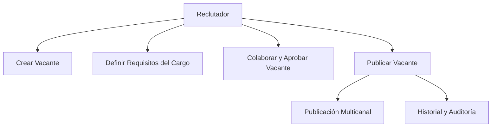
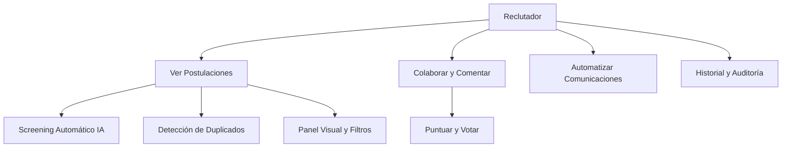
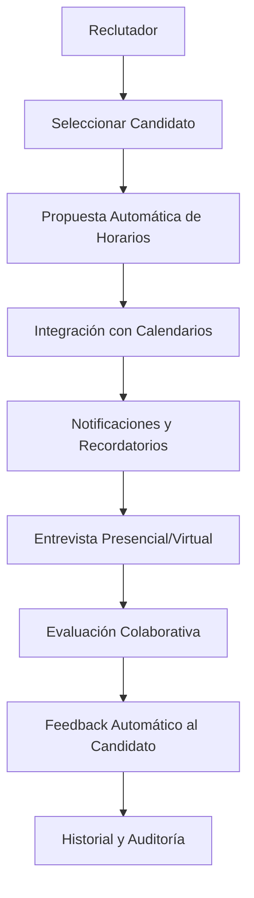
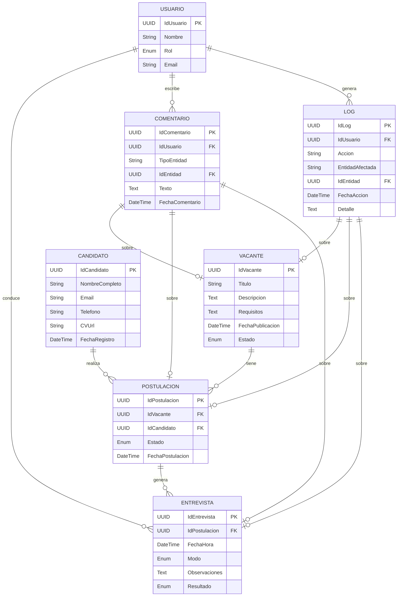

# LT-JFG - Documentación del Sistema Applicant Tracking System (ATS)

Este documento consolida toda la información, análisis, modelos y diagramas relacionados con la construcción de un sistema **Applicant Tracking System (ATS)**. Incluye definición general, casos de uso, diagrama entidad-relación, y arquitectura C4 completa (niveles 1 al 4).

---

## ✅ 1. ¿Qué es un Applicant Tracking System (ATS)?

Un **Applicant Tracking System (ATS)** es un software diseñado para gestionar, automatizar y optimizar el proceso de reclutamiento de personal. Permite a las empresas organizar y seguir a los candidatos desde la publicación de una vacante hasta la contratación.

---

## ✅ 2. Beneficios de un ATS

- **Eficiencia y ahorro de tiempo**
- **Mejora la calidad de la contratación**
- **Centralización de la información**
- **Reducción del sesgo**
- **Mejor experiencia del candidato**
- **Cumplimiento legal**
- **Análisis e informes**

---


## ✅ 3. Funcionalidades Principales del ATS (ordenadas por prioridad)

1. **Recepción y almacenamiento de aplicaciones**  
   El sistema centraliza la recepción de aplicaciones de candidatos desde distintos canales (sitio web, portales de empleo, referencias), organizando la información en un repositorio consultable y estructurado.

2. **Filtrado y revisión automatizada de CVs**  
   Utiliza algoritmos de búsqueda y filtros (palabras clave, experiencia, educación) para ayudar a los reclutadores a identificar rápidamente los candidatos más aptos y descartar los no calificados.

3. **Gestión del flujo de candidatos**  
   Permite mover a los candidatos a través de diferentes etapas (preselección, entrevista, evaluación, oferta) manteniendo un seguimiento visual del estado de cada uno.

4. **Publicación de vacantes**  
   Los reclutadores pueden crear y publicar vacantes en múltiples plataformas con un solo clic, integrando con portales como LinkedIn, Indeed y el sitio web de la empresa.

5. **Automatización de comunicación**  
   Envía correos automáticos para confirmar recepción de postulaciones, agendar entrevistas, informar resultados o solicitar documentos, mejorando la experiencia del candidato.

6. **Pruebas técnicas o psicométricas**  
   Integra herramientas de evaluación que permiten aplicar pruebas en línea, calificar automáticamente y vincular los resultados al perfil del candidato.

7. **Programación de entrevistas**  
   Ofrece opciones de calendario, horarios disponibles y confirmaciones por correo para coordinar entrevistas entre candidatos y entrevistadores sin necesidad de correos manuales.

8. **Colaboración en equipo**  
   Los reclutadores, entrevistadores y gerentes pueden dejar comentarios, puntuaciones y observaciones en los perfiles, fomentando una evaluación colaborativa y transparente.

9. **Análisis y reportes**  
   Genera reportes automáticos sobre métricas clave como tiempo de contratación, tasa de conversión, fuente de candidatos y efectividad del proceso de selección.

10. **Integraciones externas**  
    Se conecta con sistemas de correo, calendarios, plataformas de entrevistas, sistemas de recursos humanos (HRIS) y más, asegurando interoperabilidad en todo el ecosistema de talento.

---

## ✅ 4. Lean Canvas del ATS

```markdown
# Lean Canvas - Applicant Tracking System (ATS)

## 1. Problema
- Proceso manual de selección lento y desorganizado  
- Difícil seguimiento de candidatos  
- Falta de métricas claras  
- Mala experiencia del candidato  

## 2. Segmento de Clientes
- Empresas medianas y grandes  
- Agencias de reclutamiento  
- Departamentos de RRHH  
- Startups con alto crecimiento  
- Consultoras de talento humano  

## 3. Propuesta de Valor
Sistema todo-en-uno que automatiza, organiza y optimiza el proceso de reclutamiento desde la publicación hasta la contratación.

## 4. Solución
- Panel visual de candidatos  
- Filtros automáticos de CV  
- Pruebas y entrevistas integradas  
- Publicación en múltiples canales  
- Reportes de desempeño  

## 5. Canales
- Sitio web del producto  
- Publicidad en LinkedIn / Facebook  
- Alianzas con consultoras  
- SEO / Marketing de contenidos  
- Marketplaces de herramientas para RRHH  

## 6. Fuentes de Ingresos
- Suscripción mensual (SaaS)  
- Licencia anual para empresas grandes  
- Complementos premium (pruebas, soporte, evaluaciones)  

## 7. Estructura de Costos
- Desarrollo y mantenimiento del software  
- Infraestructura cloud (AWS, Azure)  
- Marketing y ventas  
- Soporte al cliente  
- Integraciones con terceros  

## 8. Métricas Clave
- Tasa de conversión prueba gratuita → suscripción  
- Tiempo promedio de contratación  
- Retención mensual de clientes  
- Net Promoter Score (NPS)  
- Costo de adquisición de clientes (CAC)  

## 9. Ventaja Injusta
- Algoritmo de matching inteligente candidato-vacante  
- UX superior y onboarding guiado  
- Integración con WhatsApp y versión móvil  
- IA para redacción de vacantes efectivas  
```

---


## ✅ 5. Casos de Uso Principales del ATS

### 🎯 Caso de Uso 1: Publicar Vacante

**Descripción**:  
Permite al reclutador crear y publicar una nueva oferta laboral en el sistema y en portales externos.

**Mejoras y Automatizaciones:**
- Redacción asistida por IA para la descripción y requisitos de la vacante.
- Detección automática de sesgos en el texto de la vacante.
- Publicación multicanal automatizada (varios portales y redes sociales con un solo clic).
- Colaboración en tiempo real: managers y reclutadores pueden comentar y aprobar la vacante antes de publicarla.
- Historial y auditoría de todas las acciones sobre la vacante.

**Flujo principal ajustado:**
1. El reclutador accede al sistema.
2. Crea una nueva vacante, con sugerencias automáticas de IA para el texto y requisitos.
3. El sistema revisa y sugiere mejoras para evitar sesgos.
4. Reclutadores y managers pueden comentar y aprobar la vacante en tiempo real.
5. Selecciona los canales de publicación (portal interno, LinkedIn, etc.).
6. Publica la vacante en todos los canales seleccionados automáticamente.
7. El sistema registra todas las acciones y notifica a los interesados.



---

### 🎯 Caso de Uso 2: Gestionar Postulaciones

**Descripción**:  
Permite al reclutador visualizar, filtrar, clasificar y gestionar las postulaciones recibidas.

**Mejoras y Automatizaciones:**
- Screening automático de CVs y puntuación de candidatos por IA.
- Detección de duplicados y perfiles sospechosos.
- Colaboración y feedback en tiempo real (comentarios, puntuaciones, votaciones).
- Automatización de comunicaciones (respuestas automáticas a candidatos).
- Panel visual y filtros avanzados.
- Historial de interacciones y auditoría.

**Flujo principal ajustado:**
1. El reclutador consulta las postulaciones activas.
2. La IA filtra y puntúa automáticamente los candidatos.
3. El sistema detecta duplicados y posibles fraudes.
4. El equipo puede comentar, puntuar y votar sobre cada candidato en tiempo real.
5. El sistema envía automáticamente notificaciones a los candidatos según su estado.
6. El reclutador puede compartir candidatos con managers o entrevistadores.
7. Todo el historial de acciones y comentarios queda registrado.



---

### 🎯 Caso de Uso 3: Programar Entrevista

**Descripción**:  
Facilita la coordinación y registro de entrevistas entre candidatos y entrevistadores.

**Mejoras y Automatizaciones:**
- Propuestas automáticas de horarios según disponibilidad.
- Integración con calendarios externos (Google, Outlook, etc.).
- Notificaciones y recordatorios automáticos.
- Videoentrevistas integradas y grabación opcional.
- Evaluación asistida por IA (sugerencias de preguntas, análisis de sentimiento en feedback).
- Colaboración en tiempo real entre entrevistadores.
- Feedback automático al candidato tras la entrevista.

**Flujo principal ajustado:**
1. El reclutador selecciona al candidato.
2. El sistema sugiere automáticamente fechas y horas disponibles para todos los participantes.
3. Se integra con los calendarios de los entrevistadores y candidatos.
4. El sistema envía invitaciones y recordatorios automáticos.
5. La entrevista puede ser presencial o virtual (con grabación y análisis opcional).
6. Los entrevistadores dejan comentarios y evaluaciones colaborativas.
7. El sistema puede enviar feedback automático al candidato y registrar todo el proceso.



## ✅ 6. Diagrama Entidad Relación (ER)



---

## ✅ 7. Arquitectura de Alto Nivel del ATS (Microservicios + JWT)

El siguiente diagrama representa un diseño de arquitectura moderna para el ATS utilizando una estrategia de microservicios desplegados detrás de un API Gateway, autenticación con JWT y servicios desacoplados para diferentes dominios del proceso de selección.

### 🔐 Flujo general:

- **Usuarios** acceden a la **Web App** desde el navegador.
- Los **assets estáticos** se sirven vía **CloudFront**.
- Las solicitudes API autenticadas se enrutan desde el frontend hacia:
  - **ELB (Load Balancer)**
  - **API Gateway**, que enruta a microservicios específicos.
- El **Auth Service** permite obtener y verificar tokens JWT.
- Los microservicios están organizados por dominio funcional:
  - **Job Postings Service**
  - **Candidate Profiles Service**
  - **Application Tracking Service**
  - **Interview Scheduling Service**
  - **Auth Service**
- **Nuevos microservicios para soportar funcionalidades avanzadas:**
  - **IA/Automation Service:** Provee redacción asistida, screening automático, matching inteligente, análisis de sentimiento y detección de sesgos mediante IA.
  - **Collaboration/Notification Service:** Gestiona comentarios, chat, votaciones y notificaciones en tiempo real entre reclutadores, managers y entrevistadores.
  - **Workflow Orchestrator:** Orquesta automatizaciones, recordatorios, triggers y tareas programadas en los procesos de selección.
  - **Integrations Service:** Facilita la conexión con herramientas externas (Slack, Teams, calendarios, portales de empleo, etc.).
  - **Audit/Logs Service:** Registra todas las acciones y cambios en el sistema para trazabilidad y cumplimiento normativo.
- Cada microservicio expone una API propia y persiste datos en su propia base de datos (RDS), cumpliendo el principio de base de datos por servicio.

### 🔗 Diagrama actualizado:

```mermaid
graph TD;
    subgraph Frontend
        A[Web App (Admin/Candidato)]
    end
    subgraph Infraestructura
        B[CloudFront (Assets)]
        C[ELB]
        D[API Gateway]
    end
    subgraph Microservicios
        E[Auth Service]
        F[Job Postings Service]
        G[Candidate Profiles Service]
        H[Application Tracking Service]
        I[Interview Scheduling Service]
        J[IA/Automation Service]
        K[Collaboration/Notification Service]
        L[Workflow Orchestrator]
        M[Integrations Service]
        N[Audit/Logs Service]
    end
    subgraph Externos
        O[Correo/Notificaciones]
        P[Portales de Empleo]
        Q[Calendarios]
        R[APIs de IA Externas]
        S[Herramientas de Colaboración]
    end

    A --> B
    A --> C
    B --> C
    C --> D
    D --> E
    D --> F
    D --> G
    D --> H
    D --> I
    D --> J
    D --> K
    D --> L
    D --> M
    D --> N

    F -- Publica --> P
    M -- Integra --> Q
    M -- Integra --> S
    K -- Notifica --> O
    J -- Consume --> R
    N -- Registra --> O
    L -- Orquesta --> F
    L -- Orquesta --> G
    L -- Orquesta --> H
    L -- Orquesta --> I
    K -- Colabora --> F
    K -- Colabora --> H
    K -- Colabora --> I
```

Esta arquitectura permite escalar y evolucionar el sistema fácilmente, soportando funcionalidades avanzadas de IA, automatización, colaboración y cumplimiento normativo, diferenciando el ATS frente a la competencia.

---

## ✅ 8. Modelo C4 - Nivel 1: Diagrama de Contexto

@startuml "ATS_Context_Actualizado"
!include https://raw.githubusercontent.com/plantuml-stdlib/C4-PlantUML/master/C4_Context.puml

LAYOUT_TOP_DOWN()
LAYOUT_WITH_LEGEND()

' Actores externos
Person(recruiter, "Reclutador", "Usuario interno que publica vacantes y gestiona candidatos")
Person(interviewer, "Entrevistador", "Evalúa candidatos en entrevistas")
Person(candidate, "Candidato", "Persona externa que aplica a vacantes")

System_Boundary(ats, "Applicant Tracking System (ATS)") {
    System(web_app_admin, "Módulo Admin", "Web App", "Panel para reclutadores y entrevistadores")
    System(web_app_candidate, "Portal Web Candidatos", "Web App", "Portal donde los candidatos aplican y consultan")
    System(ia_service, "IA/Automation Service", "Microservicio IA", "Matching, screening, redacción asistida, análisis de sentimiento")
    System(collab_service, "Collaboration/Notification Service", "Microservicio Colaboración", "Comentarios, chat, notificaciones en tiempo real")
    System(workflow_service, "Workflow Orchestrator", "Microservicio Workflows", "Automatización de procesos y recordatorios")
    System(integration_service, "Integrations Service", "Microservicio Integraciones", "Conexión con portales, calendarios, herramientas externas")
    System(audit_service, "Audit/Logs Service", "Microservicio Auditoría", "Registro de acciones y cumplimiento")
}

System_Ext(email_service, "Servicio de Notificaciones", "Envía correos automáticos")
System_Ext(job_board, "Portal de Empleo (Ej. LinkedIn, Indeed)", "Sistema externo de publicación de vacantes")
System_Ext(calendar, "Calendarios Externos", "Google/Outlook Calendar")
System_Ext(ai_api, "APIs de IA Externas", "OpenAI, Azure AI, etc.")
System_Ext(collab_tool, "Herramientas de Colaboración", "Slack, Teams, etc.")

Rel(recruiter, web_app_admin, "Usa", "HTTPS")
Rel(interviewer, web_app_admin, "Accede para evaluar entrevistas", "HTTPS")
Rel(candidate, web_app_candidate, "Postula a vacantes", "HTTPS")

Rel(web_app_admin, ia_service, "Solicita IA para redacción, screening, matching")
Rel(web_app_admin, collab_service, "Colabora y recibe notificaciones")
Rel(web_app_admin, workflow_service, "Automatiza procesos y recordatorios")
Rel(web_app_admin, integration_service, "Integra con portales/calendarios")
Rel(web_app_admin, audit_service, "Registra acciones")
Rel(web_app_candidate, ia_service, "Screening y feedback IA")
Rel(web_app_candidate, collab_service, "Notificaciones y chat")
Rel(web_app_candidate, workflow_service, "Recordatorios y automatización")
Rel(web_app_candidate, audit_service, "Registra acciones")

Rel(ia_service, ai_api, "Consume APIs de IA externas")
Rel(collab_service, collab_tool, "Integra con herramientas de colaboración")
Rel(integration_service, job_board, "Publica vacantes")
Rel(integration_service, calendar, "Sincroniza entrevistas")
Rel(audit_service, email_service, "Envía alertas/auditoría")

@enduml

---

## ✅ 9. Modelo C4 - Nivel 2: Diagrama de Contenedores

@startuml "ATS_Contenedores_Actualizado"
!include https://raw.githubusercontent.com/plantuml-stdlib/C4-PlantUML/master/C4_Container.puml

LAYOUT_TOP_DOWN()
LAYOUT_WITH_LEGEND()

Person(recruiter, "Reclutador", "Usuario interno que gestiona vacantes y entrevistas")
Person(interviewer, "Entrevistador", "Evalúa candidatos y registra observaciones")
Person(candidate, "Candidato", "Postula a vacantes y consulta el estado")

System_Boundary(ats, "Applicant Tracking System (ATS)") {
    Container(web_admin, "Web Admin", "React / Angular", "Interfaz para reclutadores y entrevistadores")
    Container(web_candidate, "Web Candidatos", "Next.js / Vue", "Portal donde los candidatos aplican")
    Container(api_rest, "API REST ATS", "ASP.NET Core / Node.js", "Orquesta la lógica de negocio del sistema")
    ContainerDb(db, "Base de Datos ATS", "PostgreSQL / SQL Server", "Almacena vacantes, usuarios, postulaciones, entrevistas")
    Container(mail_service, "Servicio de Notificaciones", "SendGrid / SMTP", "Envía correos automáticos")
    Container(job_integration, "Integración con Portales", "REST Client", "Publica vacantes en plataformas externas")
    Container(ia_service, "IA/Automation Service", "Python/Node.js", "Matching, screening, redacción asistida, análisis de sentimiento")
    Container(collab_service, "Collaboration/Notification Service", "Node.js/Socket.io", "Comentarios, chat, notificaciones en tiempo real")
    Container(workflow_service, "Workflow Orchestrator", "Node.js/Python", "Automatización de procesos y recordatorios")
    Container(integration_service, "Integrations Service", "Node.js", "Conexión con portales, calendarios, herramientas externas")
    Container(audit_service, "Audit/Logs Service", "Node.js/Python", "Registro de acciones y cumplimiento")
}

Rel(recruiter, web_admin, "Gestiona procesos de selección", "HTTPS")
Rel(interviewer, web_admin, "Evalúa entrevistas", "HTTPS")
Rel(candidate, web_candidate, "Postula a vacantes", "HTTPS")

Rel(web_admin, api_rest, "Consume")
Rel(web_candidate, api_rest, "Consume")

Rel(api_rest, db, "Lee/Escribe")
Rel(api_rest, mail_service, "Envía notificaciones", "SMTP/REST")
Rel(api_rest, job_integration, "Publica vacantes", "REST")
Rel(api_rest, ia_service, "Solicita IA para screening, matching, redacción")
Rel(api_rest, collab_service, "Colaboración y notificaciones")
Rel(api_rest, workflow_service, "Automatización de procesos")
Rel(api_rest, integration_service, "Integra con portales/calendarios")
Rel(api_rest, audit_service, "Registra acciones y auditoría")

Rel(ia_service, job_integration, "Sugiere portales para publicación")
Rel(ia_service, api_rest, "Devuelve resultados IA")
Rel(collab_service, api_rest, "Recibe eventos y envía notificaciones")
Rel(workflow_service, api_rest, "Orquesta tareas y recordatorios")
Rel(integration_service, job_integration, "Publica vacantes")
Rel(integration_service, mail_service, "Envía notificaciones externas")
Rel(audit_service, db, "Almacena logs y auditoría")

@enduml

---

## ✅ 10. Modelo C4 - Nivel 3: Diagrama de Componentes (API REST ATS)

@startuml "ATS_Componentes_API_REST_Actualizado"
!include https://raw.githubusercontent.com/plantuml-stdlib/C4-PlantUML/master/C4_Component.puml

LAYOUT_TOP_DOWN()
LAYOUT_WITH_LEGEND()

Person(recruiter, "Reclutador")
Person(candidate, "Candidato")
Person(interviewer, "Entrevistador")

Container(api, "API REST ATS", "ASP.NET Core", "Contenedor principal con lógica de negocio")

System_Boundary(api_boundary, "Componentes del Contenedor: API REST ATS") {
  Component(VacanteController, "VacanteController", "REST Controller", "Gestiona endpoints para vacantes")
  Component(PostulacionController, "PostulacionController", "REST Controller", "Gestiona postulaciones")
  Component(EntrevistaController, "EntrevistaController", "REST Controller", "Gestiona entrevistas")
  Component(UsuarioController, "UsuarioController", "REST Controller", "Gestiona usuarios y autenticación")

  Component(VacanteService, "VacanteService", "Service", "Contiene lógica de negocio de vacantes")
  Component(PostulacionService, "PostulacionService", "Service", "Lógica para procesar postulaciones")
  Component(EntrevistaService, "EntrevistaService", "Service", "Lógica para gestionar entrevistas")
  Component(IAClient, "IA/Automation Client", "Client", "Consume IA/Automation Service para screening, matching, redacción")
  Component(CollabClient, "Collaboration Client", "Client", "Consume Collaboration/Notification Service")
  Component(WorkflowClient, "Workflow Client", "Client", "Consume Workflow Orchestrator")
  Component(IntegrationClient, "Integrations Client", "Client", "Consume Integrations Service")
  Component(AuditClient, "Audit Client", "Client", "Registra acciones en Audit/Logs Service")

  Component(RepositorioVacante, "RepositorioVacante", "Repository", "Acceso a datos de vacantes")
  Component(RepositorioPostulacion, "RepositorioPostulacion", "Repository", "Acceso a postulaciones")
  Component(RepositorioEntrevista, "RepositorioEntrevista", "Repository", "Acceso a entrevistas")
}

Rel(recruiter, VacanteController, "Usa", "HTTP")
Rel(candidate, PostulacionController, "Envía solicitud", "HTTP")
Rel(interviewer, EntrevistaController, "Accede", "HTTP")

Rel(VacanteController, VacanteService, "Usa")
Rel(PostulacionController, PostulacionService, "Usa")
Rel(EntrevistaController, EntrevistaService, "Usa")
Rel(UsuarioController, AuditClient, "Registra acciones")

Rel(VacanteService, IAClient, "Solicita screening, matching, redacción IA")
Rel(PostulacionService, IAClient, "Solicita screening IA")
Rel(EntrevistaService, CollabClient, "Notifica y colabora en entrevistas")
Rel(VacanteService, WorkflowClient, "Automatiza procesos de vacantes")
Rel(PostulacionService, WorkflowClient, "Automatiza procesos de postulaciones")
Rel(EntrevistaService, WorkflowClient, "Automatiza procesos de entrevistas")
Rel(VacanteService, IntegrationClient, "Publica en portales externos")
Rel(PostulacionService, AuditClient, "Registra acciones")
Rel(EntrevistaService, AuditClient, "Registra acciones")

Rel(VacanteService, RepositorioVacante, "Lee/Escribe")
Rel(PostulacionService, RepositorioPostulacion, "Lee/Escribe")
Rel(EntrevistaService, RepositorioEntrevista, "Lee/Escribe")

@enduml

---

## ✅ 11. Modelo C4 - Nivel 4: Diagrama Interno VacanteService

@startuml "ATS_VacanteService_Detalle_Actualizado"
!include https://raw.githubusercontent.com/plantuml-stdlib/C4-PlantUML/master/C4_Component.puml

LAYOUT_TOP_DOWN()
LAYOUT_WITH_LEGEND()

Container_Boundary(c1, "VacanteService [Service]") {
  Component(VacanteService, "VacanteService", "Service", "Gestiona lógica de publicación y validación de vacantes")
  Component(ValidadorVacante, "ValidadorVacante", "Helper", "Aplica reglas de negocio sobre los campos de vacantes")
  Component(PublicadorVacante, "PublicadorVacante", "Helper", "Publica vacantes en portales externos (Ej. LinkedIn)")
  Component(IAClient, "IA/Automation Client", "Client", "Solicita redacción asistida, matching y screening IA")
  Component(WorkflowClient, "Workflow Client", "Client", "Automatiza procesos y recordatorios")
  Component(AuditClient, "Audit Client", "Client", "Registra acciones en Audit/Logs Service")
  Component(RepositorioVacante, "RepositorioVacante", "Repository", "Interfaz para acceder a la base de datos")
  Component(Vacante, "Vacante", "Entidad", "Modelo de dominio que representa una vacante")
}

Rel(VacanteService, ValidadorVacante, "Usa para validar campos")
Rel(VacanteService, PublicadorVacante, "Usa para publicar")
Rel(VacanteService, IAClient, "Solicita IA para redacción, screening, matching")
Rel(VacanteService, WorkflowClient, "Automatiza procesos y recordatorios")
Rel(VacanteService, AuditClient, "Registra acciones y auditoría")
Rel(VacanteService, RepositorioVacante, "Lee/Escribe datos")
Rel(VacanteService, Vacante, "Orquesta creación/modificación")

@enduml

---
