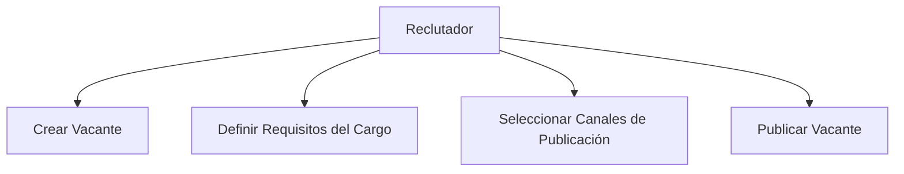
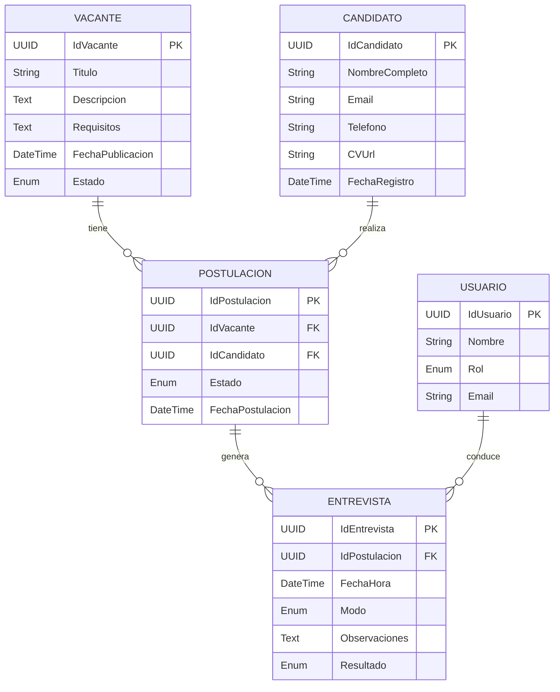
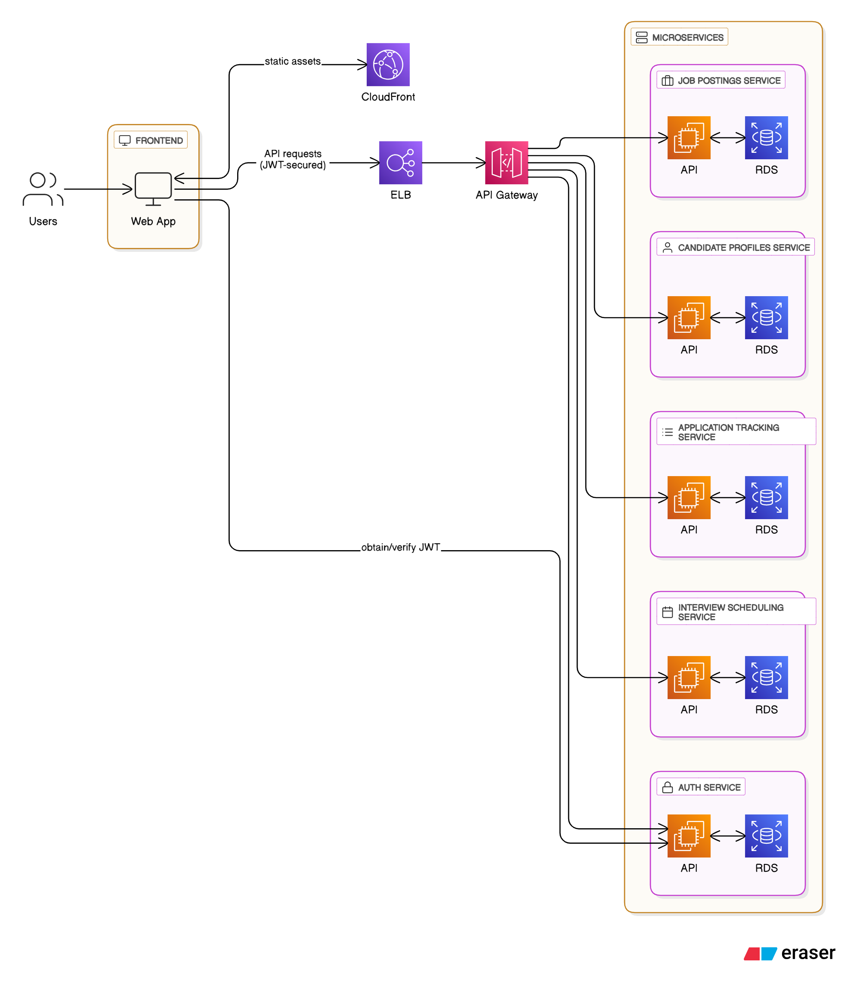
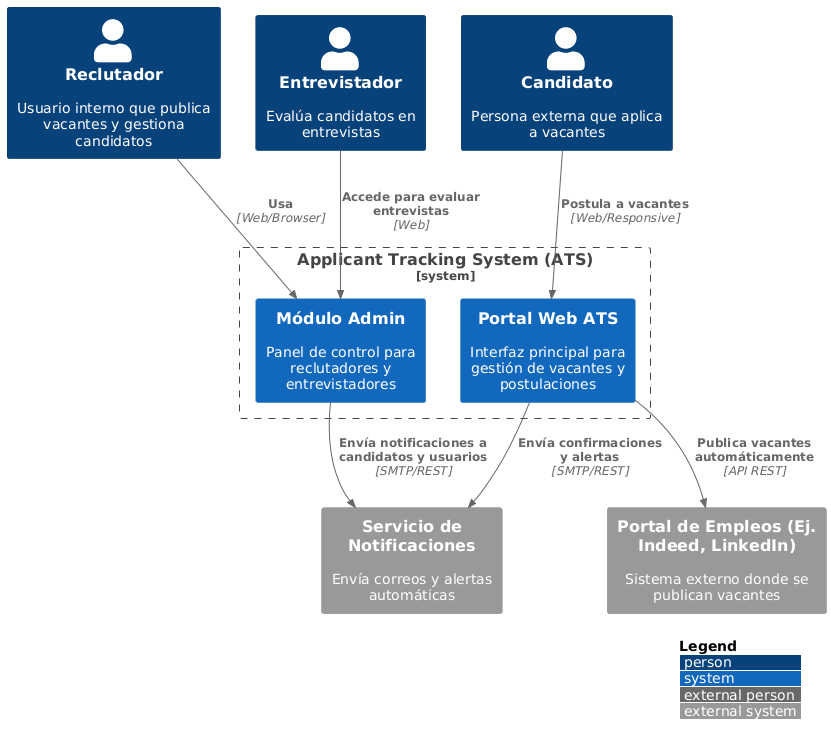
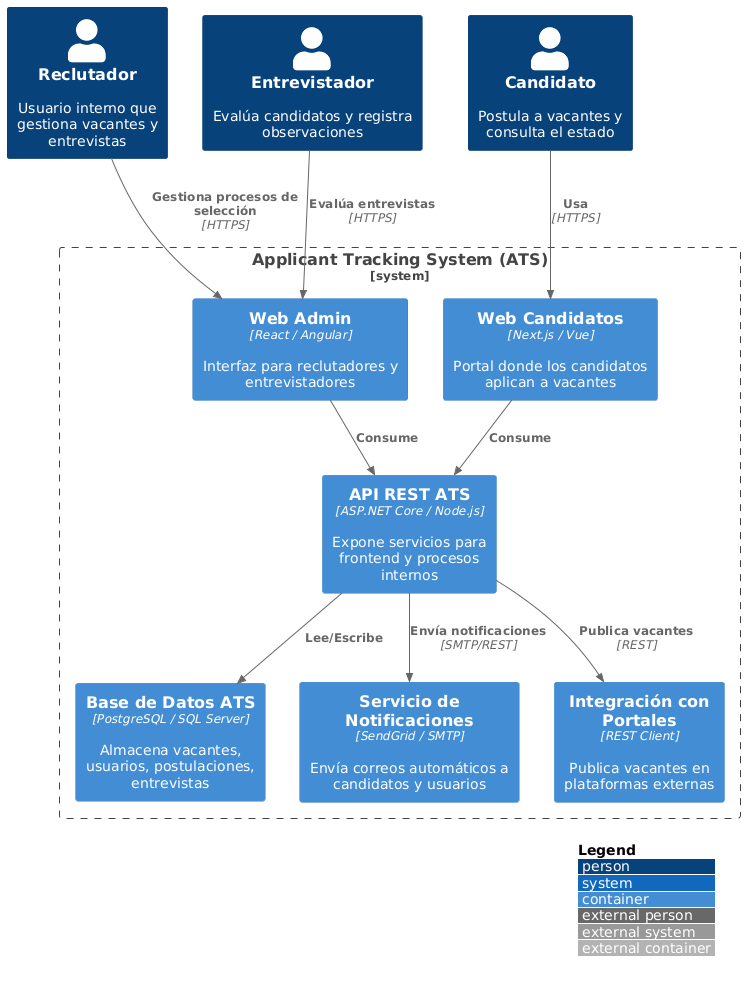
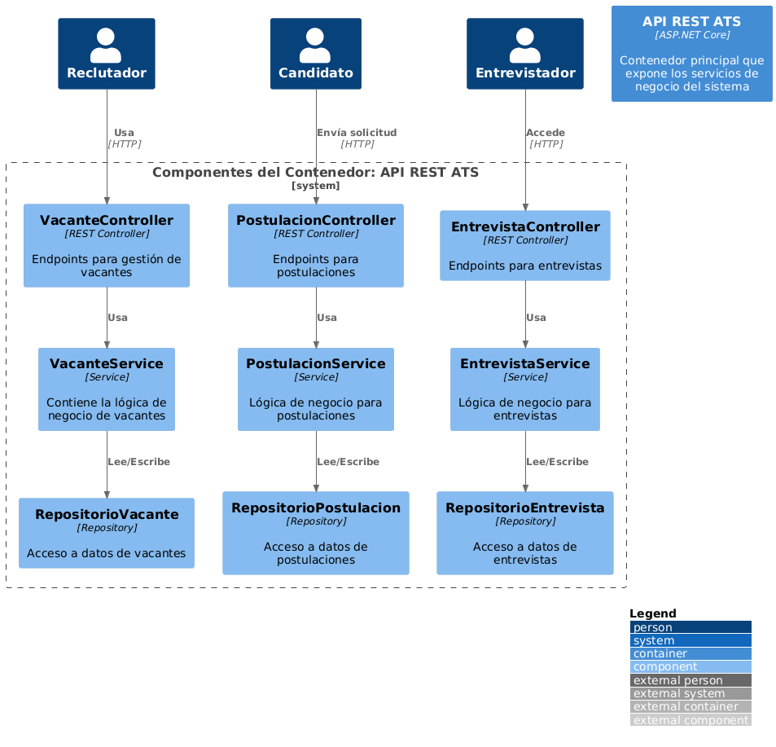
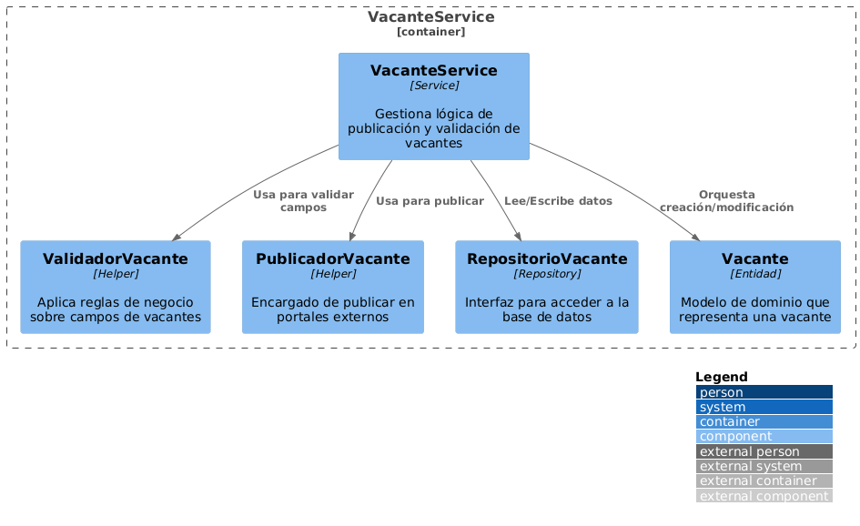

# LT-JFG - Documentación del Sistema Applicant Tracking System (ATS)

Este documento consolida toda la información, análisis, modelos y diagramas relacionados con la construcción de un sistema **Applicant Tracking System (ATS)**. Incluye definición general, casos de uso, diagrama entidad-relación, y arquitectura C4 completa (niveles 1 al 4).

---

## ✅ 1. ¿Qué es un Applicant Tracking System (ATS)?

Un **Applicant Tracking System (ATS)** es un software diseñado para gestionar, automatizar y optimizar el proceso de reclutamiento de personal. Permite a las empresas organizar y seguir a los candidatos desde la publicación de una vacante hasta la contratación.

---

## ✅ 2. Beneficios de un ATS

- **Eficiencia y ahorro de tiempo**
- **Mejora la calidad de la contratación**
- **Centralización de la información**
- **Reducción del sesgo**
- **Mejor experiencia del candidato**
- **Cumplimiento legal**
- **Análisis e informes**

---


## ✅ 3. Funcionalidades Principales del ATS (ordenadas por prioridad)

1. **Recepción y almacenamiento de aplicaciones**  
   El sistema centraliza la recepción de aplicaciones de candidatos desde distintos canales (sitio web, portales de empleo, referencias), organizando la información en un repositorio consultable y estructurado.

2. **Filtrado y revisión automatizada de CVs**  
   Utiliza algoritmos de búsqueda y filtros (palabras clave, experiencia, educación) para ayudar a los reclutadores a identificar rápidamente los candidatos más aptos y descartar los no calificados.

3. **Gestión del flujo de candidatos**  
   Permite mover a los candidatos a través de diferentes etapas (preselección, entrevista, evaluación, oferta) manteniendo un seguimiento visual del estado de cada uno.

4. **Publicación de vacantes**  
   Los reclutadores pueden crear y publicar vacantes en múltiples plataformas con un solo clic, integrando con portales como LinkedIn, Indeed y el sitio web de la empresa.

5. **Automatización de comunicación**  
   Envía correos automáticos para confirmar recepción de postulaciones, agendar entrevistas, informar resultados o solicitar documentos, mejorando la experiencia del candidato.

6. **Pruebas técnicas o psicométricas**  
   Integra herramientas de evaluación que permiten aplicar pruebas en línea, calificar automáticamente y vincular los resultados al perfil del candidato.

7. **Programación de entrevistas**  
   Ofrece opciones de calendario, horarios disponibles y confirmaciones por correo para coordinar entrevistas entre candidatos y entrevistadores sin necesidad de correos manuales.

8. **Colaboración en equipo**  
   Los reclutadores, entrevistadores y gerentes pueden dejar comentarios, puntuaciones y observaciones en los perfiles, fomentando una evaluación colaborativa y transparente.

9. **Análisis y reportes**  
   Genera reportes automáticos sobre métricas clave como tiempo de contratación, tasa de conversión, fuente de candidatos y efectividad del proceso de selección.

10. **Integraciones externas**  
    Se conecta con sistemas de correo, calendarios, plataformas de entrevistas, sistemas de recursos humanos (HRIS) y más, asegurando interoperabilidad en todo el ecosistema de talento.

---

## ✅ 4. Lean Canvas del ATS

```markdown
# Lean Canvas - Applicant Tracking System (ATS)

## 1. Problema
- Proceso manual de selección lento y desorganizado  
- Difícil seguimiento de candidatos  
- Falta de métricas claras  
- Mala experiencia del candidato  

## 2. Segmento de Clientes
- Empresas medianas y grandes  
- Agencias de reclutamiento  
- Departamentos de RRHH  
- Startups con alto crecimiento  
- Consultoras de talento humano  

## 3. Propuesta de Valor
Sistema todo-en-uno que automatiza, organiza y optimiza el proceso de reclutamiento desde la publicación hasta la contratación.

## 4. Solución
- Panel visual de candidatos  
- Filtros automáticos de CV  
- Pruebas y entrevistas integradas  
- Publicación en múltiples canales  
- Reportes de desempeño  

## 5. Canales
- Sitio web del producto  
- Publicidad en LinkedIn / Facebook  
- Alianzas con consultoras  
- SEO / Marketing de contenidos  
- Marketplaces de herramientas para RRHH  

## 6. Fuentes de Ingresos
- Suscripción mensual (SaaS)  
- Licencia anual para empresas grandes  
- Complementos premium (pruebas, soporte, evaluaciones)  

## 7. Estructura de Costos
- Desarrollo y mantenimiento del software  
- Infraestructura cloud (AWS, Azure)  
- Marketing y ventas  
- Soporte al cliente  
- Integraciones con terceros  

## 8. Métricas Clave
- Tasa de conversión prueba gratuita → suscripción  
- Tiempo promedio de contratación  
- Retención mensual de clientes  
- Net Promoter Score (NPS)  
- Costo de adquisición de clientes (CAC)  

## 9. Ventaja Injusta
- Algoritmo de matching inteligente candidato-vacante  
- UX superior y onboarding guiado  
- Integración con WhatsApp y versión móvil  
- IA para redacción de vacantes efectivas  
```

---


## ✅ 5. Casos de Uso Principales del ATS

### 🎯 Caso de Uso 1: Publicar Vacante

**Descripción**:  
Permite al reclutador crear y publicar una nueva oferta laboral en el sistema y en portales externos.

**Flujo principal**:
1. El reclutador accede al sistema.
2. Crea una nueva vacante especificando título, descripción, requisitos y tipo de contrato.
3. Selecciona los canales donde se publicará (portal interno, LinkedIn, etc.).
4. Confirma y publica la vacante.



---

### 🎯 Caso de Uso 2: Gestionar Postulaciones

**Descripción**:  
Permite al reclutador visualizar, filtrar, clasificar y gestionar las postulaciones recibidas.

**Flujo principal**:
1. El reclutador consulta las postulaciones activas.
2. Filtra candidatos por criterios (experiencia, formación, skills).
3. Revisa CVs y detalles del candidato.
4. Clasifica: preselecciona, descarta o deja comentarios.
5. Comparte información con el equipo de entrevistas si es necesario.

```mermaid
usecaseDiagram
actor Reclutador
Reclutador --> (Ver Postulaciones)
Reclutador --> (Filtrar Candidatos)
Reclutador --> (Revisar Currículum)
Reclutador --> (Clasificar Candidato)
Reclutador --> (Agregar Comentarios o Tareas)
```

---

### 🎯 Caso de Uso 3: Programar Entrevista

**Descripción**:  
Facilita la coordinación y registro de entrevistas entre candidatos y entrevistadores.

**Flujo principal**:
1. El reclutador selecciona al candidato.
2. Define fecha, hora y modo de entrevista.
3. El sistema notifica a los participantes (entrevistador y candidato).
4. Ambas partes confirman disponibilidad.
5. El entrevistador registra su evaluación tras la entrevista.

```mermaid
usecaseDiagram
actor Reclutador
actor Candidato
actor Entrevistador
Reclutador --> (Seleccionar Candidato)
Reclutador --> (Agendar Entrevista)
Reclutador --> (Notificar a Participantes)
Candidato --> (Confirmar Entrevista)
Entrevistador --> (Confirmar Entrevista)
Entrevistador --> (Registrar Evaluación)
```

## ✅ 6. Diagrama Entidad Relación (ER)



---

## ✅ 7 Arquitectura de Alto Nivel del ATS (Microservicios + JWT)

El siguiente diagrama representa un diseño de arquitectura moderna para el ATS utilizando una estrategia de microservicios desplegados detrás de un API Gateway, autenticación con JWT y servicios desacoplados para diferentes dominios del proceso de selección.

### 🔐 Flujo general:

- **Usuarios** acceden a la **Web App** desde el navegador.
- Los **assets estáticos** se sirven vía **CloudFront**.
- Las solicitudes API autenticadas se enrutan desde el frontend hacia:
  - **ELB (Load Balancer)**
  - **API Gateway**, que enruta a microservicios específicos.
- El **Auth Service** permite obtener y verificar tokens JWT.
- Los microservicios están organizados por dominio funcional:
  - **Job Postings Service**
  - **Candidate Profiles Service**
  - **Application Tracking Service**
  - **Interview Scheduling Service**
  - **Auth Service**
- Cada microservicio expone una API propia y persiste datos en su propia base de datos (RDS), cumpliendo el principio de base de datos por servicio.

### 🔗 Diagrama:

![Diseño ATS - Alto Nivel]

🔗 [Ver diagrama en Eraser](https://app.eraser.io/workspace/yJvVKoEjtaN8fxjuiy7X?origin=share&elements=LFUPD_atxkRV-qmc65i2Sg)


---

## ✅ 8. Modelo C4 - Nivel 1: Diagrama de Contexto

![Nivel 1 - Diagrama de Contexto]

---

## ✅ 9. Modelo C4 - Nivel 2: Diagrama de Contenedores

![Nivel 2 - Diagrama de Contenedores]

---

## ✅ 10. Modelo C4 - Nivel 3: Diagrama de Componentes (API REST ATS)

![Nivel 3 - Diagrama de Componentes]

---

## ✅ 11. Modelo C4 - Nivel 4: Diagrama Interno VacanteService

![Nivel 4 - Diagrama VacanteService]

---
