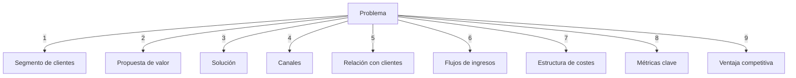
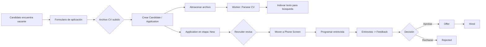
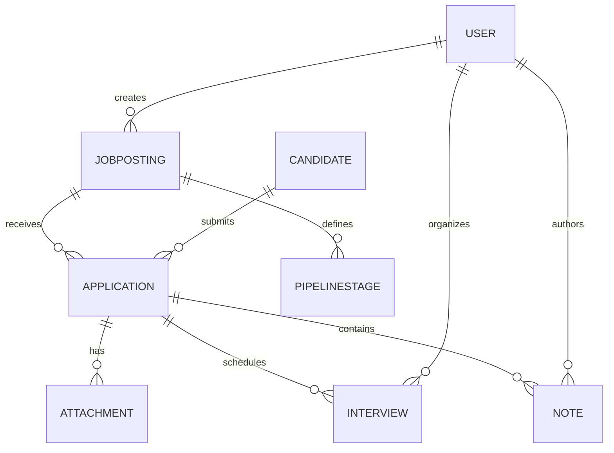

# Especificación inicial para el desarrollo de un ATS (Applicant Tracking System)

Proveer una especificación exhaustiva y lista para usarse como base en la primera fase de diseño y desarrollo de un ATS. El documento debe servir tanto a un equipo de desarrollo (backend, frontend, QA, DevOps) como a un generador de especificaciones automáticas (IA o herramienta de gestión de producto).

---

## 1) 📘 Descripción básica del proyecto

El software LTI es una solución basada en el estándar Learning Tools Interoperability (LTI) que permite integrar aplicaciones de aprendizaje externas (herramientas educativas, simuladores, cuestionarios, analíticas, etc.) dentro de plataformas de gestión del aprendizaje (LMS) como Moodle, Canvas, Blackboard o Google Classroom.

Su principal objetivo es garantizar la interoperabilidad, seguridad y escalabilidad en la integración de herramientas educativas sin necesidad de desarrollos a medida para cada LMS.

## 1.2) 🚀 Valor añadido y ventajas competitivas

Estandarización: Cumple con el estándar IMS LTI, lo que asegura compatibilidad con los LMS más utilizados en el mercado.

Agilidad en integraciones: Reduce drásticamente el tiempo y coste de integración de herramientas educativas.

Seguridad avanzada: Manejo de autenticación y autorización basado en protocolos seguros (OAuth 2.0, JWT).

Experiencia de usuario fluida: Los estudiantes y profesores acceden a herramientas externas sin necesidad de múltiples logins (“Single Sign-On”).

Escalabilidad: Facilita la incorporación de nuevas herramientas de terceros en el ecosistema educativo.

Competitividad: Aumenta la capacidad de instituciones educativas y edtechs de innovar y diferenciarse en su oferta digital.

**Público objetivo / Stakeholders:** RRHH / Recruiters, Hiring Managers, Administradores del sistema, Candidatos.

**Alcances del MVP (resumido):**

- Creación y gestión de puestos de trabajo (vacantes).
- Recepción de candidaturas con subida de CV.
- Visualización y gestión de un pipeline por vacante (kanban simple: New → Screening → Interview → Offer → Hired/Rejected).
- Perfil de candidato con historial de candidaturas, entrevistas y notas.
- Búsqueda y filtrado básico (por nombre, email, skills, etiquetas).
- Gestión básica de usuarios y permisos (Admin / Recruiter / Hiring Manager).

---

## 2) Principales funcionalidades básicas (MVP)

1. **Gestión de ofertas (Jobs)**
   - Crear, editar, publicar/despublicar vacantes.
   - Campos principales: título, ubicación, descripción, requisitos, tipo de contrato, salario (opcional), etiquetas, responsable.
2. **Aplicación de candidatos**
   - Formulario público para aplicar a una vacante (nombre, email, teléfono, CV/Adjuntos, carta de presentación opcional).
   - Endpoint para recibir aplicaciones desde integraciones externas (webhooks/API).
3. **Parsing y almacenamiento de CVs**
   - Subida de archivos (PDF, DOCX) y extracción básica de texto (nombre, email, teléfono, skills, experiencia) para indexación.
4. **Pipeline / Kanban por vacante**
   - Visualizar y mover aplicaciones entre etapas: New, Phone Screen, Tech Interview, Offer, Hired, Rejected.
   - Registro automático de auditoría (quién movió la aplicación y cuándo).
5. **Perfil de candidato**
   - Vista central con datos del candidato, CV(s), notas, actividad, historial de movimientos y entrevistas.
6. **Entrevistas / Calendario**
   - Programar entrevistas (crear evento, enviar invitaciones por email, integración con Google Calendar / Microsoft Outlook opcional).
7. **Notas y feedback**
   - Añadir notas internas y calificaciones por entrevista y por candidato.
8. **Usuarios y roles**
   - RBAC: Admin, Recruiter, Hiring Manager. Gestión de usuarios (crear, desactivar, asignar roles).
9. **Búsqueda y filtros**
   - Búsqueda por texto completo (nombre, correo, skills) y filtros por etapa, vacante, etiquetas, fecha de aplicación.
10. **Export / Reportes básicos**

- Export CSV de candidaturas por vacante; métricas simples (nº aplicaciones, tiempo medio en pipeline).

## 3) Historias de Usuario (explicadas) y diagrama del flujo principal

A continuación se listan historias de usuario prioritarias con criterios de aceptación y tareas técnicas sugeridas.

### HU-01: Crear y publicar una vacante

- **Como** Recruiter
- **Quiero** crear una nueva oferta de trabajo con título, descripción y requisitos y publicarla
- **Para** que los candidatos puedan ver y postularse a la vacante
- **Criterios de aceptación**:
  - Existe una UI para crear vacantes con validación de campos obligatorios.
  - Al publicar, la vacante pasa a "publicada" y aparece en el listado público/API.
  - Se guarda historial de cambios (audit log).
- **Tareas técnicas**:
  - CRUD backend `/api/jobs` (POST/GET/PUT/DELETE), validaciones, permisos.
  - UI formulario para crear/editar vacante.

### HU-02: Aplicar a una vacante

- **Como** Candidato
- **Quiero** subir mi CV y datos personales desde la página de una vacante
- **Para** postular al proceso de selección
- **Criterios de aceptación**:
  - Formulario acepta CVs en PDF/DOCX; muestra confirmación al aplicar.
  - Se crea un registro `Application` vinculado al `Job` y al `Candidate` (si existe por email, se vincula).
  - Se almacena el archivo y se ejecuta parsing para extraer texto.
- **Tareas técnicas**:
  - Endpoint `POST /api/jobs/{id}/apply`.
  - Servicio de almacenamiento (S3/local) y worker asíncrono para parsing.

### HU-03: Ver perfil de candidato

- **Como** Hiring Manager
- **Quiero** ver la ficha completa del candidato con CV, notas e historial
- **Para** evaluar si seguir con entrevistas
- **Criterios de aceptación**:
  - Perfil muestra datos extraídos del CV y adjuntos descargables.
  - Se ven notas internas y el historial de movimientos.
- **Tareas técnicas**:
  - Endpoint `GET /api/candidates/{id}` y UI de candidate profile.

### HU-04: Mover una aplicación en el pipeline

- **Como** Recruiter
- **Quiero** mover una aplicación de "New" a "Phone Screen" y dejar una nota
- **Para** marcar el avance en el proceso
- **Criterios de aceptación**:
  - La aplicación cambia su `stage` y se registra usuario y timestamp.
  - Se puede añadir una nota asociada a ese movimiento.
- **Tareas técnicas**:
  - Endpoint `PATCH /api/applications/{id}/stage` con autorización y logging.

### HU-05: Programar una entrevista

- **Como** Recruiter
- **Quiero** programar una entrevista y enviar invitaciones a participantes
- **Para** coordinar disponibilidad y registrar feedback
- **Criterios de aceptación**:
  - Se crea un `Interview` con fecha/hora y participantes.
  - Los invitados reciben notificación por email con link a evento.
- **Tareas técnicas**:
  - Integración opcional con Google Calendar / Outlook via OAuth2; fallback: envío de email con ICS.

### HU-06: Buscar candidatos por skills

- **Como** Hiring Manager
- **Quiero** buscar candidatos que tengan "Java" y "Spring" en su CV
- **Para** filtrar candidatos relevantes
- **Criterios de aceptación**:
  - Los resultados incluyen candidato cuyo CV indexado contiene los términos.
  - Paginación y orden por relevancia o fecha de aplicación.
- **Tareas técnicas**:
  - Indexar texto de CVs en motor de búsqueda (Postgres full-text o ElasticSearch).

(Se pueden añadir más historias: exportar, gestionar usuarios, reportes, pipeline automations, integración con job boards, etc.)

### Diagrama del flujo principal (aplicar → pipeline → entrevista)

---

## 4) Modelo de datos — Entidades básicas y relaciones

A continuación se listan las entidades mínimas, atributos fundamentales (tipo sugerido) y una descripción de relaciones.

### Entidades y campos (resumen)

**User**

- id: UUID (PK)
- email: varchar
- name: varchar
- password_hash: varchar (si aplica)
- role: enum (ADMIN, RECRUITER, HIRING_MANAGER)
- active: boolean
- created_at, updated_at: timestamp

**JobPosting (Job)**

- id: UUID (PK)
- title: varchar
- department: varchar
- location: varchar
- description: text
- requirements: text
- status: enum (DRAFT, PUBLISHED, ARCHIVED)
- owner_id: UUID (FK -> User.id)
- created_at, updated_at

**Candidate**

- id: UUID (PK)
- first_name, last_name
- email: varchar (index)
- phone: varchar
- summary: text
- parsed_data: jsonb (skills, experience, education, locations)
- created_at, updated_at

**Application**

- id: UUID (PK)
- job_id: UUID (FK -> JobPosting.id)
- candidate_id: UUID (FK -> Candidate.id)
- source: varchar (web, linkedin, import)
- stage: enum (NEW, SCREENING, INTERVIEW, OFFER, HIRED, REJECTED)
- applied_at: timestamp
- score: integer (opcional)
- metadata: jsonb

**Attachment (CV / Files)**

- id: UUID
- application_id: UUID (FK)
- candidate_id: UUID (FK, opcional)
- filename: varchar
- mime_type: varchar
- storage_path: varchar (S3 key)
- text_content: text (extracted)
- created_at

**Interview**

- id: UUID
- application_id: UUID (FK)
- organizer_id: UUID (FK -> User)
- scheduled_at: timestamp
- duration_minutes: int
- location_or_video_link: varchar
- status: enum (SCHEDULED, COMPLETED, CANCELLED)

**Note**

- id: UUID
- application_id: UUID (FK)
- author_id: UUID (FK -> User.id)
- content: text
- private: boolean
- created_at

**PipelineStage (configurable por empresa)**

- id: UUID
- job_id: UUID (FK) — opcional, o global default
- name: varchar
- order: int

**AuditLog**

- id: UUID
- entity: varchar
- entity_id: UUID
- action: varchar
- performed_by: UUID
- payload: jsonb
- created_at

### Relaciones (resumen)

- Un `JobPosting` **tiene** muchas `Application` (1..N).
- Un `Candidate` puede tener muchas `Application` (1..N).
- Una `Application` puede tener múltiples `Attachment` (CVs, portfolios).
- Una `Application` puede tener múltiples `Interview` y `Note` (1..N).
- Un `User` puede crear/editar `JobPosting`, añadir `Note` y programar `Interview`.

---

### Diagrama ER (Mermaid)

---

## Consideraciones técnicas y no-funcionales

- **Almacenamiento de ficheros**: S3 (o equivalente), con referencias en DB. Evitar almacenar binarios en la base de datos.
- **Indexado / Búsqueda**: Postgres Full-Text o ElasticSearch para búsquedas por CV y skills. Considerar ranking por relevancia.
- **Workers asíncronos**: Parsing de CVs y tareas pesadas en background (RabbitMQ, Redis Queue, Celery, Spring Batch, etc.).
- **Integraciones**: Email (SMTP/Sendgrid), Calendar (Google / Microsoft via OAuth), Webhooks para job-boards.
- **Seguridad**: Autenticación (JWT / OAuth2), RBAC, validación de uploads, escaneo de virus (ClamAV) en uploads si procede.
- **Escalabilidad**: Separar servicios pesados (parsing, indexing) y permitir horizontal scaling.
- **Privacidad / GDPR**: Gestión de consentimiento, eliminación segura de datos de candidatos, registros de acceso.

---

## Endpoints API (ejemplos mínimos)

- `POST /api/jobs` — crear vacante
- `GET /api/jobs` — listar vacantes (filtros)
- `GET /api/jobs/{id}` — detalle vacante
- `POST /api/jobs/{id}/apply` — aplicar a vacante (multipart: datos + CV)
- `GET /api/applications` — listar aplicaciones (filtros por stage, job, date)
- `PATCH /api/applications/{id}/stage` — mover etapa
- `GET /api/candidates/{id}` — perfil candidato
- `POST /api/interviews` — crear entrevista
- `POST /api/attachments/{id}/scan` — endpoint interno para procesar/parsear

---

## Páginas / Pantallas sugeridas (UI)

- Dashboard (KPIs: nuevas aplicaciones, tiempo medio en pipeline)
- Lista de vacantes
- Formulario de creación/edición de vacante
- Página pública de la vacante + formulario de aplicación
- Kanban / Pipeline por vacante
- Perfil de candidato (timeline, CV, notas)
- Calendario / entrevistas
- Usuarios y configuración (roles, pipeline configurable)

---

## Criterios de aceptación del MVP

- Publicación de vacantes funcional y accesible públicamente.
- Recepción y almacenamiento seguro de candidaturas con CVs.
- Pipeline funcional: mover aplicaciones y registrar auditoría.
- Perfil de candidato con historial e historial de notas.
- Búsqueda básica por texto sobre CVs (funcionalidad de búsqueda operativa).
- Usuarios con roles y permisos básicos implementados.

---

## Entregables sugeridos tras este primer prompt

1. Documento de especificación técnica (este prompt + decisiones tecnológicas).
2. Backlog priorizado (épicas y user stories listas para Jira/Trello).
3. OpenAPI / Swagger con endpoints clave.
4. Modelo de datos y script SQL inicial (DDL).
5. Wireframes de pantallas principales (pueden ser simples sketches).
6. Plan de pruebas (unit + integración + E2E) y casos críticos.

---

## Notas finales

Incluye en la entrega cualquier preferencia tecnológica (por ejemplo Java Spring Boot + PostgreSQL + React) y si se desea que el ATS sea multi-tenant o single-tenant. También indica si las integraciones externas (Google Calendar, LinkedIn, job-boards) son obligatorias en el MVP o pueden dejarse para fases posteriores.

---
