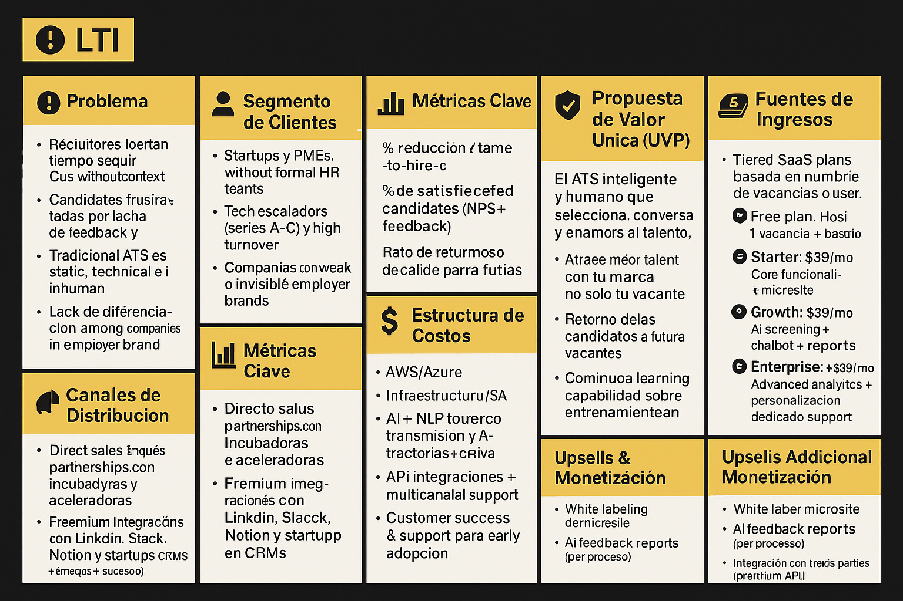

# 1. Breve Descripción

## ¿Qué es **LTI ATS**?

**LTI** es un sistema de seguimiento de candidatos (**ATS**) inteligente y humano, diseñado para startups y pymes en crecimiento que buscan atraer y seleccionar mejor talento con menos recursos.

---

## ¿Cuál es su propósito?

Automatizar lo operativo y personalizar lo humano, conectando a empresas con talento de forma más empática, ágil y efectiva.

---

## Propuesta Unica de Valor (UVP)

El ATS LTI inteligente y humano que selecciona, conversa y enamora ❤️ al talento!
— Automatiza lo operativo. Personaliza lo humano.
— Atrae mejor talento con tu marca, no solo tu vacante.

## ¿A quién va dirigido?

- Startups
- Pymes sin área de RRHH estructurada
- Empresas en etapas de escalado (Series A-C) que necesitan contratar con rapidez, precisión y buena experiencia de marca empleadora

---

## ¿Qué problemas soluciona?

- **Reducción del tiempo de contratación**
- **Mayor satisfacción y engagement de candidatos**
- **Diferenciación de marca en el proceso de selección**
- **Feedback automatizado y personalizado** para mejorar la experiencia del postulante.

## Ventaja Competitiva

- Asistente IA contextualizado al tono y cultura de cada empresa.
- Integración directa con canales de comunicación reales (WhatsApp, LinkedIn).
- Brand microsites automáticos con storytelling.
- Capacidad de aprendizaje continuo por interacción humana real.
  ✅ Puntos fuertes para inversores:
- Escalable por arquitectura SaaS + componentes modulares.
- Alta capacidad de viralización vía experiencia positiva del candidato.
- Foco en diferenciación por experiencia humana, no solo automatización.
- Atractivo para segmentos en crecimiento: startups, HR-tech, consultoras.
- Monetización clara desde la versión gratuita hasta el enterprise con alto margen.

## Diagrama Lean Canvas

# 2. Principales tres (3) Casos de Uso

## ✅ Caso de Uso 1: **Gestión del Proceso de Reclutamiento** (End-to-End Recruiting Workflow)

- **Actor principal:** Usuario HR (reclutador, hiring manager)
- **Objetivo:** Gestionar el ciclo completo de contratación desde la creación del puesto hasta la selección final del candidato.

**Flujo de actividades:**
1. Crear una nueva vacante de empleo.
2. Publicar automáticamente en portales, micrositio de marca, redes sociales y bolsas de trabajo.
3. Recibir aplicaciones en tiempo real.
4. Visualizar y filtrar candidatos mediante scoring de IA.
5. Programar entrevistas con recordatorios automáticos.
6. Realizar pruebas técnicas online integradas.
7. Realizar entrevistas y registrar evaluaciones.
8. Tomar decisión de contratación desde el mismo panel.
9. Marcar candidato como contratado, cerrar el proceso y generar reportes.

**Valor agregado LTI:**
- Micrositio personalizable de marca empleadora.
- IA que clasifica y prioriza candidatos según el perfil ideal.
- Trazabilidad completa del proceso.

---

## ✅ Caso de Uso 2: **Comunicación Inteligente con Candidatos**

- **Actor principal:** Candidato
- **Objetivo:** Mejorar la experiencia del postulante con información clara, oportuna y personalizada a lo largo del proceso.

**Flujo de actividades:**
1. El candidato aplica desde distintos canales (portal, redes, micrositio).
2. Recibe confirmación automática de su postulación.
3. Durante el proceso, recibe notificaciones de estatus: revisión de CV, entrevistas agendadas, pruebas asignadas, etc.
4. Accede a una interfaz o inbox centralizado con todo el historial de su proceso.
5. Recibe feedback (incluso automatizado) al final del proceso.

**Valor agregado LTI:**
- Motor de comunicación multicanal (email, SMS, WhatsApp).
- Feedback automatizado y empático.
- Inbox candidato centralizado y trackeable.

---

## ✅ Caso de Uso 3: **Cribado y Entrevistas Potenciadas por IA** (AI-Powered Screening & Interviewing)

- **Actor principal:** Usuario HR (reclutador)
- **Objetivo:** Agilizar la revisión y evaluación de candidatos mediante tecnología de inteligencia artificial.

**Flujo de actividades:**
1. La IA analiza los CV recibidos y los cruza con los requisitos del puesto.
2. Clasifica y prioriza a los candidatos en un ranking visual.
3. Sugiere preguntas personalizadas para la entrevista según las competencias y datos del candidato.
4. Sugiere si avanzar o descartar basándose en criterios configurables (skill match, experiencia, educación, etc.).
5. Ayuda a detectar sesgos o vacíos en las decisiones de contratación.

**Valor agregado LTI:**
- Asistente de IA entrenado con criterios del cliente.
- Sugerencias personalizadas por puesto.
- Ahorro de tiempo en cribado y entrevistas más consistentes.

# Diagrama en formato UML
@startuml
left to right direction
skinparam backgroundColor #ffffff
skinparam ActorBorderColor black
skinparam ActorFontColor black
skinparam usecase {
    BackgroundColor #fdf6e3
    BorderColor black
    ArrowColor black
}

actor "Reclutador" as Recruiter
actor "Candidato" as Candidate
actor "Sistema de Publicación" as JobBoard
actor "Motor de IA" as AI

package "LTI ATS - Casos de Uso MVP" {
    
    usecase "1. Crear y gestionar vacantes" as UC1
    usecase "2. Recibir y centralizar postulaciones" as UC2
    usecase "3. Cribado automático con IA" as UC3

    Recruiter --> UC1
    UC1 --> JobBoard : «publica en»
    UC1 --> UC2 : «genera entrada para»

    Candidate --> UC2 : «aplica a vacantes»
    
    UC2 --> UC3 : «envía candidatos a evaluar»
    AI --> UC3 : «realiza análisis y ranking»

    Recruiter --> UC2 : «visualiza y filtra»
    Recruiter --> UC3 : «revisa shortlist IA»

}

@enduml

## 📝 Resumen de Componentes

| **Elemento**              | **Tipo**         | **Descripción**                                                        |
|---------------------------|------------------|------------------------------------------------------------------------|
| **Reclutador**            | Actor            | Usuario interno encargado de crear vacantes y gestionar candidatos.    |
| **Candidato**             | Actor            | Usuario externo que aplica a las vacantes desde distintos canales.     |
| **Sistema de Publicación**| Actor            | Servicios externos donde se publican las ofertas (portales, micrositios). |
| **Motor de IA**           | Actor            | Componente responsable de analizar y clasificar automáticamente perfiles. |
| **UC1**                   | Caso de uso      | Proceso de creación y gestión de ofertas laborales.                    |
| **UC2**                   | Caso de uso      | Centralización de postulaciones desde múltiples canales.               |
| **UC3**                   | Caso de uso      | Cribado automático de candidatos basado en criterios inteligentes.     |

# 3. Modelo de Datos
erDiagram
    CANDIDATO ||--o{ VACANTE : "aplica a"
    VACANTE }o--|| RECLUTADOR : "creada por"
    RECLUTADOR }o--|| EMPRESA : "trabaja en"
    VACANTE }o--|| EMPRESA : "pertenece a"

    CANDIDATO {
        UUID id
        string nombre
        string email
        string telefono
        string cv_url
        datetime fecha_aplicacion
        string estado
        float ranking_ia
    }

    VACANTE {
        UUID id
        string titulo
        text descripcion
        string ubicacion
        enum tipo
        datetime fecha_publicacion
        enum estado
    }

    RECLUTADOR {
        UUID id
        string nombre
        string email
        enum rol
    }

    EMPRESA {
        UUID id
        string nombre
        string industria
        string pais
        string sitio_web
    }

✅ Entidades Clave
1. Candidato
Representa a una persona que aplica a una vacante.

Campos importantes:

id: UUID

nombre: string

email: string

telefono: string

cv_url: string (link al currículum)

fecha_aplicacion: datetime

estado: string (Ej: Aplicado, En revisión, Entrevista, Rechazado, Contratado)

ranking_ia: decimal (score calculado por IA)

id_vacante: FK a Vacante

2. Reclutador
Usuario que administra vacantes y gestiona postulaciones.

Campos importantes:

id: UUID

nombre: string

email: string

rol: enum (Ej: Admin, Reclutador)

empresa_id: FK a Empresa

3. Vacante
Representa una posición laboral publicada en el sistema.

Campos importantes:

id: UUID

titulo: string

descripcion: text

ubicacion: string

tipo: enum (Ej: Tiempo completo, Freelance, Remoto)

fecha_publicacion: datetime

estado: enum (Activa, Cerrada)

reclutador_id: FK a Reclutador

empresa_id: FK a Empresa

4. Empresa
Organización propietaria de las vacantes y usuarios del sistema.

Campos importantes:

id: UUID

nombre: string

industria: string

pais: string

sitio_web: string

🧩 Relaciones
Un Reclutador pertenece a una Empresa.

Una Vacante es publicada por un Reclutador y pertenece a una Empresa.

Un Candidato aplica a una Vacante.

Una Empresa puede tener múltiples Vacantes y Reclutadores.

# 4. Arquitectura de Microservicios – LTI ATS (High-Level)
🔧 1. Componentes Principales (Dominios y Servicios)
🟨 1.1. Servicio de Gestión de Vacantes
CRUD de vacantes

Publicación en micrositios y portales externos

Filtros, estado, categorización

Indexación para búsqueda

🟨 1.2. Servicio de Gestión de Candidatos
Aplicaciones a vacantes

Almacenamiento de CV y metadatos

Seguimiento de estado (pipeline)

Relación con scoring IA

🟨 1.3. Servicio de Reclutadores
Gestión de usuarios internos (Reclutadores)

Roles y permisos

Asociaciones con empresas

🟨 1.4. Servicio de Empresas
Registro y configuración de empresas

Branding y micrositios de carrera

Integración con dominios personalizados

🟨 1.5. Servicio de Matching Inteligente (IA)
Procesamiento de CVs y perfiles

Algoritmo de matching entre candidatos y vacantes

Generación de ranking inteligente

🟨 1.6. Servicio de Notificaciones
Emails, alertas push, recordatorios

Comunicación con candidatos (status updates)

Webhooks para sistemas externos

🟨 1.7. Servicio de Autenticación & Autorización (Auth)
Registro/login con OAuth2 / JWT

Gestión de sesiones y acceso

Multitenancy para empresas

🔄 2. API Gateway
Punto único de entrada

Ruteo a microservicios internos

Rate limiting, seguridad, logging

Puede usar soluciones como Kong, API Gateway (AWS), etc.

🛢️ 3. Almacenamiento
PostgreSQL / MySQL: Base de datos relacional para datos transaccionales (vacantes, usuarios, empresas).

ElasticSearch: Búsqueda rápida de vacantes y candidatos.

S3 o similar: Almacenamiento de archivos (CVs).

Redis: Cacheo de resultados y sesiones para rapidez.

MongoDB / Document DB (opcional): Para storing de perfiles enriquecidos no estructurados por IA.

📈 4. Escalabilidad y Despliegue
Despliegue con contenedores Docker

Orquestación con Kubernetes (K8s)

Autoescalado de servicios según carga (ej. muchos candidatos aplicando)

Circuit Breakers y Health checks por servicio

🔐 5. Seguridad y Auditoría
JWT + RBAC por microservicio

Logs centralizados (ELK / Grafana)

Auditoría de acciones clave

Detección de anomalías en login o tráfico IA

Arquitectura Formato Mermaid
flowchart TB
  subgraph Frontend
    UI[Frontend Web/Mobile]
  end

  subgraph Gateway
    APIGW[API Gateway\n(Autenticación, Ruteo, Rate Limiting)]
  end

  subgraph Services
    Auth[Auth Service\n(OAuth2, JWT)]
    Candidate[Candidate Service\n(CRUD, Aplicaciones)]
    Recruiter[Recruiter Service\n(Gestión de usuarios internos)]
    Vacancy[Vacancy Service\n(Creación y búsqueda de vacantes)]
    Company[Company Service\n(Empresas, micrositios)]
    Match[AI Matching Service\n(Scoring, IA, ranking)]
    Notify[Notification Service\n(Correos, Webhooks)]
  end

  subgraph Infra
    DB[(PostgreSQL)]
    Search[(ElasticSearch)]
    FileStore[(S3 - CV Storage)]
    Cache[(Redis)]
    Logs[(ELK / Grafana)]
  end

  UI --> APIGW
  APIGW --> Auth
  APIGW --> Candidate
  APIGW --> Recruiter
  APIGW --> Vacancy
  APIGW --> Company
  APIGW --> Match
  APIGW --> Notify

  Candidate --> DB
  Candidate --> FileStore
  Candidate --> Match
  Match --> Search
  Match --> DB

  Recruiter --> DB
  Company --> DB
  Vacancy --> DB
  Vacancy --> Search

  Notify --> Logs
  Auth --> DB
  Auth --> Cache
  APIGW --> Logs

🧠 Leyenda de Componentes Clave

| **Componente**         | **Rol**                                                        |
|------------------------|----------------------------------------------------------------|
| **API Gateway**        | Punto de entrada seguro para el frontend                       |
| **Auth Service**       | Manejo de identidad y control de acceso (JWT, OAuth2)          |
| **Candidate Service**  | Gestión de candidatos y aplicaciones                           |
| **Recruiter Service**  | Registro y permisos de usuarios de empresa                     |
| **Vacancy Service**    | CRUD y búsqueda de vacantes                                    |
| **Company Service**    | Configuración de marca y micrositios de carrera                |
| **AI Matching Service**| Scoring basado en IA para preselección                        |
| **Notification Service**| Comunicación automática por correo o webhook                  |
| **ElasticSearch**      | Búsqueda optimizada para candidatos/vacantes                   |
| **Redis**              | Cacheo de datos frecuentes (ranking, sesiones)                 |
| **S3**                 | Almacenamiento de archivos (CVs)                               |
| **Grafana/ELK**        | Observabilidad, métricas, trazabilidad                        |

# 5. Diagrama C4 (Mermaid)
## C1 – System Context (ATS LTI)

graph TB
    subgraph External Users
        Candidate[User: Candidato]
        Recruiter[User: Reclutador]
    end

    subgraph LTI ATS System
        CandidateService[Candidate Service]
        VacancyService[Vacancy Service]
        MatchingService[IA Matching Service]
        AuthService[Auth Service]
    end

    Candidate -->|Aplica a vacantes| CandidateService
    Recruiter -->|Consulta perfiles| CandidateService
    CandidateService --> VacancyService
    CandidateService --> MatchingService
    CandidateService --> AuthService

## C2 – Container Diagram (ATS LTI System)

graph TD
    subgraph ATS LTI
        WebUI[Web Frontend - React/Vue]
        APIGateway[API Gateway]
        CandidateAPI[Candidate API]
        CandidateDB[(PostgreSQL)]
        FileStorage[(CV Storage - S3)]
        IAEngine[IA Engine]
    end

    Candidate --> WebUI
    WebUI --> APIGateway
    APIGateway --> CandidateAPI
    CandidateAPI --> CandidateDB
    CandidateAPI --> FileStorage
    CandidateAPI --> IAEngine
    
## C3 – Component Diagram (Candidate Service)
graph TD
    subgraph "Candidate Service (Spring Boot / Express)"
        APILayer["REST Controller (POST /candidates, GET /status)"]
        AppLogic["Application Service Layer"]
        CVParser["CV Parser / Validator"]
        ProfileBuilder["Profile Builder"]
        ScoringClient["IA Scoring Client"]
        CandidateRepo["Candidate Repository (JPA / ORM)"]
        FileClient["File Storage Client (S3)"]
    end

    APILayer --> AppLogic
    AppLogic --> CVParser
    AppLogic --> ProfileBuilder
    AppLogic --> ScoringClient
    AppLogic --> CandidateRepo
    AppLogic --> FileClient

    CandidateRepo --> DB[(PostgreSQL)]
    FileClient --> S3[(Object Storage)]
    ScoringClient --> IAEngine[(IA Matching Service)]

## Breve descripción de cada componente interno (C3)

| **Componente**      | **Descripción**                                                        |
|---------------------|------------------------------------------------------------------------|
| **REST Controller** | Exposición de endpoints públicos (/apply, /candidates/{id})            |
| **Application Logic** | Orquestación de pasos para aplicar, validar y guardar datos           |
| **CV Parser**       | Extracción de datos del CV en PDF/DOC                                  |
| **Profile Builder** | Construcción del perfil del candidato (skills, experiencia, etc.)       |
| **Scoring Client**  | Comunicación con servicio IA para obtener ranking y fit de la vacante   |
| **Candidate Repo**  | Abstracción de acceso a base de datos relacional                       |
| **File Client**     | Subida y recuperación de archivos a S3                                 |

