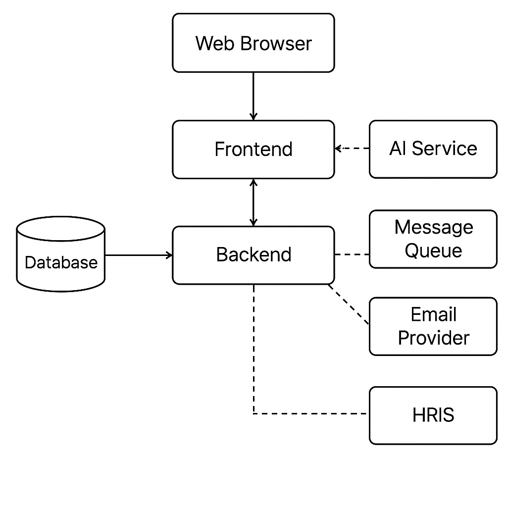

# 🏗️ Descripción Narrativa de la Arquitectura
El sistema LTI estará basado en una arquitectura modular y desacoplada, utilizando un stack 100% TypeScript (React + Node.js) con servicios en la nube, priorizando simplicidad, velocidad de desarrollo y escalabilidad futura.

# 1. Front-end Web (React + Tailwind)
* Construido con React, usa un enfoque SPA (Single Page Application).
* Comunicación vía API RESTful al backend.
* Incluye vistas para:
    * Panel de vacantes
    * Postulaciones
    * Revisión colaborativa
    * Feedback con IA
* Compatible con navegación responsiva (móvil).

# 2. Back-end API (Node.js + Express + TypeScript)
* Provee endpoints REST para el front-end.
* Se encarga de autenticación, lógica de negocio y validaciones.
* Gestiona seguridad y roles de acceso.
* Genera reportes y archivos exportables (Excel/PDF).

# 3. Base de Datos Relacional (PostgreSQL)
* Almacena entidades estructuradas: usuarios, vacantes, candidatos, postulaciones, feedback.
* Indexación por búsqueda rápida (por texto, nombre, estado).
* Usa UUIDs para todas las entidades principales.

# 4. Servicios de IA (OpenAI)
* Utiliza API de OpenAI (GPT) para:
    * Generación de resúmenes de CVs.
    * Sugerencia de descripciones y preguntas para vacantes.
    * Comparación automática entre candidatos.
* Las llamadas se gestionan desde el backend vía wrapper con control de logs y errores.

# 5. Cola de eventos (Redis + BullMQ)
* Usada para procesar tareas en segundo plano:
    * Generación asincrónica de análisis de IA.
    * Envío de correos de notificación.
    * Exportaciones de archivos grandes.
* Escalable en futuro si se cambia a RabbitMQ o un bus de eventos completo.

# 6. Integraciones externas
* Correo electrónico: se usa un proveedor como **SendGrid** o **Resend** para notificaciones automáticas (aplicación recibida, comentarios, cierre de vacante).
* Integración con HRIS (opcional):
    * No se conecta directamente con sistemas externos.
    * Ofrece API REST pública + exportación a Excel estructurada por candidato/vacante.

# 7. Autenticación y Seguridad
* Login con email/contraseña (JWT).
* Roles por usuario (admin, recruiter, manager).
* Logs de acceso, control de permisos, y cumplimiento básico GDPR.

📦 Diagrama de Arquitectura (caja y líneas)
A continuación generaremos el diagrama que representa esta arquitectura a alto nivel.

