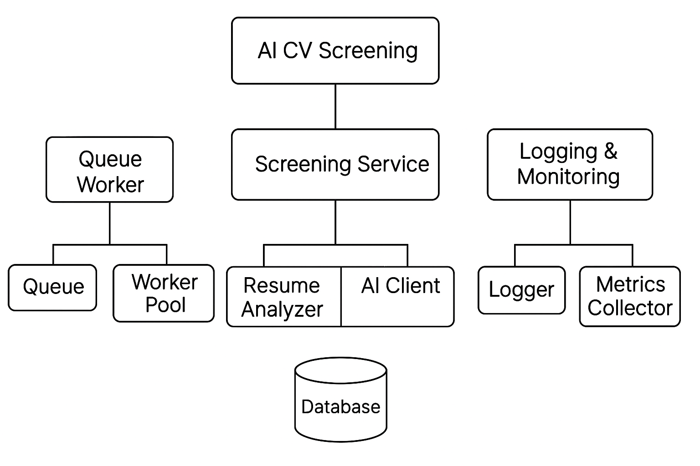

**Agente IA usado**: Chat GPT (Gratuito)

**Prompt 1**: En modo razonamiento

Esta tarea debería tener el punto de vista de un product manager.
Se necesita hacer el diseño y documentación del sistema de sofware siguiendo las siguientes fases:
1. Investigación y análisis
2. Casos de Uso
3. Modelado de datos
4. Diseño de alto nivel

El sistema es para una startup llamada LTI, que quiere desarrollar el ATS del futuro. Se adjunta imágen con los puntos principales de un ATS.

Todavía no hay nada creado, así que hay que definir las funcionalidades clave que harán brillar a LTI por encima de los competidores:
* aumentar la eficiencia para los departamentos de HR
* mejorar la colaboración en tiempo real entre reclutadores y managers, automatizaciones
* asistencia de IA en diversas tareas

Hay que hacer brainstorming, investigar cuáles pueden ser las claves del éxito, y dejarlo plasmado para el resto del equipo.

La primera versión del sistema debe contar con:
* Descripción breve del software LTI, valor añadido y ventajas competitivas. Explicación de las funciones principales. Añadir un diagrama Lean Canvas para entender el modelo de negocio.
* Descripción de los 3 casos de uso principales, con el diagrama asociado a cada uno
* Modelo de datos que cubra entidades, atributos (nombre y tipo) y relaciones
* Diseño del sistema a alto nivel, tanto explicado como diagrama adjunto
* Diagrama C4 que llegue en profundidad a uno de los componentes del sistema

Usando Metaprompting, define los prompt adecuados, permitan poder realizar en conjunto con la IA y una persona, el plan de trabajo para lograr esta tarea. Hazme las preguntas que consideres que importantes, para aclarar ideas y ver que puntos fueron omitidos y sería importante incluir.

**Respuesta 1**:

A continuación encontrarás una propuesta de Meta-prompts organizados por fases, que te ayudarán a colaborar con la IA y con tu equipo humano para generar cada artefacto solicitado. Al final incluyo también una serie de preguntas de aclaración que sugiero hacer al inicio del proyecto para no omitir ningún punto crítico.

1. Investigación y análisis
* Prompt IA (mercado y competencia)

> “Eres un Product Manager que está analizando el mercado de Applicant Tracking Systems (ATS). Describe las tendencias actuales, principales retos de los departamentos de RR.HH., y analiza 5 competidores líderes (por ejemplo Greenhouse, Lever, SmartRecruiters, etc.), señalando sus fortalezas y debilidades.”

* Prompt IA (usuarios y necesidades)

> “Identifica y perfila a los stakeholders clave de nuestro ATS (reclutadores, hiring managers, candidatos, TI…). Para cada uno, resume sus pains & gains y prioriza sus necesidades más críticas.”

* Prompt IA (valor diferencial LTI)

> “Con base en la investigación previa, genera una propuesta de valor para LTI: ¿qué funcionalidades, flujos y asistencias de IA pueden convertirlo en el ‘ATS del futuro’? Enumera al menos 3 pilares diferenciales.”

2. Casos de Uso
* Prompt IA (selección de casos)

> “Propón los 3 casos de uso principales para la primera versión de LTI (por ejemplo: creación y seguimiento de ofertas, colaboración en selección, onboarding preliminar). Para cada uno, escribe un título, actor(es), precondición, flujo principal y flujo alternativo.”

* Prompt IA (diagramas UML)

> “A partir de los casos de uso definidos, genera un diagrama de casos de uso UML (lista de actores y relaciones con cada caso) y describe cómo se visualizaría gráficamente.”

3. Modelado de datos
* Prompt IA (entidades y atributos)

> “Diseña un modelo lógico de datos para LTI: define al menos 8–10 entidades (Job, Candidate, Application, User, Interview, Feedback, AutomationRule, etc.), con sus atributos principales (nombre y tipo) y relaciones entre ellas (1-n, n-m).”

* Prompt IA (diagrama ER)

> “Convierte el modelo lógico en un diagrama Entidad-Relación describiendo llaves primarias, foráneas y cardinalidades.”

4. Diseño de alto nivel
* Prompt IA (arquitectura y componentes)

> “Escribe una descripción narrativa de la arquitectura de LTI: front-end, back-end, bases de datos, servicios de IA, colas de eventos, integraciones con proveedores de correo y HRIS. Luego elabora un diagrama de alto nivel (tipo caja-y-líneas) que lo represente.”

* Prompt IA (diagrama C4 – componente)

> “Profundiza en uno de los componentes críticos (por ejemplo, el módulo de ‘Asistencia de IA para criba de CV’): describe sus subcomponentes, interfaces, tecnologías sugeridas y muestra un diagrama C4 (nivel 3) de ese módulo.”

# Plan de trabajo colaborativo
1. Kick-off interno
    * Reunión de 1h con stakeholders.
    * Revisar prompts y confirmar objetivos.

2. Sprints de IA + revisión humana
    * Sprint 1 (2 días): Investigación de mercado y propuesta de valor.
    * Sprint 2 (2 días): Redacción de casos de uso + diagramas.
    * Sprint 3 (2 días): Modelado de datos y diagrama ER.
    * Sprint 4 (2 días): Arquitectura y diagramas C4.
3. Revisión final y documentación
    * Consolidar artefactos en un único repositorio (Docs & Confluence).
    * Feedback de TI, RR.HH. y Dirección.

# Preguntas de aclaración iniciales
1. Alcance y prioridades
    * ¿Qué módulos son must-have en MVP y cuáles pueden dejarse para versiones posteriores?
    * ¿Hay requerimientos legales o de compliance (GDPR, ISO, etc.) que debamos contemplar?
2. Tecnología y equipo
    * ¿Qué stack tecnológico prefiere el equipo (Java, .NET, Node.js, React…)?
    * ¿Disponemos de servicios de IA propios o usaremos terceros (OpenAI, Azure Cognitive Services…)?
3. Integraciones y datos legacy
    * ¿Debemos integrarnos con algún sistema HRIS existente (SAP, Workday, BambooHR…)?
    * ¿Existe ya una base de datos de candidatos a migrar?
4. Timeline y recursos
    * ¿Cuál es la fecha objetivo de lanzamiento del MVP?
    * ¿Con qué tamaño de equipo contamos para desarrollo, QA y operaciones?
5. Usuarios y métricas
    * ¿Cómo mediremos el éxito (KPI’s: time-to-hire, candidate NPS, adopción interna…)?
    * ¿Háblame del perfil y número estimado de usuarios concurrentes en el MVP?

Con estos Meta-prompts y preguntas iniciales, podrás alinear a tu equipo y a la IA sobre qué, cómo y por qué de cada fase, asegurando cobertura completa de todos los entregables. ¿Qué otros aspectos crees que deberíamos explorar antes de arrancar?

**Prompt 2**: 

Me parece una excelente propuesta para dar cumplimiento a esta tarea, así que responderé las preguntas iniciales para ir iniciando el plan.
1. Los módulos must-have serían la creación de trabajos, recepción de postulaciones recibidas, revisión de aplicaciones y seleccionar candidato para contratar. En los modelos igualmente indicar de las otras partes, aunque no sean implementadas en la primera etapa.
2. Considera los requerimientos legales que sean más generales, considerando la unión europea como referencia.
3. El stack tecnológico preferido es typescript, tanto para frontend como para backend.
4. Se usaran servicios de IA de terceros, OpenAI
5. En una primera etapa no hay una integración especifica con un HRIS determinado, por lo que solo se deben disponer de API's de salida y generación de archivos excel para que puedan hacer el proceso de datos por medio de carga de datos que el propio HRIS establezca y con estas dos cubrimos un amplio espectro para integrar.
6. No hay ninguna base de datos para migrar, ni de candidatos ni nada en este momento.
7. Respecto a los tiempos, considerando que es una startup, se buscan los tiempos más cortos posibles, pero que aunque el producto sea simple, cubra el funcionamiento mínimo viable para operar.
8. Considerar un equipo pequeño inicialmente, es decir de 1 a 3 personas.
9. Establece los KPI que consideres pertinentes y que puedan ser medidos sin complejizar el proceso de implementación.
10. Los usuarios serán pocos, no más de 5, y con el conocimiento principal en el negocio, considera que es un proyecto pequeño, pero ambicioso, por lo que espera ir creciendo con el tiempo.

Con las preguntas aclaradas, demos inicio al plan para poder generar todo el contenido esperado.

**Respuesta 2**

Perfecto, con tus respuestas claras y el contexto definido, daremos inicio al Plan de Trabajo siguiendo las fases y entregables establecidos. A continuación te presento la Fase 1: Investigación y análisis, con su desarrollo inicial.

# 🧩 Fase 1: Investigación y Análisis
## 📌 Descripción del Producto: LTI ATS
LTI ATS es una plataforma de seguimiento de candidatos diseñada desde cero para maximizar la eficiencia de los procesos de reclutamiento en startups y empresas en crecimiento. Su valor diferencial reside en su diseño ligero, colaborativo y con fuerte presencia de IA, enfocado en ayudar a equipos pequeños a tomar decisiones rápidas e informadas.

🎯 Valor añadido
✨ IA integrable desde el primer día: análisis automático de CVs, resúmenes de perfiles, preguntas sugeridas para entrevistas y más.

🤝 Colaboración fluida: comentarios, feedback y decisiones en tiempo real entre RRHH y managers.

⚡ Automatización accesible: reglas configurables para filtros, avisos, pasos del proceso, sin depender de IT.

📤 Exportación lista para HRIS: integraciones flexibles con APIs o exportaciones en Excel.

🛡️ Cumplimiento
Respeta principios clave del RGPD: consentimiento explícito, portabilidad, eliminación de datos, y mínimo tratamiento.

Seguridad por defecto en almacenamiento de datos y logs de acceso.

## 🔎 Análisis de la competencia
|Plataforma	    |Fortalezas                                 |Debilidades                            |
|---------------|-------------------------------------------|---------------------------------------|
|Greenhouse     | Flujo robusto, buena UX, integraciones    | Costoso y complejo para pymes         |
|Lever	        | CRM integrado, interfaz moderna           | Limitado en personalización IA        |
|BreezyHR       | Fácil de usar, ideal para pymes           | Falta profundidad en análisis         |
|Workable       | Buenas plantillas y recomendaciones IA    | Poco flexible en colaboración real    |
|Recruitee      | Colaboración simple, intuitivo	        | Limitado en automatización avanzada   |

## 📌 Propuesta de Valor (Pilares Diferenciales)
## 1. IA de apoyo integral
    Desde la criba de CVs hasta generación de resumen ejecutivo de candidatos y preguntas para entrevistas personalizadas.

## 2. Flujo colaborativo simplificado
    Reclutadores y managers pueden opinar, etiquetar, y decidir sin pasos engorrosos ni capacitaciones.

## 3. Minimalismo poderoso
    Todo lo necesario para operar en menos de 5 clics. MVP centrado en agilidad, sin sobrecarga funcional.

## 📊 Lean Canvas
| Sección            |	Contenido                                                                       |
|--------------------|----------------------------------------------------------------------------------|   
| Problema           | Reclutamiento lento, falta de colaboración, info dispersa, sin IA útil.          |
| Clientes           | Startups pequeñas y medianas (3–30 empleados), sin RRHH dedicado.                |
| Propuesta          | Valor	ATS simple, ágil, colaborativo y con IA desde el inicio.                |
| Solución           | LTI ATS: colaboración + IA + automatización mínima viable.                       |
| Métricas clave     | Tiempo hasta contratar, satisfacción usuarios, uso IA, adopción por rol.         |
| Ventaja competitiva| Stack moderno, sin legacy, optimizado para productividad real.                   |
| Canales            | Ventas directas, referencias, incubadoras de startups.                           |
| Costes             | Infraestructura cloud, licencias IA, soporte.                                    |
| Ingresos           | Suscripción mensual por empresa según número de vacantes activas.                |

## ✅ Próximo paso
Fase 2: Casos de Uso

Antes de generarlos, por favor confirma:
1. ¿Quieres que el primer caso de uso sea el flujo completo desde creación de vacante → revisión → contratación?
2. ¿Debería incluir interacción con funcionalidades IA en alguno de los casos?
3. ¿Tienes alguna preferencia sobre el estilo de los diagramas UML (plantillas, símbolos o herramientas específicas)? Si no, usaré un formato estándar.

¿Te parece bien avanzar con esto o prefieres revisar/modificar algo del análisis antes de seguir?

**Prompt 3**
Para la fase 2 de los casos de uso te confirmo:
1. El caso propuesto me parece excelente para ser el primero
2. Si, incluyelo si aporta valor al producto
3. Utiliza un formato estándar

**Respuesta 3**
Perfecto, con tus indicaciones claras, pasamos a la Fase 2: Casos de Uso, centrados en reflejar el valor de LTI ATS en tres flujos fundamentales del proceso de selección.
---
# 🧩 Fase 2: Casos de Uso
## ✅ Caso de Uso 1: Crear y gestionar una vacante (con IA)
**Nombre**: Crear Vacante con Sugerencias de IA
**Actor principal**: Reclutador
**Actores secundarios**: Manager de contratación
**Precondiciones**: El usuario está autenticado y tiene rol autorizado para crear vacantes.
**Postcondición**: La vacante queda publicada internamente (o externamente, si se desea).

## Flujo principal:
1. El reclutador accede al panel de creación de vacantes.
2. Completa los campos básicos (título, descripción, requisitos).
3. Activa el botón “Sugerencias IA”.
4. El sistema genera recomendaciones de:
* Habilidades clave a incluir.
* Preguntas de screening.
* Formato de descripción optimizado.
5. El reclutador revisa y edita el contenido sugerido.
6. Selecciona el canal de publicación (interno / externo).
7. El manager revisa la vacante y la aprueba.
8. El sistema publica la vacante y queda activa para postulaciones.

## Flujos alternativos:
* Si el manager no aprueba, la vacante queda en estado “borrador”.
* Si falla la llamada a la IA, se muestra mensaje y continúa flujo manual.

## ✅ Caso de Uso 2: Evaluar postulaciones en colaboración
**Nombre: Revisión Colaborativa de Candidatos**
**Actor principal:** Reclutador
**Actores secundarios:** Manager de contratación, IA del sistema
**Precondiciones:** Hay una o más postulaciones asociadas a una vacante activa.
**Postcondición:** Candidatos quedan clasificados para avanzar, rechazar o entrevistar.

## Flujo principal:
1. El reclutador entra a la lista de postulaciones de una vacante.
2. Visualiza una tabla con datos clave (nombre, experiencia, educación, etc.).
3. Activa “Resumen IA” para ver el análisis automático de cada CV:
* Fortalezas destacadas.
* Red flags detectadas.
* Recomendación preliminar (fit alto / medio / bajo).
4. El manager agrega comentarios y etiquetas (👍, 👎, ⚠️).
5. El equipo decide en conjunto qué candidatos avanzan.
6. El sistema actualiza el estado de cada postulación.

## Flujos alternativos:
* Si hay desacuerdo, se deja comentario y se deja pendiente la decisión.

## ✅ Caso de Uso 3: Selección final y cierre del proceso
**Nombre:** Selección de Candidato Final
**Actor principal:** Manager de contratación
**Actores secundarios:** Reclutador
**Precondiciones:** El proceso de entrevistas ha concluido y hay feedback registrado.
**Postcondición:** Se marca un candidato como “Contratado” y se cierra la vacante.

## Flujo principal:
1. El manager accede a la etapa final de la vacante.
2. Consulta el historial de cada candidato finalista:
* CV original
* Notas de entrevistas
* Evaluaciones del equipo
3. Utiliza IA para ver comparación automática entre finalistas.
4. Selecciona un candidato y lo marca como “Contratado”.
5. El sistema actualiza el estado de la vacante a “Cerrada”.
6. Genera reporte resumen exportable (Excel o PDF).
7. El resto de los candidatos quedan marcados como “No seleccionados”.

## Flujos alternativos:
* Si ningún candidato es adecuado, se reactiva la vacante y se reinicia el proceso.

## 📊 Diagrama de Casos de Uso UML
Este es un esquema textual del diagrama. Lo representaré gráficamente si lo deseas luego (SVG o imagen).
```
            +-----------------+
            |   Reclutador    |
            +-----------------+
                   |
    +---------------------------------------+
    |  Crear vacante con IA                 |
    +---------------------------------------+
                   |
    +---------------------------------------+
    |  Ver y gestionar postulaciones        |
    +---------------------------------------+
                   |
    +---------------------------------------+
    |  Generar feedback y etiquetar         |
    +---------------------------------------+

            +---------------------+
            |   Manager Contrato  |
            +---------------------+
                   |
    +---------------------------------------+
    |  Revisar y aprobar vacante            |
    +---------------------------------------+
                   |
    +---------------------------------------+
    |  Seleccionar candidato final          |
    +---------------------------------------+
 
            +---------------+
            |     IA LTI    |
            +---------------+
                 |     |     |
                Sugerencias, análisis, comparaciones
```

## ✅ Próximo paso
Pasamos a la Fase 3: Modelado de datos. Para ello, definiré:
* Entidades principales (Job, Candidate, Application, User, Feedback, etc.).
* Atributos clave (con nombre y tipo).
* Relaciones (1:1, 1:N, N:M).

¿Quieres que partamos directamente con eso o deseas que genere primero el diagrama gráfico de los casos de uso?

**Prompt 4:**
Continua con el siguiente paso, los casos de eso están bien así por el momento

**Respuesta 4:**
Excelente. Continuamos entonces con la Fase 3: Modelado de Datos, diseñando el modelo que respalde funcionalmente los casos de uso del MVP y deje espacio para crecimiento futuro.

# 🧩 Fase 3: Modelado de Datos
## ✅ Entidades principales y atributos
A continuación se muestra el modelo lógico con las entidades clave, sus atributos (nombre y tipo de dato sugerido) y sus relaciones.

### 1. User
Representa a los usuarios del sistema: reclutadores, managers, administradores.

|Atributo  | Tipo                              |
|----------|-----------------------------------|
|id        | UUID                              |
|name      | string                            |
|email	   | string                            |
|role	   | enum (recruiter, manager, admin)  |
|createdAt | datetime                          |

### 2. Job
Vacante publicada o en borrador.

|Atributo   | Tipo                              |
|-----------|-----------------------------------|
|id	        |   UUID                            |
|title      |	string                          |
|description|	text                            |
|department	|   string                          |
|location   |	string                          |
|status     |	enum (draft, open, closed)      |
|createdBy  |	FK → User                       |
|createdAt  |	datetime                        |

### 3. Application
Postulación de un candidato a un trabajo.

|Atributo   | Tipo                                                      |
|-----------|-----------------------------------------------------------|
|id	        |   UUID                                                    |
|jobId      |	FK → Job                                                |
|candidateId|	FK → Candidate                                          |
|status	    |   enum (new, reviewed, rejected, interviewed, hired)      |
|source	    |   string (e.g., "LinkedIn", "Referral")                   |
|createdAt  |	datetime                                                |

### 4. Candidate
Persona postulante al sistema.

|Atributo   | Tipo                                                      |
|-----------|-----------------------------------------------------------|
|id	        |   UUID                                                    |
|fullName   |	string                                                  |
|email	    |   string                                                  |
|phone	    |   string                                                  |
|resumeUrl	|   string                                                  |
|createdAt	|   datetime                                                |

### 5. Feedback
Opiniones y evaluaciones de los usuarios sobre postulaciones.

|Atributo       | Tipo                                                  |
|---------------|-------------------------------------------------------|
|id	            |   UUID                                                |
|applicationId  |	FK → Application                                    |
|reviewerId     |	FK → User                                           |
|rating         |	integer (1-5)                                       |
|comments       |	text                                                |
|createdAt      |	datetime                                            |

### 6. IAAnalysis
Resultados de la IA sobre un CV o perfil.

|Atributo       | Tipo                                                  |
|---------------|-------------------------------------------------------|
|applicationId  |	FK → Application                                    |
|summary        |	text                                                |
|strengths      |	json/text                                           |
|weaknesses	    |   json/text                                           |
|fitScore	    |   float (0-1)                                         |
|generatedAt	|   datetime                                            |

### 7. JobApproval
Registro de aprobación de una vacante.

|Atributo   | Tipo                                                      |
|-----------|-----------------------------------------------------------|
|id	        |   UUID                                                    |
|jobId      |	FK → Job                                                |
|approverId |	FK → User                                               |
|approved   |	boolean                                                 |
|reviewedAt |	datetime                                                |
|comments   |	text                                                    |

### 8. Tag
Etiqueta colaborativa sobre una postulación.

|Atributo   | Tipo                                                      |
|-----------|-----------------------------------------------------------|
|id	        |   UUID                                                    |
|name       |	string                                                  |

### 9. ApplicationTag
Relación N:M entre Tags y Applications.

|Atributo       | Tipo                                                  |
|---------------|-------------------------------------------------------|
|applicationId  |	FK → Application                                    |
|tagId	        |   FK → Tag                                            |

## ✅ Relaciones
* User → Job: 1:N (un usuario puede crear muchos trabajos)
* Job → Application: 1:N
* Candidate → Application: 1:N
* Application → Feedback: 1:N (múltiples evaluaciones por candidato)
* Application → IAAnalysis: 1:1
* Job → JobApproval: 1:N
* Application ↔ Tag: N:M (por medio de ApplicationTag)

## 🔁 Futuro (entidades no-MVP)
Estas entidades podrían añadirse más adelante:
* Interview: estructura de entrevistas y agenda.
* HiringPipeline: etapas definidas por trabajo.
* AutomationRule: sistema de automatización (si esto/entonces aquello).
* Notification: sistema de alertas internas.

# 📌 Próximo paso
Vamos a construir ahora el diagrama Entidad-Relación (ER) en formato gráfico, que muestra las entidades, atributos clave y relaciones entre ellas.

¿Quieres que lo genere como imagen directamente (ERD estilo clásico), o prefieres avanzar al diseño de alto nivel del sistema (Fase 4) y luego generar los diagramas juntos al final?

**Prompt 5**

Genera la imagen directamente del diagrama ER, luego genera el diseño de alto nivel, para cumplir con el cuarto artefacto de la tarea

**Respuesta 5**
Procesando imagen
Hay muchas personas creando imágenes en este momento, así que podría tardar un poco. Te avisaremos cuando tu imagen esté lista.

**Nota a la respuesta 5**
Generó una imagen del diagrama cortado. En un contexto normal, debería buscar generar el diagrama con otra herramienta, pero considerando que debería darle contexto a otra herramienta, dejaré la que generó Chat GPT para el ejercicio.

**Prompt 6:** Fase 4
En el contexto de la fase 4. Escribe una descripción narrativa de la arquitectura de LTI: front-end, back-end, bases de datos, servicios de IA, colas de eventos, integraciones con proveedores de correo y HRIS. Luego elabora un diagrama de alto nivel (tipo caja-y-líneas) que lo represente.

**Respuesta 6:**
# 🧩 Fase 4: Diseño de Alto Nivel
## 🏗️ Descripción Narrativa de la Arquitectura
El sistema LTI estará basado en una arquitectura modular y desacoplada, utilizando un stack 100% TypeScript (React + Node.js) con servicios en la nube, priorizando simplicidad, velocidad de desarrollo y escalabilidad futura.

## 1. Front-end Web (React + Tailwind)
* Construido con React, usa un enfoque SPA (Single Page Application).
* Comunicación vía API RESTful al backend.
* Incluye vistas para:
    * Panel de vacantes
    * Postulaciones
    * Revisión colaborativa
    * Feedback con IA
* Compatible con navegación responsiva (móvil).

## 2. Back-end API (Node.js + Express + TypeScript)
* Provee endpoints REST para el front-end.
* Se encarga de autenticación, lógica de negocio y validaciones.
* Gestiona seguridad y roles de acceso.
* Genera reportes y archivos exportables (Excel/PDF).

## 3. Base de Datos Relacional (PostgreSQL)
* Almacena entidades estructuradas: usuarios, vacantes, candidatos, postulaciones, feedback.
* Indexación por búsqueda rápida (por texto, nombre, estado).
* Usa UUIDs para todas las entidades principales.

## 4. Servicios de IA (OpenAI)
* Utiliza API de OpenAI (GPT) para:
    * Generación de resúmenes de CVs.
    * Sugerencia de descripciones y preguntas para vacantes.
    * Comparación automática entre candidatos.
* Las llamadas se gestionan desde el backend vía wrapper con control de logs y errores.

## 5. Cola de eventos (Redis + BullMQ)
* Usada para procesar tareas en segundo plano:
    * Generación asincrónica de análisis de IA.
    * Envío de correos de notificación.
    * Exportaciones de archivos grandes.
* Escalable en futuro si se cambia a RabbitMQ o un bus de eventos completo.

## 6. Integraciones externas
* Correo electrónico: se usa un proveedor como **SendGrid** o **Resend** para notificaciones automáticas (aplicación recibida, comentarios, cierre de vacante).
* Integración con HRIS (opcional):
    * No se conecta directamente con sistemas externos.
    * Ofrece API REST pública + exportación a Excel estructurada por candidato/vacante.

## 7. Autenticación y Seguridad
* Login con email/contraseña (JWT).
* Roles por usuario (admin, recruiter, manager).
* Logs de acceso, control de permisos, y cumplimiento básico GDPR.

📦 Diagrama de Arquitectura (caja y líneas)
A continuación generaremos el diagrama que representa esta arquitectura a alto nivel.


**Prompt 7:** Fase 5

En el contexto de la fase 5. Profundiza en uno de los componentes críticos (por ejemplo, el módulo de ‘Asistencia de IA para criba de CV’): describe sus subcomponentes, interfaces, tecnologías sugeridas y muestra un diagrama C4 (nivel 3) de ese módulo.

**Respuesta 7:**
Perfecto. Para la Fase 5, profundizaremos en uno de los componentes más diferenciales de LTI: el módulo de Asistencia de IA para criba de CV.

# 🧩 Fase 5: Diagrama C4 – Nivel 3 (Componente: Criba de CV con IA)
## 🎯 Descripción general
Este módulo permite que el sistema analice postulaciones entrantes y entregue, mediante IA, un resumen útil, fortalezas, debilidades y una puntuación de ajuste (“fitScore”) respecto a la vacante. Esto ayuda a priorizar candidatos y acelerar el proceso.

Se activa cuando un **Application** es recibido o actualizado, y puede ser consultado manualmente desde la UI o programado como una automatización del backend.

# 🧩 Subcomponentes del módulo
## 1. CV Preprocessor
* Extrae y normaliza información de documentos PDF o texto (experiencia, educación, skills).
* Usa bibliotecas como pdf-parse, textract o langchain para estructuración.

## 2. Prompt Builder
* Toma los datos del candidato + descripción del trabajo y construye un prompt óptimo.
* Asegura que el formato sea consistente y claro para el modelo de lenguaje.

## 3. OpenAI Connector
* Llama a la API de OpenAI (gpt-4o), enviando el prompt y recibiendo el resultado estructurado.
* Maneja control de errores, latencia y repetición segura.

## 4. Parser & Validator
* Convierte la respuesta de IA en un JSON con estructura fija:
{ summary, strengths, weaknesses, fitScore }.
* Valida que existan los campos y que el fitScore esté entre 0 y 1.

## 5. Storage Layer
* Guarda el resultado en la tabla IAAnalysis, asociada al Application.
* Expone API para su consulta por el frontend.

# 📥 Interfaces
|Subcomponente      | Interfaces expuestas          	        |Formato    |
|-------------------|-------------------------------------------|-----------|
|CV Preprocessor    | extractCV(fileUrl: string): ParsedData	|JSON       |
|Prompt Builder     | buildPrompt(parsedData, jobData): string	|texto      |
|OpenAI Connector   | sendPrompt(prompt: string): RawResponse	|texto      |
|Parser & Validator | parseResponse(text: string): IAAnalysisDTO|JSON       |
|Storage Layer	    | saveAnalysis(applicationId, analysisDTO)	|DB write   |

# 🧪 Tecnologías recomendadas
|Propósito	            | Tecnología sugerida               |
|-----------------------|-----------------------------------|
|Procesamiento texto    | pdf-parse, textract, langchain    |
|Backend	            | Node.js + TypeScript              |
|LLM API	            | OpenAI (GPT-4o)                   |
|Cola de tareas         | BullMQ + Redis                    |
|Persistencia	        | PostgreSQL (IAAnalysis table)     |
|Seguridad	            | Input sanitization + timeouts     |

# 🗺️ Diagrama C4 – Nivel 3 (Componente Interno)
Procedo ahora a generar el diagrama que representa la arquitectura interna de este módulo específico.



**Prompt 8:** Usando Github Copilot en VSC

En el directorio LTI-aqs, crea un archivo readme.md que sirva de indice a los archivos md que contienen las diferentes fases, el archivo prompts.md contiene todo el contenido de como se definieron las fases, y los otros archivos corresponden a una página de cada una de las fases. La idea de que el archivo readme sirva de indice y guia para mostrar el resultado de la tarea completada

**Respuesta 8:**
Generó completo el archivo LTI-aqs/readme.md que sirve de indice