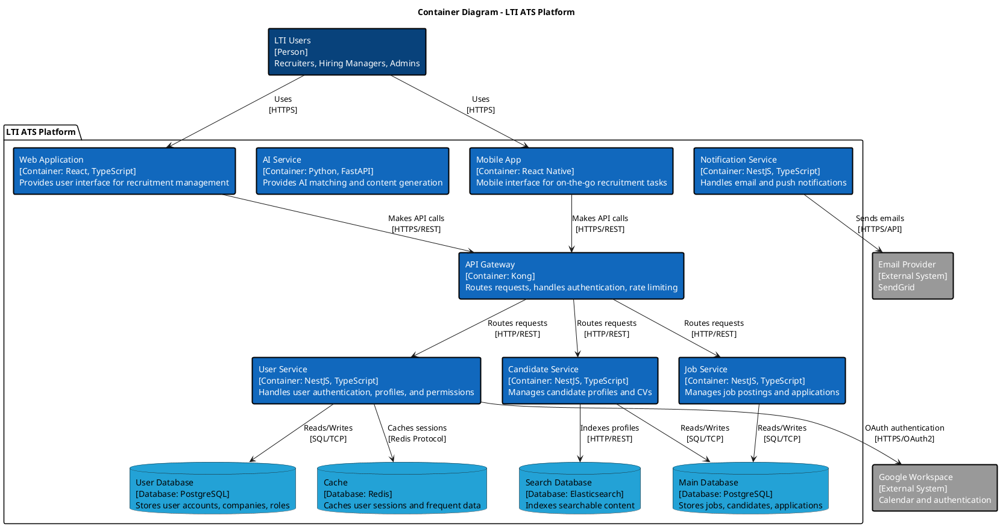
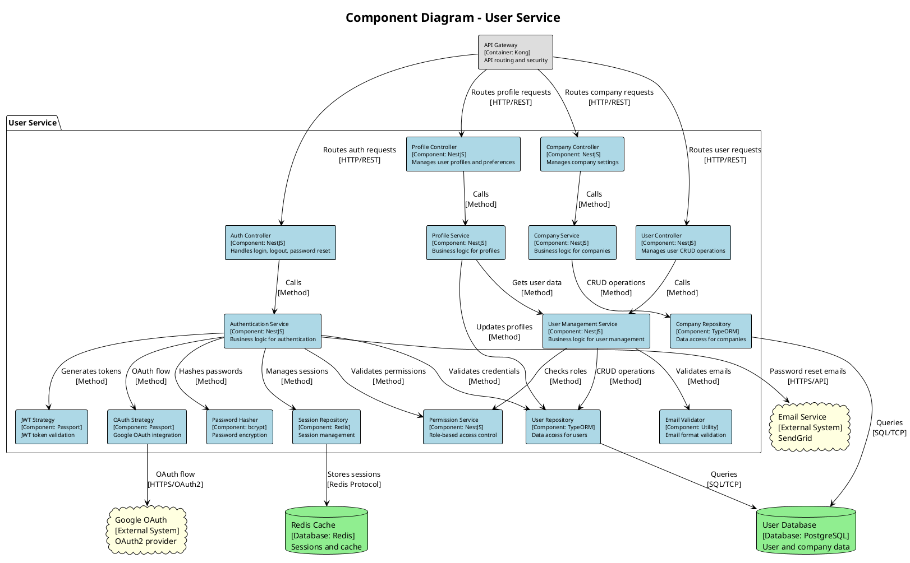
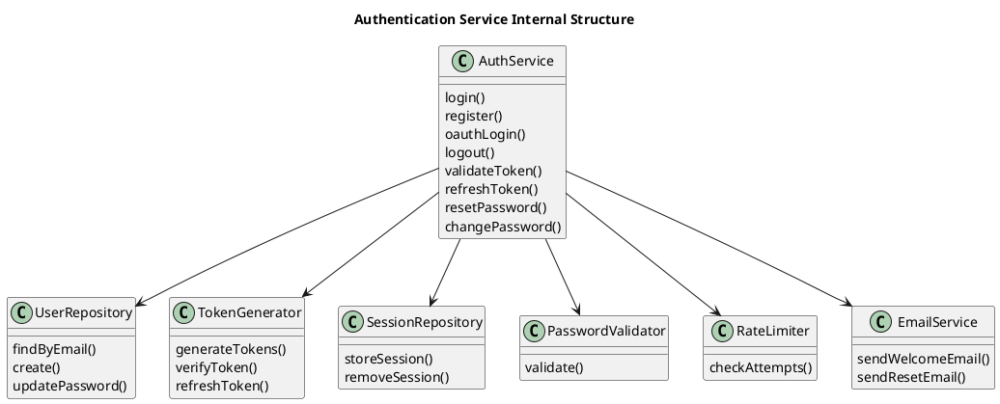

# Diagrama C4 - User Service (Completo) - PlantUML

## 🎯 Componente Seleccionado: User Service

**Justificación:** El User Service es el **más sencillo** pero **fundamental** del sistema. Maneja autenticación, gestión de usuarios y perfiles, con lógica de negocio clara y dependencias mínimas.

---

## 📊 Nivel 1: System Context Diagram

```plantuml
@startuml C4_Context
!include https://raw.githubusercontent.com/plantuml-stdlib/C4-PlantUML/master/C4_Context.puml

LAYOUT_WITH_LEGEND()

title System Context Diagram - LTI ATS Platform

Person(recruiter, "Recruiter", "HR professional who manages candidates and job postings")
Person(hiring_manager, "Hiring Manager", "Manager who reviews candidates and makes hiring decisions")
Person(admin, "System Admin", "Manages company settings and user permissions")

System(lti_ats, "LTI ATS Platform", "Applicant Tracking System with AI-powered matching and collaboration")

System_Ext(google_workspace, "Google Workspace", "Calendar and authentication services")
System_Ext(linkedin, "LinkedIn", "Professional networking and job posting platform")
System_Ext(email_service, "Email Service", "SendGrid for transactional emails")
System_Ext(slack, "Slack", "Team communication and notifications")

Rel(recruiter, lti_ats, "Manages candidates, posts jobs, schedules interviews")
Rel(hiring_manager, lti_ats, "Reviews candidates, provides feedback, makes decisions")
Rel(admin, lti_ats, "Configures system, manages users, views analytics")

Rel(lti_ats, google_workspace, "Syncs calendars, authenticates users")
Rel(lti_ats, linkedin, "Posts jobs, imports candidate profiles")
Rel(lti_ats, email_service, "Sends notifications and communications")
Rel(lti_ats, slack, "Sends real-time notifications")

@enduml
```

---

## 📊 Nivel 2: Container Diagram



---

## 📊 Nivel 3: Component Diagram - User Service



---

## 📊 Nivel 4: Code Diagram - Authentication Service



---

## 🔍 Explicación Detallada por Niveles

### **Nivel 1: System Context**
- **Scope:** Todo el sistema LTI ATS desde perspectiva externa
- **Audiencia:** Stakeholders de negocio, arquitectos de solución
- **Propósito:** Entender qué hace el sistema y cómo interactúa con usuarios y sistemas externos

### **Nivel 2: Container**
- **Scope:** Dentro del sistema LTI, mostrando contenedores de alto nivel
- **Audiencia:** Arquitectos de software, desarrolladores senior
- **Propósito:** Decisiones de tecnología y comunicación entre contenedores

### **Nivel 3: Component (User Service)**
- **Scope:** Dentro del User Service, mostrando componentes principales
- **Audiencia:** Desarrolladores del equipo User Service
- **Propósito:** Estructura interna del servicio y responsabilidades

### **Nivel 4: Code (Authentication Service)**
- **Scope:** Dentro del Authentication Service, mostrando clases y métodos
- **Audiencia:** Desarrolladores trabajando en autenticación
- **Propósito:** Implementación detallada y flujo de código

---

## 🛠️ Implementación Real - Snippets de Código

### **Authentication Service (TypeScript)**

```typescript
@Injectable()
export class AuthService {
  constructor(
    private userRepository: UserRepository,
    private sessionRepository: SessionRepository,
    private tokenGenerator: TokenGenerator,
    private passwordHasher: PasswordHasher,
    private emailService: EmailService,
    private rateLimiter: RateLimiter
  ) {}

  async login(email: string, password: string, ip: string): Promise<LoginResponse> {
    // Rate limiting
    await this.rateLimiter.checkLoginAttempts(ip, email);
    
    // Find user
    const user = await this.userRepository.findByEmail(email);
    if (!user) {
      throw new UnauthorizedException('Invalid credentials');
    }
    
    // Verify password
    const isValidPassword = await this.passwordHasher.verify(password, user.passwordHash);
    if (!isValidPassword) {
      await this.rateLimiter.recordFailedAttempt(ip, email);
      throw new UnauthorizedException('Invalid credentials');
    }
    
    // Generate tokens
    const tokens = await this.tokenGenerator.generateTokens(user);
    
    // Store session
    await this.sessionRepository.storeSession(user.id, tokens.refreshToken, ip);
    
    // Reset rate limiting
    await this.rateLimiter.resetAttempts(ip, email);
    
    return {
      accessToken: tokens.accessToken,
      refreshToken: tokens.refreshToken,
      user: this.sanitizeUser(user)
    };
  }

  async register(userData: RegisterDto): Promise<RegisterResponse> {
    // Validate password strength
    await this.passwordValidator.validate(userData.password);
    
    // Check if user exists
    const existingUser = await this.userRepository.findByEmail(userData.email);
    if (existingUser) {
      throw new ConflictException('User already exists');
    }
    
    // Hash password
    const passwordHash = await this.passwordHasher.hash(userData.password);
    
    // Create user
    const user = await this.userRepository.create({
      ...userData,
      passwordHash,
      isActive: true,
      emailVerified: false
    });
    
    // Send welcome email
    await this.emailService.sendWelcomeEmail(user.email, user.firstName);
    
    return {
      message: 'User registered successfully',
      userId: user.id
    };
  }

  async oauthLogin(oauthData: OAuthUserData): Promise<LoginResponse> {
    // Find or create user
    let user = await this.userRepository.findByEmail(oauthData.email);
    
    if (!user) {
      user = await this.userRepository.create({
        email: oauthData.email,
        firstName: oauthData.firstName,
        lastName: oauthData.lastName,
        avatarUrl: oauthData.picture,
        isActive: true,
        emailVerified: true,
        oauthProvider: oauthData.provider,
        oauthId: oauthData.id
      });
    }
    
    // Generate tokens
    const tokens = await this.tokenGenerator.generateTokens(user);
    
    // Store session
    await this.sessionRepository.storeSession(user.id, tokens.refreshToken);
    
    return {
      accessToken: tokens.accessToken,
      refreshToken: tokens.refreshToken,
      user: this.sanitizeUser(user)
    };
  }
}
```

### **Database Schema (User Service)**

```sql
-- Users table
CREATE TABLE users (
    id UUID PRIMARY KEY DEFAULT gen_random_uuid(),
    company_id UUID NOT NULL REFERENCES companies(id),
    email VARCHAR(255) UNIQUE NOT NULL,
    password_hash VARCHAR(255),
    first_name VARCHAR(100) NOT NULL,
    last_name VARCHAR(100) NOT NULL,
    role VARCHAR(50) NOT NULL DEFAULT 'recruiter',
    phone VARCHAR(20),
    avatar_url VARCHAR(500),
    oauth_provider VARCHAR(50),
    oauth_id VARCHAR(100),
    permissions JSONB DEFAULT '{}',
    preferences JSONB DEFAULT '{}',
    email_verified BOOLEAN DEFAULT FALSE,
    last_login TIMESTAMP,
    created_at TIMESTAMP DEFAULT NOW(),
    updated_at TIMESTAMP DEFAULT NOW(),
    is_active BOOLEAN DEFAULT TRUE
);

-- Companies table
CREATE TABLE companies (
    id UUID PRIMARY KEY DEFAULT gen_random_uuid(),
    name VARCHAR(255) NOT NULL,
    industry VARCHAR(100),
    description TEXT,
    website VARCHAR(255),
    logo_url VARCHAR(500),
    timezone VARCHAR(50) DEFAULT 'UTC',
    language VARCHAR(10) DEFAULT 'en',
    settings JSONB DEFAULT '{}',
    created_at TIMESTAMP DEFAULT NOW(),
    updated_at TIMESTAMP DEFAULT NOW(),
    is_active BOOLEAN DEFAULT TRUE
);

-- Sessions table (Redis structure)
-- Key: session:{userId}:{sessionId}
-- Value: { refreshToken, ip, userAgent, expiresAt }
```

---

## 🚀 Cómo Crear las Imágenes

### **Para PlantUML C4:**

1. **Ve a:** http://www.plantuml.com/plantuml/uml/
2. **Copia cada diagrama** (uno a la vez) del código PlantUML
3. **Se genera automáticamente** la imagen
4. **Descarga** haciendo clic derecho → "Guardar imagen"

### **Alternativa con Visual Studio Code:**
1. **Instala** la extensión "PlantUML"
2. **Crea archivo** `.puml` con el código
3. **Ctrl+Shift+P** → "PlantUML: Preview Current Diagram"
4. **Exporta** como PNG/SVG

---

## 📋 **Ventajas del User Service para C4:**

✅ **Sencillo pero completo** - Lógica clara sin complejidad excesiva  
✅ **Bien definido** - Responsabilidades claras y límites precisos  
✅ **Pocas dependencias** - Solo DB, cache y servicios externos básicos  
✅ **Patrones conocidos** - CRUD, autenticación, autorización  
✅ **Fácil de entender** - Perfecto para demostrar la metodología C4  

¿Te gustaría que profundice en algún nivel específico o que añada más detalles de implementación?