# Diseño del Sistema LTI a Alto Nivel - Arquitectura y Diagramas

## 🏗️ Visión General de la Arquitectura

El sistema LTI ATS está diseñado como una **arquitectura moderna de microservicios** con **separación clara de responsabilidades**, **escalabilidad horizontal** y **alta disponibilidad**. La arquitectura sigue los principios de **Domain-Driven Design (DDD)** y está optimizada para **colaboración en tiempo real** y **procesamiento de IA**.

---

## 📊 Diagrama de Arquitectura de Alto Nivel

```mermaid
graph TB
    subgraph "Client Layer"
        WEB[Web Application<br/>React + Vite]
        MOBILE[Mobile App<br/>React Native]
        API_DOCS[API Documentation<br/>OpenAPI/Swagger]
    end
    
    subgraph "CDN & Load Balancer"
        CDN[CloudFlare CDN]
        LB[Load Balancer<br/>AWS ALB]
    end
    
    subgraph "API Gateway"
        GATEWAY[API Gateway<br/>Kong/AWS API Gateway]
        AUTH[Authentication<br/>JWT + OAuth2]
        RATE[Rate Limiting]
    end
    
    subgraph "Core Services Layer"
        subgraph "User Management"
            USER_SVC[User Service<br/>NestJS]
            COMPANY_SVC[Company Service<br/>NestJS]
        end
        
        subgraph "Recruitment Core"
            JOB_SVC[Job Service<br/>NestJS]
            CANDIDATE_SVC[Candidate Service<br/>NestJS]
            APPLICATION_SVC[Application Service<br/>NestJS]
        end
        
        subgraph "Process Management"
            INTERVIEW_SVC[Interview Service<br/>NestJS]
            EVALUATION_SVC[Evaluation Service<br/>NestJS]
            TASK_SVC[Task Service<br/>NestJS]
        end
        
        subgraph "Intelligence & Analytics"
            AI_SVC[AI Service<br/>Python/FastAPI]
            ANALYTICS_SVC[Analytics Service<br/>NestJS]
            REPORT_SVC[Report Service<br/>NestJS]
        end
        
        subgraph "Communication"
            COMM_SVC[Communication Service<br/>NestJS]
            NOTIFICATION_SVC[Notification Service<br/>NestJS]
            REALTIME_SVC[Real-time Service<br/>Socket.io]
        end
    end
    
    subgraph "External Integrations"
        LINKEDIN[LinkedIn API]
        INDEED[Indeed API]
        GOOGLE_CAL[Google Calendar]
        ZOOM[Zoom API]
        HACKERRANK[HackerRank API]
        SENDGRID[SendGrid]
        SLACK[Slack API]
    end
    
    subgraph "AI & ML Services"
        OPENAI[OpenAI GPT-4]
        EMBEDDING[Vector Database<br/>Pinecone/Weaviate]
        ML_PIPELINE[ML Pipeline<br/>Kubeflow]
    end
    
    subgraph "Data Layer"
        subgraph "Primary Databases"
            POSTGRES_USER[PostgreSQL<br/>User Data]
            POSTGRES_JOBS[PostgreSQL<br/>Jobs & Applications]
            POSTGRES_ANALYTICS[PostgreSQL<br/>Analytics Data]
        end
        
        subgraph "Cache & Session"
            REDIS[Redis<br/>Cache & Sessions]
            REDIS_QUEUE[Redis<br/>Job Queue]
        end
        
        subgraph "File Storage"
            S3[AWS S3<br/>CVs & Documents]
            S3_STATIC[AWS S3<br/>Static Assets]
        end
        
        subgraph "Search & Logging"
            ELASTICSEARCH[Elasticsearch<br/>Search Index]
            LOGS[CloudWatch<br/>Logs & Monitoring]
        end
    end
    
    subgraph "Message Queue & Events"
        RABBITMQ[RabbitMQ<br/>Event Bus]
        KAFKA[Apache Kafka<br/>Event Streaming]
    end
    
    subgraph "Infrastructure"
        DOCKER[Docker Containers]
        K8S[Kubernetes Cluster]
        MONITORING[Prometheus + Grafana]
        SECURITY[Vault + Security]
    end
    
    %% Client connections
    WEB --> CDN
    MOBILE --> CDN
    CDN --> LB
    LB --> GATEWAY
    
    %% API Gateway connections
    GATEWAY --> AUTH
    GATEWAY --> RATE
    GATEWAY --> USER_SVC
    GATEWAY --> JOB_SVC
    GATEWAY --> CANDIDATE_SVC
    GATEWAY --> APPLICATION_SVC
    GATEWAY --> INTERVIEW_SVC
    GATEWAY --> EVALUATION_SVC
    GATEWAY --> AI_SVC
    GATEWAY --> ANALYTICS_SVC
    GATEWAY --> COMM_SVC
    GATEWAY --> REALTIME_SVC
    
    %% Service to Database connections
    USER_SVC --> POSTGRES_USER
    COMPANY_SVC --> POSTGRES_USER
    JOB_SVC --> POSTGRES_JOBS
    CANDIDATE_SVC --> POSTGRES_JOBS
    APPLICATION_SVC --> POSTGRES_JOBS
    INTERVIEW_SVC --> POSTGRES_JOBS
    EVALUATION_SVC --> POSTGRES_JOBS
    ANALYTICS_SVC --> POSTGRES_ANALYTICS
    
    %% Cache connections
    USER_SVC --> REDIS
    JOB_SVC --> REDIS
    CANDIDATE_SVC --> REDIS
    
    %% AI Services connections
    AI_SVC --> OPENAI
    AI_SVC --> EMBEDDING
    AI_SVC --> ML_PIPELINE
    CANDIDATE_SVC --> ELASTICSEARCH
    JOB_SVC --> ELASTICSEARCH
    
    %% External integrations
    JOB_SVC --> LINKEDIN
    JOB_SVC --> INDEED
    INTERVIEW_SVC --> GOOGLE_CAL
    INTERVIEW_SVC --> ZOOM
    EVALUATION_SVC --> HACKERRANK
    COMM_SVC --> SENDGRID
    NOTIFICATION_SVC --> SLACK
    
    %% File storage
    CANDIDATE_SVC --> S3
    WEB --> S3_STATIC
    
    %% Event messaging
    USER_SVC --> RABBITMQ
    JOB_SVC --> RABBITMQ
    APPLICATION_SVC --> RABBITMQ
    AI_SVC --> KAFKA
    ANALYTICS_SVC --> KAFKA
    
    %% Infrastructure
    ALL_SERVICES --> DOCKER
    DOCKER --> K8S
    K8S --> MONITORING
    K8S --> SECURITY
    ALL_SERVICES --> LOGS
```



---

## 🏛️ Arquitectura por Capas

### **1. Capa de Presentación (Frontend)**

#### **Web Application (React + Vite)**
- **Framework:** React 18 con Vite para desarrollo rápido
- **UI Library:** TailwindCSS + ShadCN/UI para componentes modernos
- **State Management:** Zustand para estado global + React Query para estado de servidor
- **Routing:** React Router v6 con lazy loading
- **Real-time:** Socket.io-client para actualizaciones en tiempo real
- **PWA:** Service Workers para funcionalidad offline básica

```typescript
// Estructura del Frontend
src/
├── components/          # Componentes reutilizables
│   ├── ui/             # Componentes base (botones, inputs)
│   ├── forms/          # Formularios específicos
│   └── charts/         # Gráficos y visualizaciones
├── pages/              # Páginas principales
│   ├── jobs/           # Gestión de ofertas
│   ├── candidates/     # Gestión de candidatos
│   ├── interviews/     # Coordinación de entrevistas
│   └── analytics/      # Dashboards y reportes
├── hooks/              # Custom hooks
├── services/           # API clients
├── stores/             # Zustand stores
└── utils/              # Utilidades y helpers
```

#### **Mobile Application (React Native)**
- **Framework:** React Native con Expo para desarrollo multiplataforma
- **Navigation:** React Navigation v6
- **Offline Support:** Redux Persist + NetInfo
- **Push Notifications:** Expo Notifications
- **Biometric Auth:** Expo Local Authentication

---

### **2. Capa de API Gateway y Seguridad**

#### **API Gateway (Kong/AWS API Gateway)**
- **Routing:** Enrutamiento inteligente a microservicios
- **Load Balancing:** Distribución de carga entre instancias
- **Rate Limiting:** Límites por usuario/API key
- **Monitoring:** Métricas y logging de requests
- **Versioning:** Versionado de APIs

#### **Autenticación y Autorización**
- **JWT Tokens:** Tokens de acceso con refresh tokens
- **OAuth2:** Integración con Google, LinkedIn, Microsoft
- **RBAC:** Control de acceso basado en roles
- **MFA:** Autenticación multifactor opcional
- **Session Management:** Gestión de sesiones con Redis

```yaml
# Configuración Kong
services:
  - name: user-service
    url: http://user-service:3001
    routes:
      - name: users-route
        paths: ["/api/v1/users"]
        methods: ["GET", "POST", "PUT", "DELETE"]
    plugins:
      - name: jwt
      - name: rate-limiting
        config:
          minute: 100
```

---

### **3. Capa de Servicios (Backend)**

#### **Arquitectura de Microservicios**

##### **User Management Domain**

**User Service**
- **Responsabilidades:** Gestión de usuarios, perfiles, preferencias
- **Endpoints:** `/users`, `/profiles`, `/preferences`
- **Base de datos:** PostgreSQL dedicada
- **Cache:** Redis para sesiones y datos frecuentes

**Company Service**
- **Responsabilidades:** Gestión de empresas, configuraciones, billing
- **Endpoints:** `/companies`, `/settings`, `/billing`
- **Integraciones:** Stripe para pagos, calendarios corporativos

##### **Recruitment Core Domain**

**Job Service**
- **Responsabilidades:** CRUD de ofertas, publicación, gestión de etapas
- **Endpoints:** `/jobs`, `/job-stages`, `/publications`
- **Integraciones:** LinkedIn Jobs API, Indeed API
- **Features:** Auto-publicación, template de ofertas, analytics básicos

**Candidate Service**
- **Responsabilidades:** Gestión de candidatos, parsing de CVs, perfiles
- **Endpoints:** `/candidates`, `/cvs`, `/profiles`
- **Features:** CV parsing con IA, deduplicación, scoring automático
- **Storage:** S3 para archivos de CV

**Application Service**
- **Responsabilidades:** Gestión de aplicaciones, pipeline, transiciones
- **Endpoints:** `/applications`, `/pipeline`, `/stages`
- **Features:** Workflow engine, reglas de automatización

##### **Process Management Domain**

**Interview Service**
- **Responsabilidades:** Programación, coordinación, management de entrevistas
- **Endpoints:** `/interviews`, `/scheduling`, `/calendar`
- **Integraciones:** Google Calendar, Outlook, Zoom, Google Meet
- **Features:** Disponibilidad automática, timezone detection, reminders

**Evaluation Service**
- **Responsabilidades:** Evaluaciones, feedback, scoring
- **Endpoints:** `/evaluations`, `/feedback`, `/scores`
- **Features:** Templates de evaluación, scoring automático, aggregation

**Task Service**
- **Responsabilidades:** Tareas colaborativas, asignaciones, seguimiento
- **Endpoints:** `/tasks`, `/assignments`, `/notifications`
- **Features:** Due dates, prioridades, menciones, automation

##### **Intelligence & Analytics Domain**

**AI Service (Python/FastAPI)**
- **Responsabilidades:** Matching de IA, generación de contenido, predictions
- **Endpoints:** `/match`, `/generate`, `/predict`
- **ML Models:** 
  - Semantic matching (BERT/Sentence Transformers)
  - Content generation (OpenAI GPT-4)
  - Hiring prediction (Custom ML model)
- **Vector Database:** Pinecone para embeddings de CVs y jobs

```python
# AI Service - Semantic Matching
@app.post("/match/candidate-job")
async def match_candidate_job(candidate_id: str, job_id: str):
    candidate_embedding = await get_candidate_embedding(candidate_id)
    job_embedding = await get_job_embedding(job_id)
    
    similarity_score = cosine_similarity(candidate_embedding, job_embedding)
    match_reasons = await generate_match_explanation(candidate_id, job_id)
    
    return {
        "match_score": similarity_score,
        "match_reasons": match_reasons,
        "confidence": calculate_confidence(similarity_score)
    }
```

**Analytics Service**
- **Responsabilidades:** KPIs, métricas, data processing
- **Endpoints:** `/analytics`, `/kpis`, `/insights`
- **Features:** Real-time dashboards, predictive analytics

**Report Service**
- **Responsabilidades:** Generación de reportes, exports, scheduling
- **Endpoints:** `/reports`, `/exports`, `/schedules`
- **Features:** Custom reports, automated delivery, multiple formats

##### **Communication Domain**

**Communication Service**
- **Responsabilidades:** Emails, SMS, templates, tracking
- **Endpoints:** `/communications`, `/templates`, `/campaigns`
- **Integraciones:** SendGrid, Twilio, Mailgun
- **Features:** Template engine, personalization, delivery tracking

**Notification Service**
- **Responsabilidades:** Push notifications, in-app notifications, preferences
- **Endpoints:** `/notifications`, `/preferences`, `/channels`
- **Features:** Multi-channel delivery, scheduling, user preferences

**Real-time Service (Socket.io)**
- **Responsabilidades:** WebSocket connections, real-time updates, collaboration
- **Features:** Room management, presence, real-time comments
- **Scaling:** Redis adapter para múltiples instancias

---

### **4. Capa de Datos**

#### **Bases de Datos Especializadas**

**PostgreSQL Clusters**
```yaml
# Database Sharding Strategy
User_DB:
  - Tables: users, companies, roles, permissions
  - Sharding: Por company_id
  - Replicas: 2 read replicas

Jobs_DB:
  - Tables: jobs, candidates, applications, interviews
  - Sharding: Por company_id + date
  - Replicas: 3 read replicas para analytics

Analytics_DB:
  - Tables: metrics, reports, aggregations
  - Partitioning: Por fecha
  - Optimization: Columnar storage para analytics
```

**Cache Strategy (Redis)**
```redis
# Cache Patterns
user:session:{user_id} -> TTL 24h
job:details:{job_id} -> TTL 1h
candidate:profile:{candidate_id} -> TTL 30min
applications:list:{job_id} -> TTL 5min
analytics:kpis:{company_id}:{date} -> TTL 1h
```

**Search Engine (Elasticsearch)**
```json
{
  "candidates_index": {
    "mappings": {
      "properties": {
        "full_name": {"type": "text", "analyzer": "standard"},
        "skills": {"type": "text", "analyzer": "keyword"},
        "experience": {"type": "nested"},
        "embedding": {"type": "dense_vector", "dims": 768}
      }
    }
  }
}
```

---

### **5. Capa de Integración**

#### **External APIs Management**

**API Integration Patterns**
```typescript
// Generic API Client with retry logic
class ExternalAPIClient {
  async callWithRetry(endpoint: string, data: any, retries = 3) {
    try {
      return await this.httpClient.post(endpoint, data);
    } catch (error) {
      if (retries > 0 && this.isRetryableError(error)) {
        await this.delay(1000 * (4 - retries));
        return this.callWithRetry(endpoint, data, retries - 1);
      }
      throw error;
    }
  }
}

// LinkedIn Integration
class LinkedInService extends ExternalAPIClient {
  async postJob(jobData: JobData): Promise<string> {
    const linkedinFormat = this.transformToLinkedInFormat(jobData);
    return this.callWithRetry('/linkedin/jobs', linkedinFormat);
  }
}
```

**Integration Hub Architecture**
- **Circuit Breaker Pattern** para resilience
- **Retry Logic** con exponential backoff
- **Rate Limiting** respetando límites de APIs externas
- **Webhook Management** para eventos entrantes
- **Data Transformation** para normalización

---

## 🚀 Patrones de Arquitectura Implementados

### **1. Domain-Driven Design (DDD)**

```
Domains:
├── UserManagement/
│   ├── Entities: User, Company, Role
│   ├── ValueObjects: Email, Phone, Address
│   ├── Repositories: UserRepository, CompanyRepository
│   └── Services: AuthService, UserProfileService
│
├── Recruitment/
│   ├── Entities: Job, Candidate, Application
│   ├── ValueObjects: Salary, Location, Skills
│   ├── Aggregates: RecruitmentProcess
│   └── Services: MatchingService, PipelineService
│
└── Communication/
    ├── Entities: Message, Template, Campaign
    ├── ValueObjects: Channel, DeliveryStatus
    └── Services: EmailService, NotificationService
```

### **2. Event-Driven Architecture**

```typescript
// Domain Events
class ApplicationSubmittedEvent {
  constructor(
    public applicationId: string,
    public candidateId: string,
    public jobId: string,
    public timestamp: Date
  ) {}
}

// Event Handlers
@EventHandler(ApplicationSubmittedEvent)
class ApplicationSubmittedHandler {
  async handle(event: ApplicationSubmittedEvent) {
    // Trigger AI matching
    await this.aiService.scheduleMatching(event.candidateId, event.jobId);
    
    // Send confirmation email
    await this.emailService.sendApplicationConfirmation(event.candidateId);
    
    // Notify recruiters
    await this.notificationService.notifyNewApplication(event.jobId);
  }
}
```

### **3. CQRS (Command Query Responsibility Segregation)**

```typescript
// Commands (Write Side)
class CreateJobCommand {
  constructor(
    public title: string,
    public description: string,
    public requirements: string,
    public companyId: string
  ) {}
}

// Queries (Read Side)
class GetJobsQuery {
  constructor(
    public companyId: string,
    public filters: JobFilters,
    public pagination: Pagination
  ) {}
}

// Separate handlers
@CommandHandler(CreateJobCommand)
class CreateJobHandler {
  async execute(command: CreateJobCommand): Promise<Job> {
    // Write to main database
    const job = await this.jobRepository.create(command);
    
    // Publish event for read model update
    await this.eventBus.publish(new JobCreatedEvent(job.id));
    
    return job;
  }
}

@QueryHandler(GetJobsQuery)
class GetJobsHandler {
  async execute(query: GetJobsQuery): Promise<JobListResponse> {
    // Read from optimized read database/cache
    return this.jobReadRepository.findByCompany(query);
  }
}
```

---

## 🔧 Consideraciones de Escalabilidad

### **Horizontal Scaling Strategy**

#### **Database Scaling**
```yaml
# PostgreSQL Scaling
Master-Slave Setup:
  - 1 Master (Write)
  - 3 Read Replicas (Read)
  - Connection Pooling: PgBouncer
  - Sharding Key: company_id + created_date

# Redis Scaling
Redis Cluster:
  - 6 Nodes (3 Master + 3 Slave)
  - Consistent Hashing
  - Automatic Failover
```

#### **Service Scaling**
```yaml
# Kubernetes Auto-scaling
apiVersion: autoscaling/v2
kind: HorizontalPodAutoscaler
metadata:
  name: job-service-hpa
spec:
  scaleTargetRef:
    apiVersion: apps/v1
    kind: Deployment
    name: job-service
  minReplicas: 2
  maxReplicas: 10
  metrics:
  - type: Resource
    resource:
      name: cpu
      target:
        type: Utilization
        averageUtilization: 70
  - type: Resource
    resource:
      name: memory
      target:
        type: Utilization
        averageUtilization: 80
```

### **Performance Optimization**

#### **Caching Strategy**
```typescript
// Multi-level caching
class CandidateService {
  async getCandidateProfile(candidateId: string): Promise<CandidateProfile> {
    // L1: In-memory cache (LRU)
    let profile = this.memoryCache.get(`candidate:${candidateId}`);
    if (profile) return profile;
    
    // L2: Redis cache
    profile = await this.redisCache.get(`candidate:profile:${candidateId}`);
    if (profile) {
      this.memoryCache.set(`candidate:${candidateId}`, profile);
      return profile;
    }
    
    // L3: Database
    profile = await this.candidateRepository.findById(candidateId);
    
    // Cache for future requests
    await this.redisCache.setex(`candidate:profile:${candidateId}`, 1800, profile);
    this.memoryCache.set(`candidate:${candidateId}`, profile);
    
    return profile;
  }
}
```

#### **Database Query Optimization**
```sql
-- Optimized queries with proper indexing
EXPLAIN ANALYZE
SELECT 
  c.id, c.first_name, c.last_name, c.email,
  a.status, a.score, a.applied_at,
  j.title as job_title
FROM candidates c
JOIN applications a ON c.id = a.candidate_id
JOIN jobs j ON a.job_id = j.id
WHERE j.company_id = $1
  AND a.status = 'in_review'
  AND a.applied_at >= NOW() - INTERVAL '30 days'
ORDER BY a.score DESC, a.applied_at DESC
LIMIT 50;

-- Corresponding indexes
CREATE INDEX CONCURRENTLY idx_applications_company_status_date 
ON applications(company_id, status, applied_at) 
WHERE status = 'in_review';
```

---

## 🔒 Seguridad y Compliance

### **Security Layers**

#### **API Security**
```typescript
// API Security Middleware Stack
app.use(helmet()); // Security headers
app.use(rateLimit()); // Rate limiting
app.use(cors(corsOptions)); // CORS configuration
app.use(compression()); // Response compression
app.use(morgan('combined')); // Request logging

// JWT Validation
@UseGuards(JwtAuthGuard, RolesGuard)
@Roles('recruiter', 'hiring_manager')
@Controller('applications')
class ApplicationController {
  @Get(':id')
  async getApplication(@Param('id') id: string, @User() user: AuthUser) {
    // Additional authorization check
    await this.authService.checkApplicationAccess(id, user.companyId);
    return this.applicationService.findById(id);
  }
}
```

#### **Data Protection**
```typescript
// Data Encryption
class DataEncryption {
  private readonly algorithm = 'aes-256-gcm';
  private readonly keyDerivation = 'pbkdf2';

  encryptPII(data: string, context: string): EncryptedData {
    const key = this.deriveKey(context);
    const iv = crypto.randomBytes(16);
    const cipher = crypto.createCipher(this.algorithm, key);
    
    let encrypted = cipher.update(data, 'utf8', 'hex');
    encrypted += cipher.final('hex');
    
    return {
      data: encrypted,
      iv: iv.toString('hex'),
      tag: cipher.getAuthTag().toString('hex')
    };
  }
}

// GDPR Compliance
class GDPRService {
  async handleDataDeletion(userId: string): Promise<void> {
    // Soft delete user data
    await this.userService.anonymizeUser(userId);
    
    // Remove from caches
    await this.cacheService.deleteUserData(userId);
    
    // Schedule background cleanup
    await this.queueService.scheduleDataPurge(userId);
  }
}
```

---

## 📊 Monitoring y Observabilidad

### **Observability Stack**

#### **Metrics Collection**
```typescript
// Custom Metrics
@Injectable()
export class MetricsService {
  private readonly promClient = require('prom-client');
  
  private readonly httpRequestDuration = new this.promClient.Histogram({
    name: 'http_request_duration_seconds',
    help: 'Duration of HTTP requests in seconds',
    labelNames: ['method', 'route', 'status_code'],
    buckets: [0.1, 0.3, 0.5, 0.7, 1, 3, 5, 7, 10]
  });
  
  private readonly activeApplications = new this.promClient.Gauge({
    name: 'active_applications_total',
    help: 'Total number of active applications',
    labelNames: ['status', 'company_id']
  });
  
  recordHttpRequest(method: string, route: string, statusCode: number, duration: number) {
    this.httpRequestDuration.labels(method, route, statusCode.toString()).observe(duration);
  }
}
```

#### **Distributed Tracing**
```typescript
// OpenTelemetry Integration
import { trace, SpanStatusCode } from '@opentelemetry/api';

@Injectable()
export class CandidateService {
  private tracer = trace.getTracer('candidate-service');
  
  async processApplication(applicationData: ApplicationData): Promise<Application> {
    const span = this.tracer.startSpan('process_application');
    
    try {
      span.setAttributes({
        'candidate.id': applicationData.candidateId,
        'job.id': applicationData.jobId,
        'company.id': applicationData.companyId
      });
      
      // AI Matching
      const aiSpan = this.tracer.startSpan('ai_matching', { parent: span });
      const matchScore = await this.aiService.calculateMatch(applicationData);
      aiSpan.setAttributes({ 'match.score': matchScore });
      aiSpan.end();
      
      // Save Application
      const saveSpan = this.tracer.startSpan('save_application', { parent: span });
      const application = await this.applicationRepository.create(applicationData);
      saveSpan.end();
      
      span.setStatus({ code: SpanStatusCode.OK });
      return application;
      
    } catch (error) {
      span.setStatus({ code: SpanStatusCode.ERROR, message: error.message });
      throw error;
    } finally {
      span.end();
    }
  }
}
```

### **Health Checks and Circuit Breakers**
```typescript
// Health Check Implementation
@Controller('health')
export class HealthController {
  @Get()
  async check(): Promise<HealthCheckResult> {
    return this.health.check([
      () => this.db.pingCheck('database'),
      () => this.redis.pingCheck('redis'),
      () => this.elasticsearch.pingCheck('elasticsearch'),
      () => this.microservice.pingCheck('ai-service', { timeout: 3000 })
    ]);
  }
}

// Circuit Breaker for External Services
class ExternalServiceClient {
  private circuitBreaker = new CircuitBreaker(this.callExternalAPI.bind(this), {
    timeout: 5000,
    errorThresholdPercentage: 50,
    resetTimeout: 30000
  });
  
  async callWithCircuitBreaker(data: any) {
    return this.circuitBreaker.fire(data);
  }
}
```

---

## 🚀 Deployment y DevOps

### **Container Strategy**
```dockerfile
# Multi-stage Dockerfile
FROM node:18-alpine AS builder
WORKDIR /app
COPY package*.json ./
RUN npm ci --only=production

FROM node:18-alpine AS runtime
RUN addgroup -g 1001 -S nodejs
RUN adduser -S nestjs -u 1001
WORKDIR /app
COPY --from=builder --chown=nestjs:nodejs /app/node_modules ./node_modules
COPY --chown=nestjs:nodejs . .
USER nestjs
EXPOSE 3000
CMD ["node", "dist/main.js"]
```

### **Kubernetes Deployment**
```yaml
apiVersion: apps/v1
kind: Deployment
metadata:
  name: candidate-service
spec:
  replicas: 3
  selector:
    matchLabels:
      app: candidate-service
  template:
    metadata:
      labels:
        app: candidate-service
    spec:
      containers:
      - name: candidate-service
        image: lti/candidate-service:latest
        ports:
        - containerPort: 3000
        env:
        - name: DATABASE_URL
          valueFrom:
            secretKeyRef:
              name: database-secret
              key: url
        - name: REDIS_URL
          valueFrom:
            configMapKeyRef:
              name: redis-config
              key: url
        resources:
          requests:
            memory: "256Mi"
            cpu: "250m"
          limits:
            memory: "512Mi"
            cpu: "500m"
        livenessProbe:
          httpGet:
            path: /health
            port: 3000
          initialDelaySeconds: 30
          periodSeconds: 10
        readinessProbe:
          httpGet:
            path: /ready
            port: 3000
          initialDelaySeconds: 5
          periodSeconds: 5
```

---

## 📈 Roadmap de Evolución

### **Fase 1: MVP (Meses 1-3)**
- ✅ Core microservices (User, Job, Candidate, Application)
- ✅ Básico de IA (matching simple)
- ✅ Frontend React básico
- ✅ Integraciones esenciales (email, calendario)

### **Fase 2: Enhanced (Meses 4-6)**
- 🔄 AI avanzada (GPT-4, embeddings)
- 🔄 Real-time collaboration
- 🔄 Mobile app
- 🔄 Analytics dashboard

### **Fase 3: Scale (Meses 7-12)**
- 📋 Advanced ML pipeline
- 📋 Multi-tenant architecture
- 📋 API marketplace
- 📋 White-label solutions

Este diseño de sistema proporciona una base sólida y escalable para el ATS LTI, con capacidades avanzadas de IA, colaboración en tiempo real y una arquitectura preparada para el crecimiento empresarial.