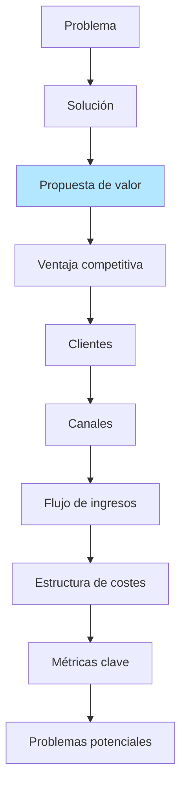
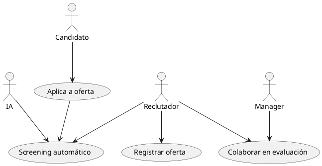
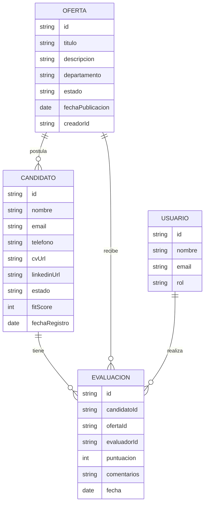
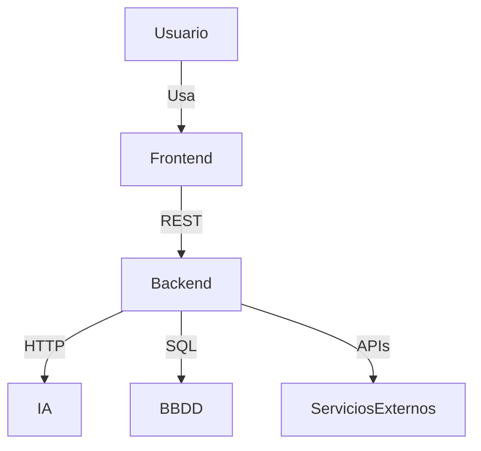
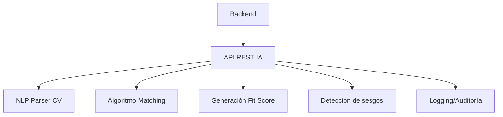

# LTI-XR.md

## 1. Descripción breve del sistema y ventajas competitivas

**LTI ATS** es un sistema de gestión de candidatos (Applicant Tracking System) diseñado para optimizar y automatizar el proceso de reclutamiento en empresas.  
Su objetivo es aumentar la eficiencia del departamento de HR, mejorar la colaboración entre equipos y facilitar la toma de decisiones usando IA.  
Entre sus ventajas competitivas destacan:

- **Asistencia de IA:** recomendación de candidatos, análisis automático de CVs, detección de sesgos y predicción de adecuación.
- **Colaboración en tiempo real:** reclutadores y managers pueden comentar y puntuar candidatos de forma colaborativa.
- **Automatizaciones:** desde publicación en portales hasta comunicaciones automáticas.
- **Integración sencilla:** APIs abiertas para conectar con portales, calendarios, videollamadas, etc.
- **Analytics avanzado:** informes personalizados sobre todo el funnel de selección.

## 2. Lean Canvas (Modelo de negocio)




| Sección              | Descripción                                                                                                   |
|----------------------|---------------------------------------------------------------------------------------------------------------|
| Problema             | Procesos manuales, ineficiencia, poca colaboración, mal uso de datos, sesgos en selección.                    |
| Solución             | Plataforma todo-en-uno con IA, automatizaciones, colaboración y reporting avanzado.                           |
| Propuesta de valor   | Optimiza el proceso de reclutamiento, mejora la experiencia, reduce tiempos y sesgos.                         |
| Ventaja competitiva  | Uso intensivo de IA, experiencia colaborativa, integración y UX moderna.                                      |
| Clientes             | Startups, PYMEs y grandes empresas con proceso de selección activo.                                           |
| Canales              | SaaS, Marketplace de apps, integraciones HR, partners tecnológicos.                                           |
| Flujo de ingresos    | Suscripción mensual/anual por volumen de empleados/ofertas activas.                                           |
| Costes clave         | Desarrollo, infraestructura cloud, IA, soporte y marketing.                                                   |
| Métricas clave       | Tasa de conversión, tiempo medio de contratación, NPS reclutadores, % de procesos automatizados.              |
| Problemas potenciales| Cambios legales, resistencia a la IA, integración con sistemas legacy.                                        |

### 3. Funciones principales

- **Gestión de ofertas de empleo:** creación, publicación y seguimiento.
- **Gestión y filtrado de candidatos:** parsing de CV, matching IA, pipeline visual.
- **Automatizaciones:** emails automáticos, agendado de entrevistas, recordatorios.
- **Colaboración y feedback:** comentarios en tiempo real, puntuaciones, historial de evaluaciones.
- **Reporting y analítica:** dashboards, métricas personalizadas, exportaciones.
- **Integraciones:** con LinkedIn, portales, Google Calendar, videollamadas, etc.

### 4. Casos de uso principales

#### 4.1. Registrar una nueva oferta de empleo

- **Actores:** Reclutador
- **Flujo:**
  - El reclutador accede y rellena los datos de la oferta.
  - El sistema la publica en portales conectados y la deja visible internamente.

#### 4.2. Screening automático de candidatos

- **Actores:** IA, Reclutador
- **Flujo:**
  - Un candidato aplica a una oferta.
  - El sistema analiza el CV con IA, extrae información relevante y sugiere un “fit score”.
  - El reclutador revisa y mueve al candidato en el pipeline.

#### 4.3. Colaboración y feedback sobre candidatos

- **Actores:** Reclutador, Manager
- **Flujo:**
  - El reclutador comparte un candidato con el manager.
  - Ambos pueden comentar, puntuar y dejar feedback visible para todo el equipo.

#### 4.4. Diagramas de casos de uso



### 5. Modelo de datos



### 6. Diseño de alto nivel

#### Explicación

La arquitectura se basa en una aplicación web SaaS con frontend **React** + backend en **Node.js**, base de datos relacional (**PostgreSQL**) y microservicio de IA (**Python**).  
Se integra con proveedores externos mediante APIs (LinkedIn, Google Calendar).  
La autenticación usa **OAuth2** y se almacena toda la interacción en la base de datos para analytics y auditoría.

#### Diagrama de alto nivel

```mermaid
graph TD
  UI[Frontend React]
  API[API REST Node.js]
  DB[(PostgreSQL)]
  IA[Microservicio IA (Python)]
  EXT[APIs externas<br>(LinkedIn, Google Calendar)]
  AUTH[Auth (OAuth2)]

  UI -- "Solicitudes HTTP" --> API
  API -- "Consultas" --> DB
  API -- "Llama" --> IA
  API -- "OAuth2" --> AUTH
  API -- "Integración" --> EXT
```

### 7. Diagrama C4: profundización en el Microservicio de IA

#### C4 nivel contenedor (resumido)



#### C4 nivel componente (Microservicio IA)



- **NLP Parser CV:** extrae y estructura datos del currículum.
- **Algoritmo Matching:** compara requisitos y experiencia.
- **Generador Fit Score:** calcula la adecuación del perfil.
- **Detección de sesgos:** analiza posibles discriminaciones.
- **Logging/Auditoría:** guarda resultados para trazabilidad.
