# Modelo de Datos LTI - ATS Sistema de Gestión de Candidatos

## 📊 Diagrama ERD - Entidades y Relaciones

```mermaid
erDiagram
    COMPANIES ||--o{ USERS : employs
    COMPANIES ||--o{ JOBS : creates
    USERS ||--o{ JOBS : manages
    USERS ||--o{ INTERVIEWS : conducts
    USERS ||--o{ TASKS : assigns
    USERS ||--o{ NOTES : writes
    USERS ||--o{ EVALUATIONS : creates
    
    JOBS ||--o{ APPLICATIONS : receives
    JOBS ||--o{ JOB_STAGES : has
    JOBS ||--o{ AI_MATCHES : generates
    
    CANDIDATES ||--o{ APPLICATIONS : submits
    CANDIDATES ||--o{ INTERVIEWS : participates
    CANDIDATES ||--o{ NOTES : about
    CANDIDATES ||--o{ EVALUATIONS : receives
    CANDIDATES ||--o{ AI_MATCHES : matched
    CANDIDATES ||--o{ COMMUNICATIONS : receives
    CANDIDATES ||--o{ ASSESSMENTS : takes
    
    APPLICATIONS ||--o{ INTERVIEWS : leads_to
    APPLICATIONS ||--o{ EVALUATIONS : evaluated_in
    APPLICATIONS ||--o{ NOTES : commented_on
    APPLICATIONS ||--o{ COMMUNICATIONS : triggers
    APPLICATIONS ||--o{ ASSESSMENTS : requires
    
    INTERVIEWS ||--o{ EVALUATIONS : generates
    INTERVIEWS ||--o{ NOTES : documented_in
    
    USERS ||--o{ COMMUNICATIONS : sends
    
    JOB_STAGES ||--o{ APPLICATIONS : stage_of
    
    COMPANIES {
        uuid id PK
        varchar name
        varchar industry
        text description
        varchar website
        varchar logo_url
        varchar timezone
        varchar language
        jsonb settings
        timestamp created_at
        timestamp updated_at
        boolean is_active
    }
    
    USERS {
        uuid id PK
        uuid company_id FK
        varchar email UK
        varchar password_hash
        varchar first_name
        varchar last_name
        varchar role
        varchar phone
        varchar avatar_url
        jsonb permissions
        jsonb preferences
        timestamp last_login
        timestamp created_at
        timestamp updated_at
        boolean is_active
    }
    
    CANDIDATES {
        uuid id PK
        varchar email UK
        varchar first_name
        varchar last_name
        varchar phone
        varchar linkedin_url
        varchar github_url
        varchar portfolio_url
        text summary
        varchar location
        varchar current_position
        varchar current_company
        integer years_experience
        decimal salary_expectation
        varchar availability
        varchar preferred_locations
        text skills
        text education
        text work_experience
        varchar cv_file_url
        varchar profile_picture_url
        varchar source
        varchar referrer_id
        jsonb metadata
        timestamp created_at
        timestamp updated_at
        boolean is_active
    }
    
    JOBS {
        uuid id PK
        uuid company_id FK
        uuid created_by FK
        uuid hiring_manager_id FK
        varchar title
        text description
        text requirements
        varchar department
        varchar location
        varchar employment_type
        varchar experience_level
        decimal salary_min
        decimal salary_max
        varchar currency
        boolean remote_allowed
        varchar status
        date published_date
        date closing_date
        jsonb benefits
        jsonb skills_required
        text company_description
        varchar external_job_id
        jsonb publication_channels
        integer views_count
        integer applications_count
        timestamp created_at
        timestamp updated_at
        boolean is_active
    }
    
    JOB_STAGES {
        uuid id PK
        uuid job_id FK
        varchar name
        text description
        integer order_index
        varchar stage_type
        boolean is_automated
        jsonb automation_rules
        jsonb evaluation_criteria
        timestamp created_at
        timestamp updated_at
        boolean is_active
    }
    
    APPLICATIONS {
        uuid id PK
        uuid candidate_id FK
        uuid job_id FK
        uuid current_stage_id FK
        varchar source
        varchar status
        decimal score
        text cover_letter
        varchar cv_version_url
        timestamp applied_at
        timestamp stage_changed_at
        jsonb application_data
        jsonb custom_fields
        timestamp created_at
        timestamp updated_at
        boolean is_active
    }
    
    INTERVIEWS {
        uuid id PK
        uuid application_id FK
        uuid interviewer_id FK
        varchar title
        text description
        varchar type
        varchar status
        datetime scheduled_at
        integer duration_minutes
        varchar meeting_link
        varchar meeting_platform
        varchar location
        jsonb attendees
        text preparation_notes
        text outcome_summary
        varchar recording_url
        jsonb metadata
        timestamp created_at
        timestamp updated_at
        boolean is_active
    }
    
    EVALUATIONS {
        uuid id PK
        uuid application_id FK
        uuid interview_id FK
        uuid evaluator_id FK
        varchar evaluation_type
        integer overall_score
        jsonb scores_breakdown
        text strengths
        text weaknesses
        text recommendations
        varchar decision
        text comments
        jsonb criteria_scores
        boolean ai_generated
        varchar ai_model_version
        timestamp created_at
        timestamp updated_at
        boolean is_active
    }
    
    NOTES {
        uuid id PK
        uuid author_id FK
        uuid candidate_id FK
        uuid application_id FK
        uuid interview_id FK
        text content
        varchar note_type
        varchar visibility
        jsonb mentions
        jsonb attachments
        timestamp created_at
        timestamp updated_at
        boolean is_active
    }
    
    TASKS {
        uuid id PK
        uuid created_by FK
        uuid assigned_to FK
        uuid candidate_id FK
        uuid application_id FK
        varchar title
        text description
        varchar priority
        varchar status
        datetime due_date
        jsonb metadata
        timestamp completed_at
        timestamp created_at
        timestamp updated_at
        boolean is_active
    }
    
    COMMUNICATIONS {
        uuid id PK
        uuid sender_id FK
        uuid candidate_id FK
        uuid application_id FK
        varchar channel
        varchar subject
        text content
        varchar status
        datetime sent_at
        datetime delivered_at
        datetime opened_at
        varchar template_id
        jsonb template_variables
        jsonb attachments
        timestamp created_at
        timestamp updated_at
        boolean is_active
    }
    
    ASSESSMENTS {
        uuid id PK
        uuid candidate_id FK
        uuid application_id FK
        varchar platform
        varchar assessment_type
        varchar title
        text description
        varchar status
        integer score
        integer max_score
        decimal percentage
        varchar result_url
        jsonb detailed_results
        datetime started_at
        datetime completed_at
        integer time_spent_minutes
        timestamp created_at
        timestamp updated_at
        boolean is_active
    }
    
    AI_MATCHES {
        uuid id PK
        uuid candidate_id FK
        uuid job_id FK
        decimal match_score
        jsonb match_reasons
        jsonb skills_match
        jsonb experience_match
        jsonb location_match
        varchar ai_model_version
        jsonb confidence_scores
        timestamp created_at
        timestamp updated_at
        boolean is_active
    }
    
    REPORTS {
        uuid id PK
        uuid company_id FK
        uuid created_by FK
        varchar report_type
        varchar title
        jsonb filters
        jsonb data
        jsonb charts_config
        datetime generated_at
        varchar schedule
        jsonb recipients
        timestamp created_at
        timestamp updated_at
        boolean is_active
    }
```



---

## 📋 Entidades Principales - Descripción Detallada

### 🏢 **COMPANIES**
**Propósito:** Organizaciones que utilizan el sistema ATS

| Campo | Tipo | Descripción | Restricciones |
|-------|------|-------------|---------------|
| id | UUID | Identificador único | PK, NOT NULL |
| name | VARCHAR(255) | Nombre de la empresa | NOT NULL |
| industry | VARCHAR(100) | Sector/industria | NULL |
| description | TEXT | Descripción de la empresa | NULL |
| website | VARCHAR(255) | Sitio web corporativo | NULL |
| logo_url | VARCHAR(500) | URL del logo | NULL |
| timezone | VARCHAR(50) | Zona horaria principal | DEFAULT 'UTC' |
| language | VARCHAR(10) | Idioma principal | DEFAULT 'en' |
| settings | JSONB | Configuraciones personalizadas | NULL |
| created_at | TIMESTAMP | Fecha de creación | NOT NULL |
| updated_at | TIMESTAMP | Última actualización | NOT NULL |
| is_active | BOOLEAN | Estado activo/inactivo | DEFAULT TRUE |

---

### 👤 **USERS**
**Propósito:** Usuarios del sistema (reclutadores, hiring managers, admins)

| Campo | Tipo | Descripción | Restricciones |
|-------|------|-------------|---------------|
| id | UUID | Identificador único | PK, NOT NULL |
| company_id | UUID | Empresa a la que pertenece | FK, NOT NULL |
| email | VARCHAR(255) | Email único | UK, NOT NULL |
| password_hash | VARCHAR(255) | Contraseña hasheada | NOT NULL |
| first_name | VARCHAR(100) | Nombre | NOT NULL |
| last_name | VARCHAR(100) | Apellido | NOT NULL |
| role | VARCHAR(50) | Rol en el sistema | NOT NULL |
| phone | VARCHAR(20) | Teléfono | NULL |
| avatar_url | VARCHAR(500) | URL foto de perfil | NULL |
| permissions | JSONB | Permisos específicos | NULL |
| preferences | JSONB | Preferencias de usuario | NULL |
| last_login | TIMESTAMP | Último acceso | NULL |
| created_at | TIMESTAMP | Fecha de creación | NOT NULL |
| updated_at | TIMESTAMP | Última actualización | NOT NULL |
| is_active | BOOLEAN | Estado activo/inactivo | DEFAULT TRUE |

**Roles posibles:** 'admin', 'recruiter', 'hiring_manager', 'interviewer', 'viewer'

---

### 🧑‍💼 **CANDIDATES**
**Propósito:** Candidatos que aplican a las ofertas laborales

| Campo | Tipo | Descripción | Restricciones |
|-------|------|-------------|---------------|
| id | UUID | Identificador único | PK, NOT NULL |
| email | VARCHAR(255) | Email único | UK, NOT NULL |
| first_name | VARCHAR(100) | Nombre | NOT NULL |
| last_name | VARCHAR(100) | Apellido | NOT NULL |
| phone | VARCHAR(20) | Teléfono | NULL |
| linkedin_url | VARCHAR(500) | Perfil LinkedIn | NULL |
| github_url | VARCHAR(500) | Perfil GitHub | NULL |
| portfolio_url | VARCHAR(500) | Portfolio personal | NULL |
| summary | TEXT | Resumen profesional | NULL |
| location | VARCHAR(255) | Ubicación actual | NULL |
| current_position | VARCHAR(255) | Posición actual | NULL |
| current_company | VARCHAR(255) | Empresa actual | NULL |
| years_experience | INTEGER | Años de experiencia | NULL |
| salary_expectation | DECIMAL(10,2) | Expectativa salarial | NULL |
| availability | VARCHAR(50) | Disponibilidad | NULL |
| preferred_locations | VARCHAR(500) | Ubicaciones preferidas | NULL |
| skills | TEXT | Habilidades técnicas | NULL |
| education | TEXT | Educación | NULL |
| work_experience | TEXT | Experiencia laboral | NULL |
| cv_file_url | VARCHAR(500) | URL del CV | NULL |
| profile_picture_url | VARCHAR(500) | Foto de perfil | NULL |
| source | VARCHAR(100) | Fuente de origen | NULL |
| referrer_id | VARCHAR(100) | ID del referente | NULL |
| metadata | JSONB | Datos adicionales | NULL |
| created_at | TIMESTAMP | Fecha de creación | NOT NULL |
| updated_at | TIMESTAMP | Última actualización | NOT NULL |
| is_active | BOOLEAN | Estado activo/inactivo | DEFAULT TRUE |

**Fuentes posibles:** 'linkedin', 'indeed', 'referral', 'email', 'website', 'manual'

---

### 💼 **JOBS**
**Propósito:** Ofertas laborales publicadas por las empresas

| Campo | Tipo | Descripción | Restricciones |
|-------|------|-------------|---------------|
| id | UUID | Identificador único | PK, NOT NULL |
| company_id | UUID | Empresa propietaria | FK, NOT NULL |
| created_by | UUID | Usuario creador | FK, NOT NULL |
| hiring_manager_id | UUID | Manager responsable | FK, NULL |
| title | VARCHAR(255) | Título del puesto | NOT NULL |
| description | TEXT | Descripción detallada | NOT NULL |
| requirements | TEXT | Requisitos del puesto | NOT NULL |
| department | VARCHAR(100) | Departamento | NULL |
| location | VARCHAR(255) | Ubicación del trabajo | NULL |
| employment_type | VARCHAR(50) | Tipo de empleo | NOT NULL |
| experience_level | VARCHAR(50) | Nivel de experiencia | NOT NULL |
| salary_min | DECIMAL(10,2) | Salario mínimo | NULL |
| salary_max | DECIMAL(10,2) | Salario máximo | NULL |
| currency | VARCHAR(10) | Moneda del salario | DEFAULT 'USD' |
| remote_allowed | BOOLEAN | Permite trabajo remoto | DEFAULT FALSE |
| status | VARCHAR(50) | Estado de la oferta | NOT NULL |
| published_date | DATE | Fecha de publicación | NULL |
| closing_date | DATE | Fecha de cierre | NULL |
| benefits | JSONB | Beneficios ofrecidos | NULL |
| skills_required | JSONB | Skills requeridos | NULL |
| company_description | TEXT | Descripción de empresa | NULL |
| external_job_id | VARCHAR(100) | ID en portales externos | NULL |
| publication_channels | JSONB | Canales de publicación | NULL |
| views_count | INTEGER | Número de visualizaciones | DEFAULT 0 |
| applications_count | INTEGER | Número de aplicaciones | DEFAULT 0 |
| created_at | TIMESTAMP | Fecha de creación | NOT NULL |
| updated_at | TIMESTAMP | Última actualización | NOT NULL |
| is_active | BOOLEAN | Estado activo/inactivo | DEFAULT TRUE |

**Estados posibles:** 'draft', 'published', 'paused', 'closed', 'filled'
**Tipos de empleo:** 'full_time', 'part_time', 'contract', 'internship', 'freelance'
**Niveles de experiencia:** 'entry', 'junior', 'mid', 'senior', 'lead', 'executive'

---

### 📋 **JOB_STAGES**
**Propósito:** Etapas del pipeline de selección por oferta laboral

| Campo | Tipo | Descripción | Restricciones |
|-------|------|-------------|---------------|
| id | UUID | Identificador único | PK, NOT NULL |
| job_id | UUID | Oferta laboral | FK, NOT NULL |
| name | VARCHAR(100) | Nombre de la etapa | NOT NULL |
| description | TEXT | Descripción de la etapa | NULL |
| order_index | INTEGER | Orden en el pipeline | NOT NULL |
| stage_type | VARCHAR(50) | Tipo de etapa | NOT NULL |
| is_automated | BOOLEAN | Etapa automatizada | DEFAULT FALSE |
| automation_rules | JSONB | Reglas de automatización | NULL |
| evaluation_criteria | JSONB | Criterios de evaluación | NULL |
| created_at | TIMESTAMP | Fecha de creación | NOT NULL |
| updated_at | TIMESTAMP | Última actualización | NOT NULL |
| is_active | BOOLEAN | Estado activo/inactivo | DEFAULT TRUE |

**Tipos de etapa:** 'application', 'screening', 'phone_interview', 'technical_test', 'on_site_interview', 'final_interview', 'offer', 'hired', 'rejected'

---

### 📝 **APPLICATIONS**
**Propósito:** Aplicaciones de candidatos a ofertas laborales

| Campo | Tipo | Descripción | Restricciones |
|-------|------|-------------|---------------|
| id | UUID | Identificador único | PK, NOT NULL |
| candidate_id | UUID | Candidato aplicante | FK, NOT NULL |
| job_id | UUID | Oferta laboral | FK, NOT NULL |
| current_stage_id | UUID | Etapa actual | FK, NOT NULL |
| source | VARCHAR(100) | Fuente de aplicación | NOT NULL |
| status | VARCHAR(50) | Estado de la aplicación | NOT NULL |
| score | DECIMAL(5,2) | Puntuación IA (0-100) | NULL |
| cover_letter | TEXT | Carta de presentación | NULL |
| cv_version_url | VARCHAR(500) | Versión específica CV | NULL |
| applied_at | TIMESTAMP | Fecha de aplicación | NOT NULL |
| stage_changed_at | TIMESTAMP | Cambio de etapa | NOT NULL |
| application_data | JSONB | Datos de aplicación | NULL |
| custom_fields | JSONB | Campos personalizados | NULL |
| created_at | TIMESTAMP | Fecha de creación | NOT NULL |
| updated_at | TIMESTAMP | Última actualización | NOT NULL |
| is_active | BOOLEAN | Estado activo/inactivo | DEFAULT TRUE |

**Estados posibles:** 'pending', 'in_review', 'interviewing', 'testing', 'offer_extended', 'hired', 'rejected', 'withdrawn'

---

### 🎯 **INTERVIEWS**
**Propósito:** Entrevistas programadas y realizadas

| Campo | Tipo | Descripción | Restricciones |
|-------|------|-------------|---------------|
| id | UUID | Identificador único | PK, NOT NULL |
| application_id | UUID | Aplicación relacionada | FK, NOT NULL |
| interviewer_id | UUID | Entrevistador principal | FK, NOT NULL |
| title | VARCHAR(255) | Título de la entrevista | NOT NULL |
| description | TEXT | Descripción/agenda | NULL |
| type | VARCHAR(50) | Tipo de entrevista | NOT NULL |
| status | VARCHAR(50) | Estado de la entrevista | NOT NULL |
| scheduled_at | TIMESTAMP | Fecha y hora programada | NOT NULL |
| duration_minutes | INTEGER | Duración en minutos | DEFAULT 60 |
| meeting_link | VARCHAR(500) | Link de videollamada | NULL |
| meeting_platform | VARCHAR(50) | Plataforma utilizada | NULL |
| location | VARCHAR(255) | Ubicación física | NULL |
| attendees | JSONB | Lista de asistentes | NULL |
| preparation_notes | TEXT | Notas de preparación | NULL |
| outcome_summary | TEXT | Resumen de resultado | NULL |
| recording_url | VARCHAR(500) | URL de grabación | NULL |
| metadata | JSONB | Metadatos adicionales | NULL |
| created_at | TIMESTAMP | Fecha de creación | NOT NULL |
| updated_at | TIMESTAMP | Última actualización | NOT NULL |
| is_active | BOOLEAN | Estado activo/inactivo | DEFAULT TRUE |

**Tipos de entrevista:** 'phone', 'video', 'in_person', 'technical', 'behavioral', 'panel', 'case_study'
**Estados:** 'scheduled', 'in_progress', 'completed', 'cancelled', 'rescheduled', 'no_show'
**Plataformas:** 'zoom', 'google_meet', 'teams', 'phone', 'in_person'

---

### ⭐ **EVALUATIONS**
**Propósito:** Evaluaciones y feedback de candidatos

| Campo | Tipo | Descripción | Restricciones |
|-------|------|-------------|---------------|
| id | UUID | Identificador único | PK, NOT NULL |
| application_id | UUID | Aplicación evaluada | FK, NOT NULL |
| interview_id | UUID | Entrevista relacionada | FK, NULL |
| evaluator_id | UUID | Evaluador | FK, NOT NULL |
| evaluation_type | VARCHAR(50) | Tipo de evaluación | NOT NULL |
| overall_score | INTEGER | Puntuación general (1-10) | NOT NULL |
| scores_breakdown | JSONB | Desglose de puntuaciones | NULL |
| strengths | TEXT | Fortalezas identificadas | NULL |
| weaknesses | TEXT | Debilidades identificadas | NULL |
| recommendations | TEXT | Recomendaciones | NULL |
| decision | VARCHAR(50) | Decisión tomada | NOT NULL |
| comments | TEXT | Comentarios adicionales | NULL |
| criteria_scores | JSONB | Puntuaciones por criterio | NULL |
| ai_generated | BOOLEAN | Generado por IA | DEFAULT FALSE |
| ai_model_version | VARCHAR(50) | Versión del modelo IA | NULL |
| created_at | TIMESTAMP | Fecha de creación | NOT NULL |
| updated_at | TIMESTAMP | Última actualización | NOT NULL |
| is_active | BOOLEAN | Estado activo/inactivo | DEFAULT TRUE |

**Tipos de evaluación:** 'interview', 'technical_test', 'portfolio_review', 'reference_check', 'final_assessment'
**Decisiones:** 'strong_hire', 'hire', 'no_hire', 'strong_no_hire', 'needs_more_info'

---

### 📝 **NOTES**
**Propósito:** Notas y comentarios colaborativos

| Campo | Tipo | Descripción | Restricciones |
|-------|------|-------------|---------------|
| id | UUID | Identificador único | PK, NOT NULL |
| author_id | UUID | Autor de la nota | FK, NOT NULL |
| candidate_id | UUID | Candidato relacionado | FK, NULL |
| application_id | UUID | Aplicación relacionada | FK, NULL |
| interview_id | UUID | Entrevista relacionada | FK, NULL |
| content | TEXT | Contenido de la nota | NOT NULL |
| note_type | VARCHAR(50) | Tipo de nota | NOT NULL |
| visibility | VARCHAR(50) | Nivel de visibilidad | DEFAULT 'team' |
| mentions | JSONB | Usuarios mencionados | NULL |
| attachments | JSONB | Archivos adjuntos | NULL |
| created_at | TIMESTAMP | Fecha de creación | NOT NULL |
| updated_at | TIMESTAMP | Última actualización | NOT NULL |
| is_active | BOOLEAN | Estado activo/inactivo | DEFAULT TRUE |

**Tipos de nota:** 'general', 'interview_prep', 'follow_up', 'concern', 'highlight', 'reminder'
**Visibilidad:** 'private', 'team', 'hiring_managers', 'public'

---

### ✅ **TASKS**
**Propósito:** Tareas asignables dentro del proceso de reclutamiento

| Campo | Tipo | Descripción | Restricciones |
|-------|------|-------------|---------------|
| id | UUID | Identificador único | PK, NOT NULL |
| created_by | UUID | Creador de la tarea | FK, NOT NULL |
| assigned_to | UUID | Asignado a | FK, NOT NULL |
| candidate_id | UUID | Candidato relacionado | FK, NULL |
| application_id | UUID | Aplicación relacionada | FK, NULL |
| title | VARCHAR(255) | Título de la tarea | NOT NULL |
| description | TEXT | Descripción detallada | NULL |
| priority | VARCHAR(20) | Prioridad | DEFAULT 'medium' |
| status | VARCHAR(50) | Estado de la tarea | DEFAULT 'pending' |
| due_date | TIMESTAMP | Fecha límite | NULL |
| metadata | JSONB | Metadatos adicionales | NULL |
| completed_at | TIMESTAMP | Fecha de completado | NULL |
| created_at | TIMESTAMP | Fecha de creación | NOT NULL |
| updated_at | TIMESTAMP | Última actualización | NOT NULL |
| is_active | BOOLEAN | Estado activo/inactivo | DEFAULT TRUE |

**Prioridades:** 'low', 'medium', 'high', 'urgent'
**Estados:** 'pending', 'in_progress', 'completed', 'cancelled', 'overdue'

---

### 📧 **COMMUNICATIONS**
**Propósito:** Historial de comunicaciones con candidatos

| Campo | Tipo | Descripción | Restricciones |
|-------|------|-------------|---------------|
| id | UUID | Identificador único | PK, NOT NULL |
| sender_id | UUID | Remitente | FK, NOT NULL |
| candidate_id | UUID | Candidato destinatario | FK, NOT NULL |
| application_id | UUID | Aplicación relacionada | FK, NULL |
| channel | VARCHAR(50) | Canal de comunicación | NOT NULL |
| subject | VARCHAR(255) | Asunto del mensaje | NULL |
| content | TEXT | Contenido del mensaje | NOT NULL |
| status | VARCHAR(50) | Estado del mensaje | NOT NULL |
| sent_at | TIMESTAMP | Fecha de envío | NULL |
| delivered_at | TIMESTAMP | Fecha de entrega | NULL |
| opened_at | TIMESTAMP | Fecha de apertura | NULL |
| template_id | VARCHAR(100) | ID del template usado | NULL |
| template_variables | JSONB | Variables del template | NULL |
| attachments | JSONB | Archivos adjuntos | NULL |
| created_at | TIMESTAMP | Fecha de creación | NOT NULL |
| updated_at | TIMESTAMP | Última actualización | NOT NULL |
| is_active | BOOLEAN | Estado activo/inactivo | DEFAULT TRUE |

**Canales:** 'email', 'sms', 'slack', 'whatsapp', 'phone'
**Estados:** 'draft', 'sent', 'delivered', 'opened', 'clicked', 'bounced', 'failed'

---

### 🧪 **ASSESSMENTS**
**Propósito:** Pruebas técnicas y evaluaciones externas

| Campo | Tipo | Descripción | Restricciones |
|-------|------|-------------|---------------|
| id | UUID | Identificador único | PK, NOT NULL |
| candidate_id | UUID | Candidato evaluado | FK, NOT NULL |
| application_id | UUID | Aplicación relacionada | FK, NOT NULL |
| platform | VARCHAR(50) | Plataforma utilizada | NOT NULL |
| assessment_type | VARCHAR(100) | Tipo de evaluación | NOT NULL |
| title | VARCHAR(255) | Título de la prueba | NOT NULL |
| description | TEXT | Descripción de la prueba | NULL |
| status | VARCHAR(50) | Estado de la prueba | NOT NULL |
| score | INTEGER | Puntuación obtenida | NULL |
| max_score | INTEGER | Puntuación máxima | NULL |
| percentage | DECIMAL(5,2) | Porcentaje logrado | NULL |
| result_url | VARCHAR(500) | URL de resultados | NULL |
| detailed_results | JSONB | Resultados detallados | NULL |
| started_at | TIMESTAMP | Inicio de la prueba | NULL |
| completed_at | TIMESTAMP | Finalización | NULL |
| time_spent_minutes | INTEGER | Tiempo empleado | NULL |
| created_at | TIMESTAMP | Fecha de creación | NOT NULL |
| updated_at | TIMESTAMP | Última actualización | NOT NULL |
| is_active | BOOLEAN | Estado activo/inactivo | DEFAULT TRUE |

**Plataformas:** 'hackerrank', 'codility', 'leetcode', 'codesignal', 'custom'
**Tipos de evaluación:** 'coding', 'algorithms', 'system_design', 'sql', 'frontend', 'data_science', 'personality'
**Estados:** 'assigned', 'started', 'completed', 'expired', 'cancelled'

---

### 🤖 **AI_MATCHES**
**Propósito:** Matches automáticos generados por IA entre candidatos y ofertas

| Campo | Tipo | Descripción | Restricciones |
|-------|------|-------------|---------------|
| id | UUID | Identificador único | PK, NOT NULL |
| candidate_id | UUID | Candidato matcheado | FK, NOT NULL |
| job_id | UUID | Oferta laboral | FK, NOT NULL |
| match_score | DECIMAL(5,2) | Puntuación del match (0-100) | NOT NULL |
| match_reasons | JSONB | Razones del match | NULL |
| skills_match | JSONB | Match de habilidades | NULL |
| experience_match | JSONB | Match de experiencia | NULL |
| location_match | JSONB | Match de ubicación | NULL |
| ai_model_version | VARCHAR(50) | Versión del modelo IA | NOT NULL |
| confidence_scores | JSONB | Puntuaciones de confianza | NULL |
| created_at | TIMESTAMP | Fecha de creación | NOT NULL |
| updated_at | TIMESTAMP | Última actualización | NOT NULL |
| is_active | BOOLEAN | Estado activo/inactivo | DEFAULT TRUE |

---

### 📊 **REPORTS**
**Propósito:** Reportes y dashboards generados

| Campo | Tipo | Descripción | Restricciones |
|-------|------|-------------|---------------|
| id | UUID | Identificador único | PK, NOT NULL |
| company_id | UUID | Empresa propietaria | FK, NOT NULL |
| created_by | UUID | Usuario creador | FK, NOT NULL |
| report_type | VARCHAR(100) | Tipo de reporte | NOT NULL |
| title | VARCHAR(255) | Título del reporte | NOT NULL |
| filters | JSONB | Filtros aplicados | NULL |
| data | JSONB | Datos del reporte | NULL |
| charts_config | JSONB | Configuración de gráficos | NULL |
| generated_at | TIMESTAMP | Fecha de generación | NOT NULL |
| schedule | VARCHAR(50) | Programación automática | NULL |
| recipients | JSONB | Destinatarios automáticos | NULL |
| created_at | TIMESTAMP | Fecha de creación | NOT NULL |
| updated_at | TIMESTAMP | Última actualización | NOT NULL |
| is_active | BOOLEAN | Estado activo/inactivo | DEFAULT TRUE |

**Tipos de reporte:** 'pipeline_funnel', 'time_to_hire', 'source_effectiveness', 'recruiter_performance', 'candidate_satisfaction', 'hiring_forecast'

---

## 🔗 Relaciones Principales

### **Relaciones One-to-Many (1:N)**
- `COMPANIES` → `USERS` (Una empresa tiene múltiples usuarios)
- `COMPANIES` → `JOBS` (Una empresa tiene múltiples ofertas)
- `USERS` → `JOBS` (Un usuario puede crear múltiples ofertas)
- `JOBS` → `APPLICATIONS` (Una oferta recibe múltiples aplicaciones)
- `CANDIDATES` → `APPLICATIONS` (Un candidato puede tener múltiples aplicaciones)
- `APPLICATIONS` → `INTERVIEWS` (Una aplicación puede tener múltiples entrevistas)
- `APPLICATIONS` → `EVALUATIONS` (Una aplicación puede tener múltiples evaluaciones)

### **Relaciones Many-to-Many (N:M)**
- `USERS` ↔ `INTERVIEWS` (Un usuario puede participar en múltiples entrevistas, una entrevista puede tener múltiples usuarios)
- `CANDIDATES` ↔ `JOBS` (A través de `APPLICATIONS`)
- `USERS` ↔ `TASKS` (Asignación y creación de tareas)

### **Relaciones de Referencia**
- `APPLICATIONS.current_stage_id` → `JOB_STAGES.id`
- `AI_MATCHES` conecta `CANDIDATES` con `JOBS`
- `NOTES` puede referenciar `CANDIDATES`, `APPLICATIONS` o `INTERVIEWS`
- `TASKS` puede referenciar `CANDIDATES` o `APPLICATIONS`

---

## 🗃️ Índices Recomendados

### **Índices de Performance**
```sql
-- Búsquedas frecuentes por email
CREATE INDEX idx_users_email ON users(email);
CREATE INDEX idx_candidates_email ON candidates(email);

-- Filtros por empresa
CREATE INDEX idx_users_company_id ON users(company_id);
CREATE INDEX idx_jobs_company_id ON jobs(company_id);

-- Búsquedas por estado
CREATE INDEX idx_jobs_status ON jobs(status);
CREATE INDEX idx_applications_status ON applications(status);
CREATE INDEX idx_interviews_status ON interviews(status);

-- Filtros por fecha
CREATE INDEX idx_applications_applied_at ON applications(applied_at);
CREATE INDEX idx_interviews_scheduled_at ON interviews(scheduled_at);

-- Búsquedas compuestas
CREATE INDEX idx_applications_job_candidate ON applications(job_id, candidate_id);
CREATE INDEX idx_applications_status_stage ON applications(status, current_stage_id);
CREATE INDEX idx_ai_matches_score ON ai_matches(job_id, match_score DESC);

-- Búsquedas de texto completo
CREATE INDEX idx_candidates_search ON candidates USING gin(
    to_tsvector('english', first_name || ' ' || last_name || ' ' || COALESCE(skills, '') || ' ' || COALESCE(summary, ''))
);
CREATE INDEX idx_jobs_search ON jobs USING gin(
    to_tsvector('english', title || ' ' || description || ' ' || requirements)
);
```

---

## 🔐 Constrains y Validaciones

### **Constrains de Integridad**
```sql
-- Validaciones de estado
ALTER TABLE jobs ADD CONSTRAINT chk_job_status 
    CHECK (status IN ('draft', 'published', 'paused', 'closed', 'filled'));

ALTER TABLE applications ADD CONSTRAINT chk_application_status 
    CHECK (status IN ('pending', 'in_review', 'interviewing', 'testing', 'offer_extended', 'hired', 'rejected', 'withdrawn'));

-- Validaciones de puntuación
ALTER TABLE evaluations ADD CONSTRAINT chk_evaluation_score 
    CHECK (overall_score >= 1 AND overall_score <= 10);

ALTER TABLE ai_matches ADD CONSTRAINT chk_match_score 
    CHECK (match_score >= 0 AND match_score <= 100);

-- Validaciones de fechas
ALTER TABLE jobs ADD CONSTRAINT chk_job_dates 
    CHECK (closing_date IS NULL OR closing_date >= published_date);

ALTER TABLE interviews ADD CONSTRAINT chk_interview_duration 
    CHECK (duration_minutes > 0 AND duration_minutes <= 480);

-- Validaciones de salario
ALTER TABLE jobs ADD CONSTRAINT chk_salary_range 
    CHECK (salary_min IS NULL OR salary_max IS NULL OR salary_max >= salary_min);

-- Unicidad compuesta
ALTER TABLE applications ADD CONSTRAINT uk_application_candidate_job 
    UNIQUE (candidate_id, job_id);
```

---

## 📊 Vistas Útiles para Reportes

### **Vista: Dashboard de Aplicaciones**
```sql
CREATE VIEW v_applications_dashboard AS
SELECT 
    a.id,
    a.status,
    a.score,
    a.applied_at,
    c.first_name || ' ' || c.last_name AS candidate_name,
    c.email AS candidate_email,
    c.current_position,
    j.title AS job_title,
    j.department,
    js.name AS current_stage,
    u.first_name || ' ' || u.last_name AS recruiter_name,
    EXTRACT(DAYS FROM NOW() - a.applied_at) AS days_in_process
FROM applications a
JOIN candidates c ON a.candidate_id = c.id
JOIN jobs j ON a.job_id = j.id
JOIN job_stages js ON a.current_stage_id = js.id
JOIN users u ON j.created_by = u.id
WHERE a.is_active = true;
```

### **Vista: KPIs por Reclutador**
```sql
CREATE VIEW v_recruiter_kpis AS
SELECT 
    u.id AS recruiter_id,
    u.first_name || ' ' || u.last_name AS recruiter_name,
    COUNT(DISTINCT j.id) AS total_jobs,
    COUNT(DISTINCT a.id) AS total_applications,
    COUNT(DISTINCT CASE WHEN a.status = 'hired' THEN a.id END) AS hired_count,
    ROUND(
        COUNT(DISTINCT CASE WHEN a.status = 'hired' THEN a.id END) * 100.0 / 
        NULLIF(COUNT(DISTINCT a.id), 0), 2
    ) AS hire_rate,
    ROUND(
        AVG(EXTRACT(DAYS FROM 
            CASE WHEN a.status = 'hired' THEN a.updated_at ELSE NULL END - a.applied_at
        )), 1
    ) AS avg_days_to_hire
FROM users u
LEFT JOIN jobs j ON u.id = j.created_by
LEFT JOIN applications a ON j.id = a.job_id
WHERE u.role = 'recruiter' AND u.is_active = true
GROUP BY u.id, u.first_name, u.last_name;
```

### **Vista: Pipeline de Candidatos**
```sql
CREATE VIEW v_candidate_pipeline AS
SELECT 
    j.id AS job_id,
    j.title AS job_title,
    js.name AS stage_name,
    js.order_index,
    COUNT(a.id) AS candidates_count,
    ROUND(
        COUNT(a.id) * 100.0 / 
        SUM(COUNT(a.id)) OVER (PARTITION BY j.id), 2
    ) AS percentage_of_total
FROM jobs j
JOIN job_stages js ON j.id = js.job_id
LEFT JOIN applications a ON j.id = a.job_id AND js.id = a.current_stage_id
WHERE j.is_active = true AND js.is_active = true
GROUP BY j.id, j.title, js.id, js.name, js.order_index
ORDER BY j.id, js.order_index;
```

---

## 🚀 Casos de Uso del Modelo de Datos

### **1. Búsqueda Avanzada de Candidatos**
```sql
-- Buscar candidatos que matcheen con skills específicos y experiencia
SELECT 
    c.*,
    am.match_score,
    am.match_reasons
FROM candidates c
LEFT JOIN ai_matches am ON c.id = am.candidate_id
WHERE 
    c.skills ILIKE '%javascript%' 
    AND c.years_experience >= 3
    AND c.location ILIKE '%remote%'
    AND c.is_active = true
ORDER BY am.match_score DESC NULLS LAST;
```

### **2. Pipeline de Contratación en Tiempo Real**
```sql
-- Estado actual del pipeline para una oferta específica
SELECT 
    js.name AS stage,
    js.order_index,
    COUNT(a.id) AS candidate_count,
    AVG(EXTRACT(DAYS FROM NOW() - a.stage_changed_at)) AS avg_days_in_stage
FROM job_stages js
LEFT JOIN applications a ON js.id = a.current_stage_id AND a.job_id = js.job_id
WHERE js.job_id = '123e4567-e89b-12d3-a456-426614174000'
GROUP BY js.id, js.name, js.order_index
ORDER BY js.order_index;
```

### **3. Análisis de Efectividad de Fuentes**
```sql
-- Conversión por fuente de candidatos
SELECT 
    a.source,
    COUNT(*) AS total_applications,
    COUNT(CASE WHEN a.status = 'hired' THEN 1 END) AS hired_count,
    ROUND(
        COUNT(CASE WHEN a.status = 'hired' THEN 1 END) * 100.0 / COUNT(*), 2
    ) AS conversion_rate,
    AVG(a.score) AS avg_ai_score
FROM applications a
WHERE a.applied_at >= NOW() - INTERVAL '6 months'
GROUP BY a.source
ORDER BY conversion_rate DESC;
```

### **4. Colaboración y Actividad del Equipo**
```sql
-- Actividad reciente del equipo por candidato
SELECT 
    c.first_name || ' ' || c.last_name AS candidate_name,
    n.content AS note_content,
    n.note_type,
    u.first_name || ' ' || u.last_name AS author_name,
    n.created_at,
    t.title AS related_task,
    t.status AS task_status
FROM candidates c
LEFT JOIN notes n ON c.id = n.candidate_id
LEFT JOIN users u ON n.author_id = u.id
LEFT JOIN tasks t ON c.id = t.candidate_id
WHERE n.created_at >= NOW() - INTERVAL '7 days'
   OR t.created_at >= NOW() - INTERVAL '7 days'
ORDER BY GREATEST(n.created_at, t.created_at) DESC;
```

---

## 📈 Métricas y KPIs Clave

### **Métricas de Proceso**
- **Time to Hire:** Tiempo promedio desde aplicación hasta contratación
- **Pipeline Velocity:** Velocidad de movimiento entre etapas
- **Source Effectiveness:** Efectividad de cada fuente de candidatos
- **Interviewer Efficiency:** Tiempo promedio de evaluación por entrevistador

### **Métricas de Calidad**
- **AI Match Accuracy:** Precisión de los matches de IA vs contrataciones reales
- **Candidate Experience Score:** Puntuación de experiencia del candidato
- **Hiring Manager Satisfaction:** Satisfacción con candidatos presentados
- **Diversity Metrics:** Métricas de diversidad en contrataciones

### **Métricas de Colaboración**
- **Team Response Time:** Tiempo de respuesta del equipo a tareas
- **Communication Frequency:** Frecuencia de comunicación con candidatos
- **Note Activity:** Actividad de notas y comentarios colaborativos
- **Task Completion Rate:** Tasa de completado de tareas asignadas

---

## 🔧 Consideraciones de Implementación

### **Optimizaciones de Performance**
1. **Particionamiento:** Particionar tablas grandes por fecha (applications, communications)
2. **Archivado:** Mover datos antiguos a tablas de archivo
3. **Caching:** Implementar cache Redis para consultas frecuentes
4. **Read Replicas:** Usar réplicas de lectura para reportes

### **Seguridad y Privacidad**
1. **Encriptación:** Encriptar datos sensibles (PII, salarios)
2. **Auditoría:** Log de cambios críticos en tabla de auditoría
3. **GDPR Compliance:** Implementar soft deletes y derecho al olvido
4. **Row Level Security:** Seguridad a nivel de fila por empresa

### **Escalabilidad**
1. **Microservicios:** Separar por dominios (candidates, jobs, communications)
2. **Event Sourcing:** Para tracking de cambios de estado
3. **CQRS:** Separar comandos de consultas para mejor performance
4. **API Rate Limiting:** Limitar llamadas a APIs externas

---

## 📋 Scripts de Migración Inicial

### **Datos de Ejemplo para Testing**
```sql
-- Insertar empresa de ejemplo
INSERT INTO companies (id, name, industry, timezone, language) VALUES
('550e8400-e29b-41d4-a716-446655440000', 'TechCorp Inc.', 'Technology', 'UTC', 'en');

-- Insertar usuarios de ejemplo
INSERT INTO users (id, company_id, email, password_hash, first_name, last_name, role) VALUES
('660e8400-e29b-41d4-a716-446655440000', '550e8400-e29b-41d4-a716-446655440000', 'recruiter@techcorp.com', 'hashed_password', 'Jane', 'Smith', 'recruiter'),
('770e8400-e29b-41d4-a716-446655440000', '550e8400-e29b-41d4-a716-446655440000', 'manager@techcorp.com', 'hashed_password', 'John', 'Doe', 'hiring_manager');

-- Insertar stages por defecto
INSERT INTO job_stages (id, job_id, name, order_index, stage_type) VALUES
('stage-1', 'job-id', 'Application Review', 1, 'application'),
('stage-2', 'job-id', 'Phone Screening', 2, 'phone_interview'),
('stage-3', 'job-id', 'Technical Interview', 3, 'technical_test'),
('stage-4', 'job-id', 'Final Interview', 4, 'final_interview'),
('stage-5', 'job-id', 'Offer', 5, 'offer');
```

Este modelo de datos proporciona una base sólida y escalable para el sistema ATS LTI, permitiendo gestión completa del ciclo de vida de reclutamiento con capacidades avanzadas de IA, colaboración y analytics.